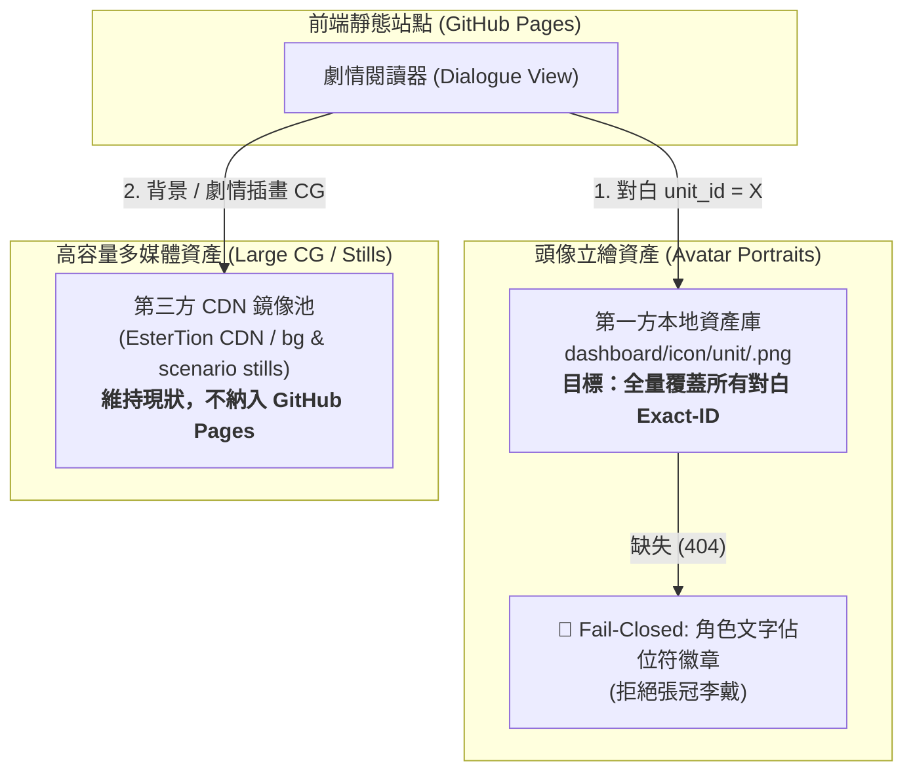

# AvatarService 頭像解析中樞：Exact-ID 本地完整託管與資產治理重構計畫與 RFC (v4)

> **文件狀態**：產品決策與資產治理修訂審查中（RFC - Request for Comments v4）  
> **提出日期**：2026-09-04  
> **目標系統**：`dashboard/avatar-service.js`、`pipeline/bundle.py`、`dashboard/dialogue-view.js`  
> **適用範疇**：全專案 9,033 篇正規劇情劇本之角色立繪頭像解析、資產治理與打包交付機制  
> **核心架構原則**：  
> **「來源決定解析策略；官方明確對白 unit_id 直連第一方本地資產；嚴格 Fail-Closed 防範身份篡改；大圖與頭像分流治理；以權威清單管理打包發布合約。」**  
> *(Source determines resolution strategy; explicit dialogue unit_id directly targets local first-party asset; strict fail-closed prevents identity mutation; bifurcated delivery for avatars vs large CGs; manifest-governed bundling & release contracts.)*

---

## 一、 核心阻斷議題：頭像資產權威來源與發布治理 (Avatar Asset Source of Truth)

在 v3 確立「由 GitHub Pages 完整託管所有對白 Exact-ID 頭像」的產品方向後，必須正視目前倉庫既有的資產治理與打包現實：

### 1. 專案既有資產現狀與盲點
1. **本地圖庫被 Git 忽略**：
   `dashboard/icon/` 目錄目前被外層 `.gitignore` 忽略。因此在乾淨 clone 的 GitHub CI 環境中，**根本不存在本地頭像二進位檔案**。
2. **打包管線主動修剪（Prune）非預期圖檔**：
   現行 [`pipeline/bundle.py`](../pipeline/bundle.py) 並非盲目複製 `dashboard/icon/unit/` 下的所有圖檔。它依賴一個受限的預期集合（`tracked_characters.json`、硬編碼之 `REALITY_UNIT_IDS`、NPC 區間 `190000~199999` 與少數特例），並且**會在打包時將不在預期清單內的 `dist_story_map/icon/unit/` 檔案主動修剪（Prune/刪除）**。
3. **阻斷結論**：
   僅在本地圖庫補充更多 Exact-ID PNG 是無效的，因為現行打包管線會直接將其排除並刪除；且 CI 無法在缺乏二進位檔的環境下驗證實體圖檔。因此本計畫必須明確定義**頭像資產的權威來源（Source of Truth）與發布合約**。

### 2. 頭像資產概念流動模型 (Conceptual Governance Model)
```text
官方正規劇情劇本 (Canonical Dialogue Stories, 9,033 篇)
        ↓
明確對白 unit_id 集合 (Explicit dialogue unit_ids)
        ↓
列管頭像資產清單 (Tracked Avatar Asset Manifest, e.g. dashboard/data/avatar_assets.json)
        ↓
本地二進位資產庫 (Local Binary Asset Store, dashboard/icon/unit/)
        ↓
發布打包管線 (pipeline.bundle)
        ↓
靜態站點發布目錄 (dist_story_map/icon/unit/)
        ↓
線上託管環境 (gh-pages)
```

### 3. 列管清單（Manifest）概念規範
建議未來規劃引入列管之資產清單檔案（例如 `dashboard/data/avatar_assets.json`，檔名非最終）：
* **職責**：代表生產環境（Production）預期必須包含的所有 Exact-ID 頭像規格。
* **可能欄位**：`unit_id`、`filename`、`size_bytes`、`sha256`（強烈建議）、`source/provenance`（台版 So-net CDN / 遊戲包抽取 / 鏡像）、`availability/status`。
* **約束**：*本 RFC 階段暫不實作此 manifest，待 Phase 2 審查後於 Phase 4 推進。*

### 4. 清單（Manifest）與二進位儲存（Binary Storage）解耦
二進位圖檔的具體儲存機制不應在審查前預設立場，保留於 Phase 2/3 容量審查後再行決策。未來可能採行的方案包含：
- **方案 A**：二進位圖檔維持本地管理（續受 `.gitignore` 忽略），主分支僅追蹤文本 Manifest。
- **方案 B**：經過容量評估後，將精選的正規對白 Exact-ID 頭像二進位圖檔直接納入主分支版本控制。
- **方案 C**：建立專屬的資產發布 Release 或專屬資產倉庫（Submodule / LFS / Asset Repo）。
- **最終生產不變量**：無論採用何種內部儲存方案，**最終生產環境的 `gh-pages` 分支必須完整包含所有正規對白所需的 Exact-ID 頭像**。

---

## 二、 產品架構決策與資產分界 (Product Architecture & Asset Boundary)

專案確立**頭像立繪（Avatar Portraits）**與**大圖 CG / 劇情背景（Large CG / Still Images）**採取雙軌分流策略：



### 1. 資產分界與交付規範
| 資產類別 | 預估體積特性 | 請求頻率 | 身份敏感度 | 生產交付策略 (Production Strategy) | 外部網路依賴 |
| :--- | :--- | :---: | :---: | :--- | :--- |
| **頭像立繪 (Avatar Portraits)** | 預期顯著小於大圖 CG；待 Phase 2 精確測量容量分佈 | 極高（每句對白） | **極高**（絕不允許張冠李戴） | **GitHub Pages 本地第一方完整託管**<br>`icon/unit/<unit_id>.png` | **執行期完全脫鉤**<br>（外部 CDN 僅作為離線抓取用） |
| **大圖 CG / 劇情背景 (Large CG / Stills)** | 檔案龐大 (數百 KB ~ 數 MB) | 低（每話數次） | 中等（場景氛圍） | **維持外部 EsterTion CDN 鏡像**<br>（嚴禁納入 GitHub Pages 倉庫） | 維持現行遠端加載合約 |

### 2. 打包管線合約修正規範 (Future Bundler Contract)
現行 `pipeline/bundle.py` 的預期圖檔邏輯未來必須重構：
* **合約轉變**：由現行「受限的 tracked/reality/NPC 預期集合」，改為**「依據批准的資產權威來源（Manifest）導出之全量正規 Exact 頭像集合」**。
* **生產修剪不變量（Critical Pruning Invariant）**：  
  > **正規劇情對白所需的 Exact 頭像，絕不能僅僅因為不在舊版 Reality/NPC/tracked 名冊中，就在打包時被從 dist 目錄中修剪刪除！**
* **約束**：*本 RFC 階段暫不修改 `pipeline/bundle.py`。*

### 3. CI 驗證 vs 本地/發布驗證分流 (CI vs Local Release Validation)
* **CI 可驗證合約（CI-Eligible Checks）**：
  - 在乾淨 clone 的 GitHub CI 中，驗證倉庫可控的元資料事實（如：`canonical explicit dialogue unit_ids ↔ tracked avatar manifest expected IDs`）。
  - **CI 絕不能宣稱驗證了未追蹤之實體 PNG 的存在**。
  - **嚴禁將外部 CDN 網路探測作為 CI 門禁**（外部網路不具確定性）。
* **本地與發布驗證合約（Local / Release Validation）**：
  - 於具備二進位圖檔的維護環境下，執行三方交叉比對：
    $$\text{Tracked Manifest} \longleftrightarrow \text{dashboard/icon/unit/ 實體圖檔} \longleftrightarrow \text{dist_story_map/icon/unit/ 打包結果}$$

---

## 三、 劇本基準與審查數據規範 (Audit Numbers & Reproducibility)

### 1. 劇本檔案清單基準
* **目錄路徑**：`dashboard/story/`
* **總 JSON 檔案數**：**9,034** 個
* **非劇本排除檔案**：**1** 個（`speaker_appearance.json`，為全域角色出場統計索引）
* **正規劇情劇本檔案（Canonical Script Files）**：**9,033** 篇（檔名匹配正規表示式 `/^\d+\.json$/`）

任何審查者可執行以下指令進行完全重現驗證：
```bash
node -e "const fs = require('fs'); const files = fs.readdirSync('dashboard/story').filter(f => f.endsWith('.json')); const scripts = files.filter(f => /^\\d+\\.json$/.test(f)); const nonScripts = files.filter(f => !/^\\d+\\.json$/.test(f)); console.log({ totalJson: files.length, canonicalScripts: scripts.length, excluded: nonScripts });"
```

### 2. 探索性數據標記（Exploratory Data Notice）
先前初步掃描產出的以下數據：
- *246 個受影響 ID*
- *293,244 句受影響對白*
- *884 張變體圖檔*
- *68 (現實) / 3 (非人) / 175 (差分) 分類*

**目前正式列為「探索性數據（Exploratory Data）」**。所有確切數據必須以接下來執行的正式列管工具 `tests/audit_dialogue_avatar_matrix.js` 之全量確定性回歸輸出為最終準則。

---

## 四、 解析器職責分離與極簡 Fail-Closed 機制

我們徹底廢除基於後綴猜測（如 `xx01`）與數值範圍猜測（如 `isKnownPlayableRange`）的啟發式邏輯，依據**呼叫來源（Caller Context）**分離入口：

### 1. 來源決定策略（Source Determines Strategy）

#### A. 明確對白劇本專用入口：`resolveExactDialoguePortraitIds(unitId)`
* **來源**：劇本 JSON 對白行中明確標註的 `unit_id`。
* **唯一合約**：
  $$\text{候選清單} = [\text{unitId}]$$
* **絕對規則**：
  - **不作後綴歸一化**：即使 ID 結尾為 `01`、`11`、`31`，亦不進行任何改寫或截斷。
  - **不作無條件 base+11 重寫**：嚴禁自動向 `base+11` 或 `base+31` 擴充候補。
  - **極簡 Fail-Closed**：若本地 `icon/unit/<unit_id>.png` 存在，直接 200 OK 渲染；若不存在，**直接 Fail-Closed 降級為角色文字佔位符徽章（Badge Placeholder）**。

#### B. 無對白 ID / 名稱推導 / 卡片通用入口：`resolveDefaultPortraitIds(baseOrCardId)`
* **來源**：對白中缺失 `unit_id`（僅有名稱）、角色清單總覽、卡片展示。
* **合約**：依據卡片/基礎代碼推導日常展示外觀：首選 `base+11`，次選 `base+31`。

### 2. 延後複雜語意降級（Deferral of Semantic Fallback）
> **紅線原則**：  
> **「顯示錯誤的頭像比顯示文字佔位符更糟糕。」**  
> *(Wrong portrait is worse than placeholder.)*

在 v4 架構中，**全面延後（DEFER）**以下複雜機制，直到 Phase 2 覆蓋率審查完成：
- ❌ **移除 `isKnownPlayableRange()`**：嚴禁引入任何基於 ID 數值範圍的猜測邏輯。
- ⏸️ **延後 `PLAYABLE_VARIANT_SET`**：不預設維護龐大的可玩變體登錄表。
- ⏸️ **延後寬鬆的 `base+11` 語意降級**：第一階段實作僅採用 `Exact 本地圖檔 -> 佔位符`。
- ⏸️ **延後執行期身份風險分類器**：不將複雜的過濾鏈條作為執行期必備模組。

**決策核心**：  
若審查證明本地圖庫能以極小的容量成本（例如幾十 MB 內）補齊所有遺漏的 exact ID，則根本不需要實作容易產生張冠李戴風險的語意降級系統。

---

## 五、 核心 API 簡化虛擬碼

```javascript
// dashboard/avatar-service.js 重構規範 (簡化極簡版)

class AvatarService {
    // 1. 劇本對白專用入口：嚴格 Exact-ID 本地優先，無猜測
    static resolveExactDialoguePortraitIds(unitId) {
        if (!unitId || (typeof unitId !== 'number' && typeof unitId !== 'string')) return [];
        const numId = Number(unitId);
        if (!Number.isInteger(numId) || numId < 100000) return [];

        // 僅返回自身 Exact-ID，由本地 icon/unit/ 目錄承接
        // 若本地不存在，瀏覽器 onerror 直接觸發文字佔位符，嚴禁自動篡改為 base+11
        return [numId];
    }

    // 2. 通用卡片 / 預設外觀解析入口 (非對白情境)
    static resolveDefaultPortraitIds(baseOrCardId) {
        if (!baseOrCardId) return [];
        const numId = Number(baseOrCardId);
        if (!Number.isInteger(numId) || numId < 100000) return [];

        const baseId = Math.floor(numId / 100) * 100;
        return [baseId + 11, baseId + 31];
    }
}
```

---

## 六、 歷史白名單遷移政策 (Whitelist Policy)

現有三個歷史白名單結構暫不立即刪除：
* `exactPortraitIds`
* `exactFirstWithBaseFallback`
* `exactRealityIds`

### 處置原則
1. **暫不破壞現有代碼結構**：在 Exact-ID-First 實作與全量審查工具上線前，保留原資料結構定義。
2. **審查驗證冗餘性**：待 Phase 2 與 Phase 7 全量劇本審查運行，確定所有案例均已被 Exact-ID 本地資產直連覆蓋、無破圖且無身份篡改後，才安全移除冗餘條目。
3. **`exactRealityIds` 的明確政策**：  
   **預期可淘汰；待 Exact-ID-First 實作與回歸審查證明全部條目冗餘後再行移除。**  
   （非盲目立即廢除，確保有測試與數據背書）。

---

## 七、 專案級確定性資產與打包審查工具規範 (Tracked Audit Tool Spec)

在修改任何業務代碼前，必須在 `tests/` 下建立確定性（Deterministic）資產與打包覆蓋率審查工具：  
📁 **`tests/audit_dialogue_avatar_matrix.js`**

### 1. 核心產出指標（Required Metrics）
腳本遍歷全部 **9,033** 篇正規劇情檔案，必須同時回答兩個核心問題：
1. **我們是否擁有該 Exact 頭像實體資產？**
2. **現行打包管線是否真能發布並保留它？**

具體輸出指標清單：
1. `canonicalStories`：正規劇本篇數（必須為 9,033）。
2. `explicitDialogueRows`：包含明確 `unit_id` 的對白總行數。
3. `distinctExplicitUnitIds`：所有對白中使用到的不重複 `unit_id` 集合。
4. `localExactFiles`：本地 `dashboard/icon/unit/` 中現存之 exact 圖檔實體集合。
5. `currentBundlerExpectedIds`：現行 `pipeline/bundle.py` 預期發布的圖檔 ID 集合。
6. `explicitLocallyPresentNotPublishable`：本地實體存在、但會被現行 bundler 修剪排除的明確對白 ID 清單。
7. `explicitPublishable`：現行管線能正確發布的明確對白 ID 清單。
8. `productionGhPagesCoverage`：若可行，比對現行 `gh-pages` 分支的圖檔覆蓋率。
9. `currentAvatarBytes`：目前本地頭像目錄實體總位元組數。
10. **精確檔案大小分佈**：
    - `averageFileSizeBytes`：平均圖檔大小。
    - `medianFileSizeBytes`：中位數大小。
    - `p95FileSizeBytes`：95 百分位大小。
    - `maxFileSizeBytes`：最大圖檔大小。
11. `projectedCompleteAvatarFootprint`：若補齊所有缺失 exact 圖檔，預估新增之頭像總容量。
12. `projectedTotalPagesFootprint`：預估對 GitHub Pages 總體積的影響。
13. `currentResolverNormalizedIds`：現行解析器會強制抹平/竄改的 ID 清單。
14. `explicitIdsWithDifferingPrimary`：現行 primary 與原始 `unit_id` 不一致之 ID 清單。

### 2. 必測列管高風險案例（Mandatory Fixtures）
腳本必須包含對以下 11 個關鍵 ID 的斷言檢驗：  
`133118`, `101421`, `125821`, `106914`, `105812`, `105913`, `106012`, `106412`, `106831`, `107331`, `107031`。

---

## 八、 測試合約矩陣 (Test Contract Matrix)

| 代號 | 測試類別 | 代表性測試案例 (Fixture) | 預期 Primary ID | 預期 Fallback 行為 | 合約要求與防護目標 |
| :---: | :--- | :--- | :---: | :--- | :--- |
| **A** | 正規可玩角色對白 | 佑樹 (`100111`)<br>可可蘿 (`105911`) | `100111`<br>`105911` | 本地 PNG (200 OK) | 驗證標準可玩角色的 exact 直連 |
| **B** | 角色換裝 / 季節變體 | 佩可（夏日）(`105821`)<br>凱留（新年）(`106021`) | `105821`<br>`106021` | 本地 PNG (200 OK) | 驗證限定換裝直連，不退回常規卡面 |
| **C** | 現實世界造型 (第 1/2/3 部) | 模索路晶 (`106831`)<br>拉基拉基 (`107331`)<br>似似花 (`107031`) | `106831`<br>`107331`<br>`107031` | 本地 PNG (200 OK) | 嚴禁退回阿斯特朗裝，杜絕沉浸感破壞 |
| **D** | 非人實體 / 召喚靈獸 | 幽靈小狗布爾布 (`133118`) | `133118` | 本地 PNG 或 **🛑 Fail-closed 佔位符** | **絕對嚴禁回退至薇歐莉特 (`133111`)** |
| **E** | 闇影 / 克隆體 / 人偶 | 霞的闇影 (`101421`)<br>莉莉的闇影 (`125821`) | `101421`<br>`125821` | 本地 PNG 或 **🛑 Fail-closed 佔位符** | 嚴禁隱式篡改為本體角色 |
| **F** | NPC 角色 (`>= 190000`) | 八斗神局長 (`193631`)<br>真軌 (`191031`)<br>長老 (`192701`) | `193631`<br>`191031`<br>`192701` | 本地 PNG (200 OK) | 驗證 NPC 包含以 `01` 結尾者不被竄改 |
| **G** | 舊式卡片輸入 (`resolveDefault`) | 佩可卡片 (`105801`) | `105811` | `[105831]` | 僅在調用 default 解析器時才推導展示外觀 |
| **H** | 缺失資產之保護 (未補齊前) | 假設全專案任一缺失 ID | 該 Exact ID | **🛑 Fail-closed 徽章佔位符** | **「錯圖不如文字佔位符」**，杜絕無端抹平 |

---

## 九、 修訂後八大決策與執行階段 (Revised Decision Sequence)

本專案流程嚴格遵循「審查先行 ➡️ 治理明確 ➡️ 打包修正 ➡️ 服務重構」：

- [x] **Phase 1: RFC 規格定稿（Finalize RFC - Current）**
  - 確立資產治理模型、資產清單規範、管線打包合約限制與 CI 驗證邊界。
- [ ] **Phase 2: 純審查階段（AUDIT ONLY）**
  - 實作 `tests/audit_dialogue_avatar_matrix.js`。
  - 測量劇本明確 ID 覆蓋率、實體檔案覆蓋率、現行 bundler 發布覆蓋率、gh-pages 現狀、精確圖檔大小分佈（avg/median/p95/max）及預估總容量。
- [ ] **Phase 3: 資產權威來源與二進位儲存決策（Decide Source-of-Truth & Storage）**
  - 依據 Phase 2 的容量數據，決定二進位儲存模型（方案 A/B/C）與權威清單格式。
- [ ] **Phase 4: 定義/實作資產清單與必要之素材補齊（Implement Manifest & Acquisition）**
  - 產出正式 manifest，並針對經評估必須補齊之 exact 圖檔執行離線抓取。
- [ ] **Phase 5: 修正管線打包與修剪合約（Update Bundler Contract）**
  - 更新 `pipeline/bundle.py`，改為依據 manifest 決定 expected icon 集合，杜絕合法 exact 圖檔被錯誤 prune。
- [ ] **Phase 6: 實作極簡 Exact-ID-First AvatarService**
  - 於 `dashboard/avatar-service.js` 實施直連邏輯與 Fail-Closed 佔位符機制。
- [ ] **Phase 7: 全量回歸驗證、本地發布驗證與 CI 合約測試**
  - 執行單元測試、本機打包驗證與 CI 元資料比對。
- [ ] **Phase 8: 外部審查與合併（External Review & Merge）**
  - 提交完整驗收數據，審查通過後合併入主分支。
  - **未獲明確授權前，嚴禁執行部署（NO DEPLOY）**。
