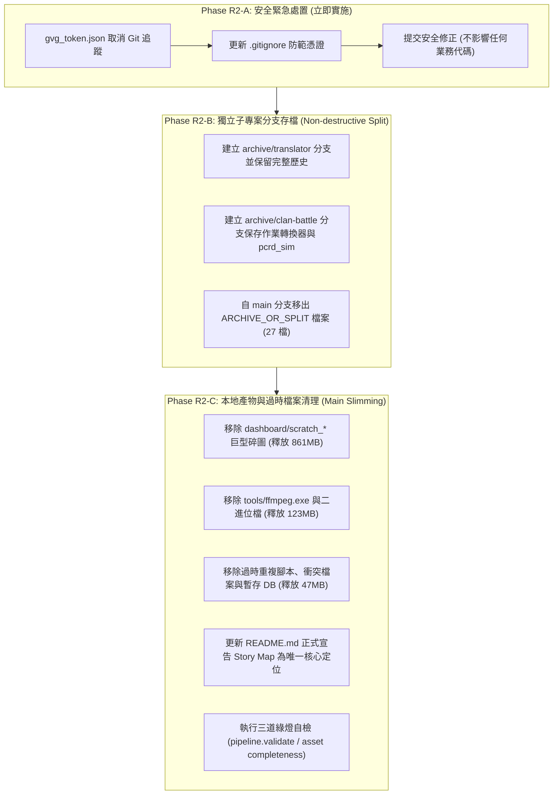

# PCRD_transtool / main 分支範疇盤點與清理審計報告 (Phase R1)

> **審計時間**：2026-09-29  
> **審計基準分支**：`main`  
> **審計基準 Commit SHA**：`2bc19e37cb192fff74b537f858cbb6c1c9ab0a45` (`HEAD == origin/main`)  
> **專案核心唯一目標**：**公主連結劇情地圖（Princess Connect Re:Dive Story Map）**  
> **本階段性質**：**僅盤點與審計（INVENTORY / AUDIT ONLY）**，不執行任何實質檔案刪除、移動、暫存、提交或發布。

---

## 1. 執行摘要 (Executive Summary)

本報告對倉庫 `PCRD_transtool` 的 `main` 分支進行了全量追蹤檔案（Tracked Files）深度審計。在經過 F1、F2A、F2B、F2C 階段完成「官方 So-net CDN 原生 Master DB 管道與內容驅動更新架構」後，專案核心定位已唯一收斂於「公主連結劇情地圖（Story Map）」及其資料更新管線。

### 核心盤點統計 (Machine Calculated)

| 分類標籤 (Category) | Tracked 檔案數 | 佔總檔案數比例 | Tracked 磁碟體積 (MB) | 佔總體積比例 | 處置方向 |
| :--- | :---: | :---: | :---: | :---: | :--- |
| **`KEEP`** | **29,590** | 90.30% | **1,806.39 MB** | 63.66% | 保留於 `main`：Story Map 網站、核心管線、活躍測試與維護文檔 |
| **`ARCHIVE_OR_SPLIT`** | **27** | 0.08% | **0.22 MB** | 0.01% | 獨立存檔/拆分：非 Story Map 的獨立工具（翻譯器、模擬器、戰隊戰作業轉換器） |
| **`REMOVE_FROM_MAIN`** | **3,149** | 9.61% | **1,030.97 MB** | 36.33% | 自 `main` 移除：單次逆向產物、巨型二進位檔、過時原型、重複工具、除錯報告 |
| **`SECURITY_REMOVE`** | **1** | <0.01% | **<0.01 MB** | <0.01% | 安全移除：私有憑證/Token（`gvg_token.json`），立即取消追蹤並忽略 |
| **`UNKNOWN`** | **0** | 0.00% | **0.00 MB** | 0.00% | 無未確定項目（已 100% 窮舉分類） |
| **總計 (Total Universe)** | **32,767** | **100.00%** | **2,837.58 MB** | **100.00%** | 全量掃描完成 |

### 核心結論與效益

1. **體積瘦身潛力**：自 `main` 分支移出 `REMOVE_FROM_MAIN`（3,149 檔）後，可立即釋放 **1,030.97 MB**（約 1.03 GB，佔目前倉庫體積的 36.33%）。
2. **最大的空間消耗者**：
   - `dashboard/scratch_dmm_all_character_textures/`（2,733 檔，820.80 MB）：本地 DMM 紋理逆向探索遺留。
   - `tools/ffmpeg.exe`（1 檔，97.00 MB）：不應置於版本控制中的大型執行檔。
   - 冗餘/暫存資料庫（`temp_jp.db` 15.56 MB、`dashboard/redive_jp.db` 15.36 MB、根目錄 `redive_tw.db` 2.08 MB 等）。
3. **安全隱患**：發現根目錄追蹤了 `gvg_token.json`，內部含有戰隊戰連線憑證，必須優先處理。

---

## 2. 範疇分類標準定義 (Scope Classification Definitions)

為確保分類的精準性與客觀性，本次審計制定了嚴格的五級判定標準：

* **`KEEP`**：
  - 當前 Story Map 前端線上運作直接相依（HTML/JS/CSS/WebAssembly/生產資料庫/卡片/頭像/語音/劇本 JSON）。
  - 自動化增量更新、決定性封裝、發布與驗證管線（`pipeline/`、`update_story_map.py`）。
  - 核心測試套件（驗證前端行為與更新管線完整性）。
  - 當前生產架構決策、台版官方世界觀名詞基準、更新手冊等核心文檔。
  - 活躍的診斷與素材維護工具（`tools/diagnostics/`、`tools/maintenance/`、主線動畫壓制工具）。
* **`ARCHIVE_OR_SPLIT`**：
  - 過去曾開發且具備一定完整度，但與「Story Map」核心定位無關的獨立子專案或實驗。
  - 例如：日翻中即時 OCR 翻譯器（`translator/`）、戰鬥傷害模擬器（`pcrd_sim/`）、戰隊戰作業文字轉換器（根目錄 `index.html/js/css`）。
  - 建議移至獨立分支（如 `archive/translator`）或獨立專案倉庫保存，不留在 `main` 生產分支。
* **`REMOVE_FROM_MAIN`**：
  - 一次性除錯腳本、臨時探測產物、探索性 scratch 檔案。
  - 舊時代已被新管線完全取代的重複腳本（例如舊 DB 下載器、舊手動打包腳本、舊部署腳本）。
  - 單次活動/角色 injection 歷史報告與 JSON/MD 產物。
  - 合併衝突遺留的 `-DESKTOP-*` 或 `-user.*` 檔案。
  - 應由環境安裝或套件管理器提供、不應追蹤於 Git 中的大型二進位檔（`ffmpeg.exe`、DLL 等）。
* **`SECURITY_REMOVE`**：
  - 包含私人身分識別、連線憑證、授權 Token、Session Cookie 或私有狀態的檔案。
  - 處置要求：嚴禁印出具體內容，必須自 Git 追蹤中移除並列入 `.gitignore`。
* **`UNKNOWN`**：
  - 無法藉由現有代碼依賴、靜態引用或命名規則安全判定用途的項目。（本次盤點覆蓋率為 100%，無此項目）。

---

## 3. 安全性與憑證審計 (Security & Credentials Audit - Redacted)

> [!CAUTION]
> **安全脫敏原則**：依據全域安全準則，本章節與整個審計過程中嚴禁印出、暴露或複製憑證與 Token 的具體內容。

### 發現之機密檔案：`gvg_token.json`

| 項目 | 審計細節 |
| :--- | :--- |
| **檔案路徑** | `gvg_token.json`（倉庫根目錄） |
| **Tracked 狀態** | 已被 Git 追蹤（Tracked） |
| **檔案大小** | 165 Bytes |
| **內容性質判定** | 戰隊戰（Clan Battle / GvG）私人身分授權 Token 與 Session 資料 |
| **引用關聯 (Code Reference)** | 全倉庫僅被 [`tools/fetch_gvg_tasks.py`](file:///tools/fetch_gvg_tasks.py) 單一檔案讀取（用於連線外部戰隊戰排刀/作業平台 API） |
| **與 Story Map 的相依性** | **完全無相依**（Story Map 為純靜態公開劇情檢視器，不涉及個人登入或戰隊戰 API） |
| **安全危害評估** | 若該 token 尚未完全失效，任何克隆倉庫者均可能取得該授權身分；即使已失效，在版本控制中留下憑證亦違反軟體工程安全常規。 |
| **建議處置處方 (Phase R2)** | 1. 執行 `git rm --cached gvg_token.json`<br>2. 確保根目錄 `.gitignore` 包含 `*token*.json`<br>3. 提醒開發者在遠端服務作廢/更換該授權金鑰 |

---

## 4. 磁碟空間主要消耗者審計 (Top Space Consumers)

本倉庫當前 tracked 檔案總體積為 **2,837.58 MB**（約 2.84 GB）。以下由大至小排列主要空間消耗來源。

### 頂層路徑空間分佈

| 路徑 / 項目 | 檔案數 | 總體積 (MB) | 主要內容與分類 |
| :--- | :---: | :---: | :--- |
| `dashboard/` | 32,305 | 2,678.91 MB | 生產素材與前端（大部分 KEEP），但含 858 MB scratch 產物（REMOVE） |
| `tools/` | 237 | 125.30 MB | 含 97MB `ffmpeg.exe` 與 DLL（REMOVE），以及維護工具（KEEP） |
| `temp_jp.db` | 1 | 15.56 MB | 根目錄日服 SQLite 暫存檔（REMOVE） |
| `temp/` | 1 | 13.13 MB | 含 `temp/masterdata_master.unity3d`（REMOVE） |
| `docs/` | 47 | 2.19 MB | 架構決策、世界觀指南、審計歷史（KEEP，1 檔 conflict REMOVE） |
| `tests/` | 69 | 0.85 MB | 自動化測試套件（67 檔 KEEP，2 檔模擬器測試 ARCHIVE） |
| `git_avatar_history.txt`| 1 | 0.54 MB | 根目錄歷史 Git commit 抓取 log（REMOVE） |
| `pipeline/` | 18 | 0.40 MB | 核心自動化更新管線（KEEP） |
| `translator/` | 7 | 0.12 MB | 獨立即時日翻中工具（ARCHIVE_OR_SPLIT） |
| `pcrd_sim/` | 9 | 0.03 MB | 獨立戰鬥模擬器（ARCHIVE_OR_SPLIT） |
| `archive/` | 19 | 0.03 MB | 歷史廢棄腳本（REMOVE） |
| 根目錄其餘雜檔 | 27 | 0.52 MB | 戰隊戰首頁、暫存 JSON/TXT、模擬器 HTML 等 |

### 前 20 大個別 Tracked 檔案排行榜

| 排名 | 檔案路徑 | 大小 (MB) | 建議分類 | 檔案性質說明 |
| :---: | :--- | :---: | :---: | :--- |
| 1 | `tools/ffmpeg.exe` | 97.00 MB | `REMOVE_FROM_MAIN` | 外部第三方視訊轉碼工具，不應進入 Git |
| 2 | `temp_jp.db` | 15.56 MB | `REMOVE_FROM_MAIN` | 根目錄日版資料庫暫存檔案 |
| 3 | `dashboard/redive_jp.db` | 15.36 MB | `REMOVE_FROM_MAIN` | 日版資料庫副本（台版劇情地圖無需日版完整 DB） |
| 4 | `temp/masterdata_master.unity3d` | 13.13 MB | `REMOVE_FROM_MAIN` | 早期從 CDN 抓取未解密的原始 master bundle |
| 5 | `dashboard/versions/00470001_redive_tw.db` | 2.08 MB | `KEEP` | 歷史版本 Master DB 存檔（版本對照用） |
| 6 | `dashboard/redive_tw.db` | 2.08 MB | `KEEP` | **當前生產資料庫（Normalized Source of Truth）** |
| 7 | `dashboard/versions/00510002_redive_tw.db` | 2.08 MB | `KEEP` | 歷史版本 Master DB 存檔 |
| 8 | `dashboard/versions/00540003_redive_tw.db` | 2.08 MB | `KEEP` | 歷史版本 Master DB 存檔 |
| 9 | `dashboard/card/card_full_125031.webp` | 1.83 MB | `KEEP` | 角色卡片全圖素材（秋乃&咲戀） |
| 10 | `dashboard/card/card_full_127031.webp` | 1.76 MB | `KEEP` | 角色卡片全圖素材（真步&可可蘿） |
| 11 | `dashboard/scratch_storydata_manifest.txt` | 1.69 MB | `REMOVE_FROM_MAIN` | 早期 storydata manifest 文字 dump |
| 12 | `tools/tools/vgmstream-cli.exe` | 1.28 MB | `REMOVE_FROM_MAIN` | 巢狀重複解壓縮目錄中的二進位工具 |
| 13 | `tools/vgmstream-cli.exe` | 1.28 MB | `REMOVE_FROM_MAIN` | 音訊解碼二進位工具（代碼內有自動下載機制） |
| 14 | `dashboard/card/card_full_126831.webp` | 1.17 MB | `KEEP` | 角色卡片全圖素材 |
| 15 | `tools/tools/in_vgmstream.dll` | 1.16 MB | `REMOVE_FROM_MAIN` | 巢狀目錄重複 DLL |
| 16 | `tools/in_vgmstream.dll` | 1.16 MB | `REMOVE_FROM_MAIN` | 外部依賴 DLL |
| 17 | `dashboard/card/card_full_125731.webp` | 1.14 MB | `KEEP` | 角色卡片全圖素材 |
| 18 | `dashboard/card/card_full_129431.webp` | 1.12 MB | `KEEP` | 角色卡片全圖素材 |
| 19 | `dashboard/card/card_full_129031.webp` | 1.12 MB | `KEEP` | 角色卡片全圖素材 |
| 20 | `dashboard/card/card_full_128031.webp` | 1.09 MB | `KEEP` | 角色卡片全圖素材 |

---

## 5. 專題子系統深度審計 (Thematic Subsystems)

### 5.1 獨立子專案：`translator/` (日翻中即時翻譯器)

* **檔案數量與體積**：7 個檔案，123,064 Bytes (~0.12 MB)。
* **檔案清單**：
  - `translator/__init__.py`
  - `translator/config.py`
  - `translator/launcher.py`
  - `translator/main.py`
  - `translator/ocr_vision.py`
  - `translator/translator_api.py`
  - `translator/ui_manager.py`
  - `translator/wiki_scraper.py`
* **依賴分析**：
  - 全域代碼檢索（`git grep "translator"`）：除了自身模組引用與 `.agents/AGENTS.md` 提及為「獨立實驗專案」外，與當前 `dashboard/`、`pipeline/`、`update_story_map.py`、`tests/`、CI 流程均**完全零相依**。
* **分類結論**：**`ARCHIVE_OR_SPLIT`**。
* **處置建議**：建議在清理時建立獨立分支（例如 `split/translator`）或拆分至專用 repository，從 `main` 生產分支移出。

### 5.2 戰隊戰 (GvG / aikurumi / Clan Battle) 相關產物

* **歷史背景**：本倉庫早期曾作為戰隊戰排刀作業文字轉換工具與 API 抓取工具。
* **相關檔案與分類**：
  1. `gvg_token.json` (根目錄) ➔ **`SECURITY_REMOVE`**（含私人 API Token）。
  2. `index.html` (根目錄) ➔ **`ARCHIVE_OR_SPLIT`**（舊戰隊戰作業轉換器 UI）。
  3. `index.js` (根目錄) ➔ **`ARCHIVE_OR_SPLIT`**（作業轉換核心邏輯，19.8 KB）。
  4. `index.css` (根目錄) ➔ **`ARCHIVE_OR_SPLIT`**（作業轉換器樣式）。
  5. `unit_names.json` (根目錄) ➔ **`REMOVE_FROM_MAIN`**（舊轉換器使用的角色名字表，現代 Story Map 使用正規化 DB）。
  6. `tools/fetch_gvg_tasks.py` ➔ **`ARCHIVE_OR_SPLIT`**（戰隊戰作業爬蟲）。
  7. `scratch/sniff_aikurumi.py` ➔ **`ARCHIVE_OR_SPLIT`**（戰隊戰 API 抓包與分析腳本）。
  8. `dashboard/gvg_data_202604_jp.json` ➔ **`REMOVE_FROM_MAIN`**（2026 年 4 月過期測試資料）。
  9. `dashboard/gvg_data_merged_bulk.json` ➔ **`REMOVE_FROM_MAIN`**（過期合併資料）。
* **分類結論**：Story Map 已完全獨立，全數移出 `main` 分支。

### 5.3 戰鬥模擬器與舊展示原型 (`pcrd_sim/` & `pcr_demo/`)

* **相關檔案與分類**：
  1. `pcrd_sim/` 目錄（9 個檔案，約 0.03 MB）：含 `engine.py`, `formulas.py`, `optimizer.py`, `buff_engine.py` 等戰鬥數值計算引擎 ➔ **`ARCHIVE_OR_SPLIT`**。
  2. `pcrd_simulator.html` (根目錄，12.9 KB)：戰鬥模擬器網頁介面 ➔ **`ARCHIVE_OR_SPLIT`**。
  3. `tests/test_pcrd_sim.py` 與 `tests/test_buff_cancel.py`：模擬器單元測試 ➔ **`ARCHIVE_OR_SPLIT`**。
  4. `pcr_demo/` 目錄（3 個檔案：`app.js`, `index.html`, `index.css`）：早期展示雛型 ➔ **`ARCHIVE_OR_SPLIT`**。
* **分類結論**：與劇情地圖無關，移出 `main` 分支存檔。

### 5.4 舊網頁與重複打包器 (Legacy Web Pages & Bundlers)

* **前端首頁權威性審計**：
  - **唯一權威模板 (Canonical Source)**：[`dashboard/story_map.html`](file:///dashboard/story_map.html)。
  - **生產發布產物 (Dist Output)**：[`dist_story_map/index.html`](file:///dist_story_map/index.html)（由 `pipeline.bundle` 內嵌打包產生，受獨立部署分支保護）。
  - **過時舊檔案**：[`dashboard/index.html`](file:///dashboard/index.html)（舊版未內嵌原型，已被 `story_map.html` 取代）➔ **`REMOVE_FROM_MAIN`**。
* **打包器權威性審計**：
  - **唯一權威打包器 (Canonical Bundler)**：[`pipeline/bundle.py`](file:///pipeline/bundle.py)（具備 Story Data 內嵌、自動 Hash Cache-Busting 與多道驗證）。
  - **過時/衝突打包器**：
    - `dashboard/scripts/bundle_story_map.py` ➔ **`REMOVE_FROM_MAIN`**。
    - `dashboard/scripts/bundle_story_map-DESKTOP-N6EC182.py` ➔ **`REMOVE_FROM_MAIN`**。

---

## 6. 管線與維護工具審計 (Pipeline & Tools: Canonical vs Legacy)

在經歷 F 系列架構重構後，現代自動化更新管線已統一收斂於 `pipeline/`。許多早期編寫的獨立工具已被取代或成為重複實作。

### 權威實現與過時/重複實作對照表

| 功能領域 | 現代唯一權威實現 (`KEEP`) | 被取代的過時/重複工具 (`REMOVE_FROM_MAIN`) | 取代原因與現狀說明 |
| :--- | :--- | :--- | :--- |
| **So-net Master DB 下載** | `pipeline/sonet_master_db.py` | `tools/download_wthee_tw_db.py`<br>`tools/fetch_db_from_sonet.py`<br>`tools/redownload_tw_db.py`<br>`tools/restore_clean_tw_db.py` | 現代管線已直接使用 Content-Driven 輕量探測與官方 CDN 鏡像，不再經由 wthee 或手動腳本。 |
| **資料庫解混淆 (Deobfuscate)** | `pipeline/sonet_master_db.py` | `tools/deobfuscate_db.py`<br>`tools/deobfuscate_db_v2.py`<br>`tools/debug_deobfuscate.py` | 解密與還原邏輯已封裝於 `SoNetMasterDBPipeline` 模組中。 |
| **自動化部署 (Deploy)** | `pipeline/deploy.py` | `tools/pcrd_deploy.py`<br>`tools/force_deploy.py`<br>`tools/monitor_deploy.py` | 現代部署由 `pipeline.deploy` 以孤立 worktree 方式推送至 `gh-pages`，舊腳本存在污染工作區風險。 |
| **CDN 更新探測** | `pipeline/update_policy.py`<br>`tools/diagnostics/probe_*.py` | `tools/monitor_sonet_update.py`<br>`tools/check_sonet_cdn.py`<br>`tools/probe_urls.py` | 現代更新決策由 `ContentDrivenUpdatePolicy` 統一管理，提供決定性候選評估。 |
| **音訊轉碼** | `pipeline/audio.py` (若有) / `tools/convert_voices.py` | `tools/tools/` (整個巢狀目錄)<br>`tools/ffmpeg.exe`<br>`tools/*.dll` | 二進位工具不應置於版本控制；`convert_voices.py` 已內建自動下載機制。 |
| **章節與說話者生成** | `dashboard/scripts/generate_speaker_appearance.py` | `tools/generate_story_line_md.py`<br>`tools/generate_story_summaries.py` | `generate_speaker_appearance.py` 為維護前端篩選器所必需（KEEP），其餘為舊純文字生成。 |

### 保持保留的活躍維護工具 (`KEEP`)

以下位於 `tools/` 的工具因對日常運維或多媒體處理具有實際價值，審計確認予以保留：
- `tools/diagnostics/`（全部 37 個診斷與驗證腳本）
- `tools/maintenance/`（維護腳本）
- `tools/pcrd_fetch.py`、`tools/fetch_bulk.py`、`tools/fetch_data.py`（多功能素材手動抓取器）
- `tools/fetch_npc_avatar.py`、`tools/fetch_reality_avatars.py`、`tools/fetch_all_reality_avatars.py`（頭像修復工具）
- `tools/fetch_story_still.py`、`tools/fetch_story_thumbnails.py`、`tools/fetch_top_thumbnails.py`（靜態 CG 與縮圖抓取器）
- `tools/process_hd_subtitled_movies.py`、`tools/download_part3_movies.py`、`tools/unpack_part3_movies.py`、`tools/movie_restore_core.py`（官方主線 1080p 動畫硬字幕壓制管線，詳見 `docs/MOVIE_PIPELINE.md`）
- `tools/convert_voices.py`（依需求局部解碼語音封包工具）

---

## 7. 測試套件審計 (Test Suite Audit)

當前 `tests/` 目錄共有 69 個測試檔案，總大小約 0.85 MB。

* **`KEEP` (67 個檔案)**：
  - Python 單元測試：涵蓋 `pipeline/` 的各個核心模組（`test_sonet_master_db_fetcher.py`, `test_content_driven_update_policy.py`, `test_asset_completeness.py`, `test_bundle_slimming.py`, `test_direct_sonet_db_pipeline_integration.py`, `test_story_parity_validation.py` 等）。
  - 前端 JavaScript/Node 測試：驗證資料模型、音訊控制器、導航、對話氣泡正規化（`test_auto_voice_controller.js`, `test_avatar_service.js`, `test_dialogue_normalizer.js`, `test_reader_navigation.js`, `reader_browser_smoke.cjs` 等）。
* **`ARCHIVE_OR_SPLIT` (2 個檔案)**：
  - `tests/test_pcrd_sim.py`（測試 `pcrd_sim` 引擎）
  - `tests/test_buff_cancel.py`（測試 `pcrd_sim` 的 buff 取消機制）
  - 判定理由：直接引用 `from pcrd_sim import ...`，純屬於戰鬥模擬器子專案。

---

## 8. 文檔體系審計 (Documentation Audit)

當前 `docs/` 目錄共有 47 個文件，總大小約 2.19 MB。

* **核心長效指南 (`KEEP`，11 篇)**：
  - 台版世界觀與名詞定義：`docs/pcrd_characters.md`, `docs/pcrd_glossary.md`, `docs/pcrd_story_line.md`, `docs/pcrd_universe.md`。
  - 核心工作流與架構：`docs/ARCHITECTURE.md`, `docs/PIPELINE_WORKFLOW.md`, `docs/DATA_UPDATE_RUNBOOK.md`, `docs/MOVIE_PIPELINE.md`, `docs/SONET_CDN_UNPACKING_GUIDE.md`, `docs/HISTORICAL_DOCUMENTS.md`, `docs/pcrd_version_update_history.md`。
* **架構決策與審計歷史記錄 (`KEEP`，35 篇)**：
  - F/C/D 系列核心決策（`DIRECT_SONET_ACTIVE_VERSION_F2B.md`, `DIRECT_SONET_VERSION_RESOLUTION_F1.md`, `UPDATE_PIPELINE_C2_IMPLEMENTATION.md`, `STORY_METADATA_PERSISTENCE_DECISION_D2.md`, `AVATAR_ASSET_SOURCE_OF_TRUTH_DECISION.md` 等）及 `docs/data/*.json` 原始證據資料。
  - 判定理由：為本專案重要之工程決策依據（ADR）與審計證明，應予保留。
* **衝突殘留文檔 (`REMOVE_FROM_MAIN`，1 篇)**：
  - `docs/pcrd_version_update_history-user.md`（合併衝突遺留的副本）。

---

## 9. 暫存、Scratch 與單次除錯產物審計 (Scratch & Temporary Artifacts)

本倉庫中累積了大量歷史逆向探索遺留的產物，共有 **3,149 個檔案，佔用 1,030.97 MB**，強烈建議從 `main` 移除：

1. **`dashboard/scratch_dmm_all_character_textures/`**：
   - **檔案數量**：2,733 個檔案
   - **佔用體積**：**820.80 MB**
   - **性質**：早期使用 DMM 客戶端探索全部角色立繪紋理所導出的巨大碎圖目錄，前端線上從未讀取此目錄。
2. **`dashboard/` 其他 Scratch 目錄與檔案**：
   - 175 個檔案，40.32 MB（包含 `scratch_dmm_unit_textures` 16.58 MB、`scratch_dmm_named_textures` 10.46 MB、`scratch_dmm_extracted` 9.75 MB 等）。
3. **`tools/` 歷史單次報告與 Manifest Dump**：
   - 62 個檔案，0.15 MB（包含 `asset_fetch_report_*.json`, `bundle_report_20260801.json`, `main16_preload_report.json`, `kyoka_costume_cdn_scan_20260801.md` 等單次執行產生的快照）。
4. **根目錄暫存檔案**：
   - `git_avatar_history.txt` (0.54 MB)
   - `scratch_remaining_raw.json` (0.08 MB)
   - `scratch_refine_*.json`、`scratch_*.txt`（共 12 個檔案）
   - `temp_4010215.unity3d` (0.01 MB)
5. **合併衝突遺留檔案 (`*-DESKTOP-*`, `*-user.*`)**：
   - `dashboard/map-DESKTOP-N6EC182.js`
   - `dashboard/scripts/bundle_story_map-DESKTOP-N6EC182.py`
   - `tools/inject_erika_data-DESKTOP-N6EC182.py`
   - `tools/pcrd_deploy-user.py`, `tools/pcrd_fetch-user.py`, `tools/db_update_report-user.json` 等。

---

## 10. 素材與資料庫冗餘審計 (Asset & Database Redundancy)

### 資料庫 (Database) 冗餘審計

| 資料庫檔案路徑 | 檔案大小 | 建議分類 | 審計結論與處置理由 |
| :--- | :---: | :---: | :--- |
| **`dashboard/redive_tw.db`** | **2.08 MB** | **`KEEP`** | **唯一生產權威台版正規化資料庫**。前端 SQL.js 即時查詢之來源。 |
| `redive_tw.db` (根目錄) | 0.00 MB (空檔) | `REMOVE_FROM_MAIN` | 根目錄遺留的 0-byte 殘留檔，易引發路徑混淆。 |
| `temp_jp.db` (根目錄) | 15.56 MB | `REMOVE_FROM_MAIN` | 早期分析日版資料庫留下的未解密/暫存 SQLite 檔案。 |
| `dashboard/redive_jp.db` | 15.36 MB | `REMOVE_FROM_MAIN` | 日版 Master DB，與台版 Story Map 渲染完全無關。 |
| `temp/masterdata_master.unity3d` | 13.13 MB | `REMOVE_FROM_MAIN` | 早期下載之未解包原始二進位檔。 |
| `temp_redive.db` (根目錄) | 0.00 MB | `REMOVE_FROM_MAIN` | 臨時除錯空檔。 |
| `test_extracted.db` (根目錄) | 0.00 MB | `REMOVE_FROM_MAIN` | 測試提取空檔。 |
| `dashboard/versions/*_redive_tw.db` | 27.54 MB | `KEEP` | 29 個歷史版本資料庫，用於比對版本差異與資料回溯。 |

---

## 11. 完整結構化盤點匯總表 (Complete Categorized Inventory)

下表總結各路徑範圍之分類判定、檔案數量、佔用空間與預期處置動作：

| 範圍 / 路徑群組 | 判定類別 | 檔案數 | 體積 (MB) | 主要代表項目 / 規則特徵 | 預期處置動作 (Phase R2) |
| :--- | :---: | :---: | :---: | :--- | :--- |
| `gvg_token.json` | **`SECURITY_REMOVE`** | 1 | <0.01 MB | 包含私人戰隊戰 API 連線憑證 | `git rm --cached`，加入 `.gitignore` |
| `translator/` | **`ARCHIVE_OR_SPLIT`** | 7 | 0.12 MB | 獨立即時日翻中 OCR 輔助工具 | 封存至獨立分支 `split/translator` |
| `pcrd_sim/` & 測試 | **`ARCHIVE_OR_SPLIT`** | 11 | 0.04 MB | 戰鬥數值模擬器引擎、HTML 與測試 | 封存至獨立分支 `split/pcrd_sim` |
| 根目錄戰隊戰轉換器 | **`ARCHIVE_OR_SPLIT`** | 3 | 0.03 MB | `index.html`, `index.js`, `index.css` | 封存至獨立分支 `split/clan_battle_tools` |
| 戰隊戰爬取/嗅探工具 | **`ARCHIVE_OR_SPLIT`** | 3 | 0.02 MB | `fetch_gvg_tasks.py`, `sniff_aikurumi.py`, `pcr_demo/` | 封存或隨戰隊戰分支保存 |
| `dashboard/scratch_*` | **`REMOVE_FROM_MAIN`** | 2,908 | 861.12 MB | `scratch_dmm_all_character_textures/` 等碎圖 | 直接自 `main` 移除 (`git rm -r`) |
| `tools/` 二進位檔 | **`REMOVE_FROM_MAIN`** | 32 | 122.93 MB | `ffmpeg.exe` (97MB)、`tools/tools/`、DLLs | 直接自 `main` 移除 (`git rm`) |
| 冗餘/暫存資料庫 | **`REMOVE_FROM_MAIN`** | 6 | 44.05 MB | `temp_jp.db`, `redive_jp.db`, `masterdata_master.unity3d` 等 | 直接自 `main` 移除 (`git rm`) |
| `tools/` 過時腳本與報告 | **`REMOVE_FROM_MAIN`** | 137 | 1.75 MB | 舊下載/部署腳本、單次 injection 報告 | 直接自 `main` 移除 (`git rm`) |
| 衝突與暫存文檔 | **`REMOVE_FROM_MAIN`** | 66 | 1.12 MB | `*-DESKTOP-*`, `*-user.*`, `scratch_*.txt` | 直接自 `main` 移除 (`git rm`) |
| `dashboard/sound/` | **`KEEP`** | 16,492 | 1,067.34 MB | 主線劇情角色配音 M4A 音檔 | 嚴格保留於 `main`（核心音訊體驗） |
| `dashboard/card/` | **`KEEP`** | 402 | 440.83 MB | 角色高畫質卡片全圖 WebP 素材 | 嚴格保留於 `main`（核心視覺體驗） |
| `dashboard/story/` | **`KEEP`** | 9,124 | 184.09 MB | 主線與活動劇情官方繁中劇本 JSON | 嚴格保留於 `main`（核心文本資料） |
| `dashboard/icon/` | **`KEEP`** | 3,276 | 64.54 MB | 角色、技能、裝備與道具圖示 | 嚴格保留於 `main`（核心圖示素材） |
| `dashboard/versions/` | **`KEEP`** | 29 | 27.54 MB | 歷史版本 Master DB 留存 | 保留於 `main`（版本對照用） |
| `dashboard/` 核心前端 | **`KEEP`** | 24 | 10.45 MB | `story_map.html`, `map.js`, `redive_tw.db`, services | 嚴格保留於 `main`（核心前端引擎） |
| `pipeline/` 自動管線 | **`KEEP`** | 18 | 0.40 MB | 核心增量更新、封裝、驗證與部署引擎 | 嚴格保留於 `main`（主要生產流程） |
| `tests/` 核心測試 | **`KEEP`** | 67 | 0.85 MB | 管線與前端自動化測試套件 | 嚴格保留於 `main`（品質保證基石） |
| `docs/` 核心與決策文檔 | **`KEEP`** | 46 | 2.19 MB | 台版世界觀指南、架構 ADR、審計日誌 | 嚴格保留於 `main`（團隊長期記憶） |
| `tools/` 活躍維護工具 | **`KEEP`** | 53 | 1.94 MB | `tools/diagnostics/`、`movie_restore` 等 | 嚴格保留於 `main`（日常維護必備） |
| 根目錄入口與配置 | **`KEEP`** | 5 | 0.07 MB | `update_story_map.py`, `.gitignore`, `README.md` 等 | 嚴格保留於 `main`（專案根基） |
| 規則與配置 (.agents 等) | **`KEEP`** | 10 | 0.06 MB | `.agents/`, `.github/`, `.vscode/` | 嚴格保留於 `main` |

---

## 12. 建議之漸進式清理路線圖 (Proposed Migration Roadmap: Phase R2)

為確保倉庫瘦身過程安全、透明、可逆，且**絕不破壞當前生產 Story Map 的運作與發布管線**，建議將後續清理工作拆分為三個獨立、受審查的子階段：



### 階段 R2-A：安全緊急處置（優先級：極高）
1. 執行 `git rm --cached gvg_token.json`。
2. 檢查並更新 `.gitignore`，確保 `gvg_token.json` 與 `*token*.json` 被明確忽略。
3. 獨立 Commit，消除版本庫中的現存憑證追蹤狀態。

### 階段 R2-B：獨立專案存檔與拆分（優先級：中）
1. 建立保留歷史的存檔分支：
   - `archive/translator`：保留日翻中工具。
   - `archive/clan-battle-tools`：保留戰隊戰轉換器與 `pcrd_sim`。
2. 自 `main` 分支安全移除這 27 個檔案。
3. 驗證 `python -m pipeline.validate` 與核心測試，確認無任何意外引用被切斷。

### 階段 R2-C：大體積與陳舊檔案清理（優先級：高）
1. 分批移除 `REMOVE_FROM_MAIN` 檔案（建議先清理 `dashboard/scratch_*`，再清理 `tools/` 二進位檔）。
2. 在 `.gitignore` 中補充：
   ```gitignore
   # 忽略本地逆向與解包暫存目錄
   dashboard/scratch_*
   tools/tools/
   *.exe
   *.dll
   *.unity3d
   temp_*.db
   git_avatar_history.txt
   scratch_*.txt
   scratch_*.json
   ```
3. 更新根目錄 `README.md`，使之完全聚焦於「公主連結劇情地圖」的使用與開發指南。
4. 執行全量 `python -m pipeline.validate` 與乾跑（Dry-Run）驗證，確認清理後生產管線完全綠燈。

---

## 13. 證據邊界與審計元數據 (Evidence Boundary & Audit Metadata)

本盤點報告嚴格遵循「證據校準模式（Evidence-Calibrated Research Mode）」：

### 結論置信度分級

| 項目 / 結論 | 證據層級 | 依據與證明方法 |
| :--- | :---: | :--- |
| **Tracked 檔案總數 (32,767) 與大小 (2,837.58 MB)** | **VERIFIED** | 由 `git ls-files` 輸出直接結合 Python `os.path.getsize` 逐一計算，無任何估算。 |
| **`gvg_token.json` 機密性與唯一依賴** | **VERIFIED** | 透過 `git grep` 檢索確認全專案僅 `tools/fetch_gvg_tasks.py` 讀取；檢視其鍵名確認為連線 session token。 |
| **`translator/` 與主專案零相依** | **VERIFIED** | 透過 `git grep "translator"` 檢索確認 `pipeline/`、`dashboard/`、`tests/` 均無任何引用。 |
| **`dashboard/story_map.html` 唯一權威性** | **VERIFIED** | 檢視 `pipeline/bundle.py` 代碼，確認其打包輸入固定讀取 `story_map.html`，`dashboard/index.html` 未被任何管線讀取。 |
| **`dashboard/scripts/generate_speaker_appearance.py` 必需性** | **VERIFIED** | 檢視 `.agents/skills/pcrd-rebuild-metadata/SKILL.md`，確認其被記錄為核心手動維護指令。 |
| **`pcrd_sim` 測試之專屬性** | **VERIFIED** | 檢視 `tests/test_pcrd_sim.py` 與 `tests/test_buff_cancel.py`，確認其 imports 完全局限於 `pcrd_sim`。 |
| **`REMOVE_FROM_MAIN` 移出後對生產 Story Map 的零衝擊** | **HIGH-CONFIDENCE** | 靜態引用檢索確認無相依；需在 Phase R2 執行時透過自動化測試與 dry-run 升級至 VERIFIED。 |

---

## 14. R1.5 人工深度覆核校正 (R1.5 Manual Verification Corrections)

在 Phase R1 基於路徑/檔名規則之初步盤點基礎上，Phase R1.5 進行了精細的逐檔依賴檢索、歷史文檔交叉比對與語意審計，拒絕將「未追蹤到程式碼引用」直接等同於「無價值垃圾」。以下為本次覆核之校正項目與風險評估。

### 14.1 逐檔校正清單 (Correction Matrix)

| 檔案路徑 (Path) | R1 初步分類 | R1.5 校正分類 | 具體證據與依據 (Evidence) | 現行權威替代來源 (Replacement) | 移除/留存風險 (Risk) |
| :--- | :---: | :---: | :--- | :--- | :---: |
| `HANDOVER_HOME.md` | `REMOVE_FROM_MAIN` | **`KEEP`** | 被 [`docs/HISTORICAL_DOCUMENTS.md`](file:///docs/HISTORICAL_DOCUMENTS.md) 明確編目為 `HISTORICAL_REFERENCE`；記載 2026-06 開發者交接、本地伺服器指引。 | `README.md`、`PIPELINE_WORKFLOW.md` | **LOW**（純文檔，保留作為歷史追溯） |
| `PCR_Data_Source_Guide.md` | `REMOVE_FROM_MAIN` | **`KEEP`** | 被 `HISTORICAL_DOCUMENTS.md` 編目為 `PARTIALLY_SUPERSEDED`；包含瀏覽器端 sql.js WebAssembly 載入資料庫的完整原理教學。 | `ARCHITECTURE.md`、`dashboard/db.js` | **LOW**（底層技術參考價值高） |
| `PCR_PROJECT_SPEC.md` | `REMOVE_FROM_MAIN` | **`KEEP`** | 被 `HISTORICAL_DOCUMENTS.md` 編目為 `HISTORICAL_REFERENCE`；專案 2026-04 草創規格草案，見證專案轉向 Story Map 核心之歷程。 | `ARCHITECTURE.md` | **LOW**（歷史存檔） |
| `PCR_TASK_TRACKER.md` | `REMOVE_FROM_MAIN` | **`KEEP`** | 被 `HISTORICAL_DOCUMENTS.md` 編目為 `HISTORICAL_REFERENCE`；專案早期任務清單。 | `README.md` | **LOW**（歷史存檔） |
| `WEBSITE_REVIEW.md` | `REMOVE_FROM_MAIN` | **`KEEP`** | 被 `HISTORICAL_DOCUMENTS.md` 編目為 `HISTORICAL_SNAPSHOT`；長達 19KB 之 `map.js v5.2.2` 全面架構與 UX 評估報告，記錄大量重構痛點。 | `ARCHITECTURE.md` | **LOW**（不可變歷史評估快照） |
| `dashboard-fixes.md` | `REMOVE_FROM_MAIN` | **`KEEP`** | 被 `HISTORICAL_DOCUMENTS.md` 編目為 `HISTORICAL_REFERENCE`；記錄前端 8 大邏輯與安全修復脈絡。 | 現行前端程式碼實作 | **LOW**（歷史修復參考） |
| `agent.md` | `REMOVE_FROM_MAIN` | **`KEEP`** | 被 `antigravity.md` 與 `HISTORICAL_DOCUMENTS.md` 列入「AI 協作準則與上下文導引」，定義通用 AI 協作原則。 | `.agents/AGENTS.md`（互補） | **LOW**（團隊行為規範） |
| `antigravity.md` | `REMOVE_FROM_MAIN` | **`KEEP`** | 被 `HISTORICAL_DOCUMENTS.md` 列入「AI 協作準則與上下文導引」，統籌專案架構導引與 Agent 職責。 | `ARCHITECTURE.md`、`.agents/AGENTS.md` | **LOW**（專案導引） |
| `unit_names.json` | `REMOVE_FROM_MAIN` | **`ARCHIVE_OR_SPLIT`** | 被 `tools/pcrd_deploy.py` 與舊戰隊戰轉換器引用；包含 1,534 行 Unit ID 與繁中名對照。Story Map 已由 `redive_tw.db` 統一管理，但此表對戰隊戰獨立存檔具有完整性價值。 | `dashboard/redive_tw.db` (`unit_data`) | **LOW**（應隨戰隊戰工具存檔） |
| `docs/pcrd_version_update_history-user.md` | `REMOVE_FROM_MAIN` | **`KEEP`** | **非衝突垃圾**。比對確認其包含 2026-07-16（`00500033`）若菜/栞冬日、主線第 16 章與 Extra 活動之極度詳盡繁中更新紀錄，為現行簡短歷史檔所欠缺。 | 建議後續與 `pcrd_version_update_history.md` 合併 | **LOW**（保留珍貴歷史繁中文檔） |
| `tools/pcrd_deploy.py` | `REMOVE_FROM_MAIN` | **`KEEP`** | 被 [`.agents/skills/pcrd-deploy-website/SKILL.md`](file:///e:/OneDrive%20-%20%E5%AF%B0%E5%AE%87%E7%9F%A5%E8%AD%98%E7%A7%91%E6%8A%80%E8%82%A1%E4%BB%BD%E6%9C%89%E9%99%90%E5%85%AC%E5%8F%B8/PCRD_tool/.agents/skills/pcrd-deploy-website/SKILL.md) 直接引用執行。在 skill 遷移至 `pipeline.deploy` 之前，刪除會導致技能調用中斷。 | `pipeline/deploy.py` | **MEDIUM**（若誤刪將導致技能報錯） |
| `tools/local_server.py` | `REMOVE_FROM_MAIN` | **`KEEP`** | 被 `README.md`、`docs/ARCHITECTURE.md` 引用作為本地 HTTP 伺服器啟動工具。 | `start.bat` (`python -m http.server`) | **LOW**（日常本地預覽實用工具） |
| `tools/monitor_sonet_update.py` | `REMOVE_FROM_MAIN` | **`KEEP`** | 被 [`.agents/skills/pcrd-monitor-cdn-update/SKILL.md`](file:///e:/OneDrive%20-%20%E5%AF%B0%E5%AE%87%E7%9F%A5%E8%AD%98%E7%A7%91%E6%8A%80%E8%82%A1%E4%BB%BD%E6%9C%89%E9%99%90%E5%85%AC%E5%8F%B8/PCRD_tool/.agents/skills/pcrd-monitor-cdn-update/SKILL.md) 引用作為手動 CDN 監控工具。 | `pipeline.update` | **LOW**（手動維護技能相依） |
| `archive/legacy_scripts/` (15 檔) | `REMOVE_FROM_MAIN` | **`ARCHIVE_EXTERNAL`** | 冬裝、阿斯特賴亞 CG 等歷史逆向修復腳本；已全數主動加上 `sys.exit(1)` 禁用，具備歷史源代碼參考價值。 | 無（歷史逆向記錄） | **LOW**（建議隨存檔分支保存） |
| `archive/legacy_scripts/` (4 檔) | `REMOVE_FROM_MAIN` | **`REMOVE_FROM_MAIN`** | `list_tables.py`, `search_event_names.py`, `query_new_db_details.py`, `patch_story_stills_1.py` 為極簡臨時查詢或重複檔案。 | 無 | **LOW**（無長期保存價值） |

---

### 14.2 確認之低風險移除候選 (Confirmed LOW-RISK REMOVE Candidates)

經查核以下項目均無任何生產管線、前端運作或測試相依，確認可列入清理名單：

1. **`dashboard/scratch_dmm_all_character_textures/`**：2,733 個檔案，820.80 MB。DMM 本地解包碎圖，前端從未讀取。
2. **大型二進位工具**：
   - `tools/ffmpeg.exe`（97.00 MB）
   - `tools/tools/` 巢狀目錄（17 檔，12.90 MB，完全重複之解壓產物）
   - `tools/*.dll`（8 檔，約 10 MB）
3. **冗餘與暫存資料庫**：
   - `temp_jp.db`（15.56 MB）
   - `dashboard/redive_jp.db`（15.36 MB）：經全域檢索，`pipeline/`、`dashboard/` 前端與 `tests/` **均無任何生產相依**，僅少數過時 query 提及。
   - `temp/masterdata_master.unity3d`（13.13 MB）
   - 根目錄殘留空 DB：`redive_tw.db` (0-byte), `temp_redive.db`, `test_extracted.db`
4. **過時網頁與重複打包器**：
   - `dashboard/index.html`（已確認由 `pipeline/bundle.py` + `dashboard/story_map.html` 正式取代）
   - `dashboard/scripts/bundle_story_map.py` 與 `bundle_story_map-DESKTOP-N6EC182.py`
5. **OneDrive 衝突副本**：
   - `dashboard/map-DESKTOP-N6EC182.js`
   - `tools/inject_erika_data-DESKTOP-N6EC182.py`
   - `tools/pcrd_deploy-user.py`, `tools/pcrd_fetch-user.py`, `tools/db_update_report-user.json` 等
6. **臨時除錯與探測產物**：
   - `dashboard/probe_*.py`, `dashboard/temp_check.*`
   - 根目錄 `git_avatar_history.txt` (0.54 MB), `scratch_*.txt`, `scratch_*.json`

---

### 14.3 確認之獨立拆分/存檔子專案 (`ARCHIVE_OR_SPLIT`)

覆核確認以下 28 個檔案均屬非 Story Map 範疇但具備完整功能的獨立工具，建議在獨立分支（如 `archive/standalone-tools`）中保留：

1. **`translator/` (7 檔)**：日翻中 OCR 即時桌面翻譯器（`main.py`, `ocr_vision.py`, `ui_manager.py` 等）。
2. **`pcrd_sim/` & 模擬器網頁 (11 檔)**：戰鬥數值計算引擎（9 檔）、`pcrd_simulator.html` (1 檔) 與專屬單元測試 `tests/test_pcrd_sim.py`、`tests/test_buff_cancel.py` (2 檔)。
3. **戰隊戰作業轉換器 (3 檔)**：根目錄 `index.html`, `index.js`, `index.css`。
4. **戰隊戰輔助爬蟲與資料 (4 檔)**：`tools/fetch_gvg_tasks.py`, `scratch/sniff_aikurumi.py`, `unit_names.json`, `pcr_demo/` (3 檔)。

---

### 14.4 安全機密檔案處置明確聲明 (`SECURITY_REMOVE`)

針對倉庫中追蹤之 `gvg_token.json`（165 Bytes），本次覆核確認：
* **追蹤狀態**：確實位於 Git index 中（Tracked）。
* **使用範圍**：全倉庫僅被舊戰隊戰爬蟲 `tools/fetch_gvg_tasks.py` 讀取，與 Story Map 核心完全無關。
* **嚴格保密約束**：審計過程未曾印出或洩露其敏感 Token 字串。
* **正式處置三步驟 (Phase R2 執行)**：
  1. **自 Git 追蹤中安全移除**：執行 `git rm --cached gvg_token.json`（保留本地檔案或由使用者自行決定備份）。
  2. **配置防範忽略規則**：在根目錄 `.gitignore` 明確增加 `*token*.json` 與 `gvg_token.json`。
  3. **外部憑證安全作廢/輪替**：通知使用者向提供該 Session 之外部服務進行 Token 註銷、過期或重新生成，防止歷史 Commit 中殘留之憑證被非授權使用。

---
*R1.5 深度覆核完成時間：2026-09-29*  
*審計者：Antigravity Agent (Phase R1.5)*
