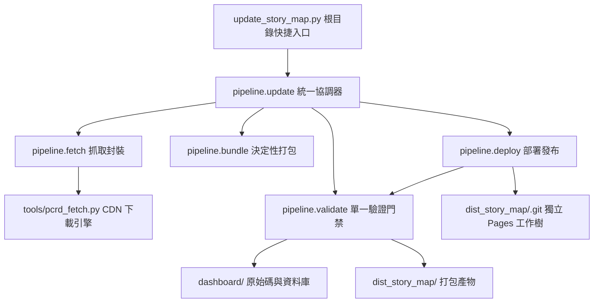

# Phase 3A — Repository Script Inventory 完整盤點報告
> [!IMPORTANT]
> 本文件為 **Phase 3A 靜態盤點成果**。本階段嚴格遵守「**0 檔案移動、0 改名、0 刪除、0 內容修改**」原則，僅進行相依性與風險評估，作為後續 Phase 3B/3C 漸進式整理之安全基準。

---
## 一、 盤點總覽 (Executive Summary)
* **盤點腳本總數 (Total Scripts)**：`140` 支* **目錄分布**：  * 根目錄 (`/`): `49` 支  * `tools/`: `83` 支  * `dashboard/scripts/`: `2` 支  * `pipeline/`: `6` 支* **分類統計 (Category Distribution)**：  * `diagnostic`: `55` 支  * `one_off`: `24` 支  * `maintenance`: `23` 支  * `unknown`: `17` 支  * `core_dependency`: `10` 支  * `legacy`: `9` 支  * `experiment`: `2` 支* **風險等級統計 (Risk Assessment)**：  * `HIGH`: `13` 支  * `LOW`: `104` 支  * `MEDIUM`: `23` 支* **產出報告與快取檔案總數 (Generated/Cache Files)**：`104` 個

---
## 二、 核心管線依賴圖譜 (Core Dependency Map)

---
## 三、 全量腳本詳細盤點清單 (Full Inventory Table)

| 路徑 (Path) | 分類 (Category) | 主要用途 (Purpose) | Story Map 關聯 | 誰引用它 (Referenced By) | 假設 CWD | 硬編碼路徑 | 寫檔 | 網路 | Git | 風險 (Risk) | 建議目的地 | 信心度 |
| :--- | :--- | :--- | :---: | :--- | :---: | :---: | :---: | :---: | :---: | :---: | :--- | :---: |
| `analyze_stills_rate.py` | `diagnostic` | 資料庫、CDN 或素材通用診斷/檢查/統計工具 | `MEDIUM` | 無 | `NO` | `YES` | `NO` | `NO` | `NO` | **`LOW`** | `tools/diagnostics/` | `HIGH` |
| `analyze_story_mapping.py` | `diagnostic` | 資料庫、CDN 或素材通用診斷/檢查/統計工具 | `MEDIUM` | 無 | `NO` | `YES` | `NO` | `NO` | `NO` | **`LOW`** | `tools/diagnostics/` | `HIGH` |
| `analyze_tw_tables.py` | `diagnostic` | 資料庫、CDN 或素材通用診斷/檢查/統計工具 | `MEDIUM` | 無 | `NO` | `NO` | `NO` | `NO` | `NO` | **`LOW`** | `tools/diagnostics/` | `HIGH` |
| `check_1808_assets.py` | `one_off` | 針對過往特定角色/活動/版本的歷史探勘或修補腳本 | `LOW` | 無 | `NO` | `YES` | `NO` | `NO` | `NO` | **`LOW`** | `archive/legacy_scripts/` | `HIGH` |
| `check_astraea_cg.py` | `one_off` | 針對過往特定角色/活動/版本的歷史探勘或修補腳本 | `LOW` | 無 | `NO` | `NO` | `NO` | `YES` | `NO` | **`LOW`** | `archive/legacy_scripts/` | `HIGH` |
| `check_astraea_stills.py` | `one_off` | 針對過往特定角色/活動/版本的歷史探勘或修補腳本 | `LOW` | 無 | `NO` | `YES` | `NO` | `YES` | `NO` | **`LOW`** | `archive/legacy_scripts/` | `HIGH` |
| `check_chara_stories_in_db.py` | `diagnostic` | 資料庫、CDN 或素材通用診斷/檢查/統計工具 | `MEDIUM` | 無 | `NO` | `YES` | `NO` | `NO` | `NO` | **`LOW`** | `tools/diagnostics/` | `HIGH` |
| `check_dist_db.py` | `diagnostic` | 資料庫、CDN 或素材通用診斷/檢查/統計工具 | `MEDIUM` | 無 | `NO` | `YES` | `NO` | `NO` | `NO` | **`LOW`** | `tools/diagnostics/` | `HIGH` |
| `check_new_events_real.py` | `diagnostic` | 資料庫、CDN 或素材通用診斷/檢查/統計工具 | `MEDIUM` | 無 | `NO` | `YES` | `NO` | `NO` | `NO` | **`LOW`** | `tools/diagnostics/` | `HIGH` |
| `check_next_event_cdn.py` | `diagnostic` | 資料庫、CDN 或素材通用診斷/檢查/統計工具 | `MEDIUM` | 無 | `NO` | `NO` | `NO` | `YES` | `NO` | **`LOW`** | `tools/diagnostics/` | `HIGH` |
| `check_reward.py` | `diagnostic` | 資料庫、CDN 或素材通用診斷/檢查/統計工具 | `MEDIUM` | 無 | `NO` | `YES` | `NO` | `NO` | `NO` | **`LOW`** | `tools/diagnostics/` | `HIGH` |
| `check_unit_names.py` | `diagnostic` | 資料庫、CDN 或素材通用診斷/檢查/統計工具 | `MEDIUM` | 無 | `NO` | `YES` | `NO` | `NO` | `NO` | **`LOW`** | `tools/diagnostics/` | `HIGH` |
| `check_winter_chara_status.py` | `one_off` | 針對過往特定角色/活動/版本的歷史探勘或修補腳本 | `LOW` | 無 | `NO` | `YES` | `NO` | `NO` | `NO` | **`LOW`** | `archive/legacy_scripts/` | `HIGH` |
| `check_winter_voices.py` | `one_off` | 針對過往特定角色/活動/版本的歷史探勘或修補腳本 | `LOW` | 無 | `NO` | `YES` | `NO` | `NO` | `NO` | **`LOW`** | `archive/legacy_scripts/` | `HIGH` |
| `dashboard/scripts/bundle_story_map-DESKTOP-N6EC182.py` | `legacy` | 歷史衝突檔、使用者臨時備份或廢棄測試檔案 | `NONE` | 無 | `NO` | `NO` | `YES` | `NO` | `NO` | **`LOW`** | `archive/legacy_scripts/` | `HIGH` |
| `dashboard/scripts/bundle_story_map.py` | `core_dependency` | 核心 Story Map / Pipeline 執行入口或相容依賴 | `HIGH` | `deploy-DESKTOP-N6EC182.py` `deploy.py` `HANDOVER_HOME.md` 等 14 處 | `NO` | `NO` | `YES` | `NO` | `NO` | **`HIGH`** | `keep_in_place` | `HIGH` |
| `deploy-DESKTOP-N6EC182.py` | `legacy` | 歷史衝突檔、使用者臨時備份或廢棄測試檔案 | `NONE` | 無 | `NO` | `NO` | `NO` | `NO` | `YES` | **`LOW`** | `archive/legacy_scripts/` | `HIGH` |
| `deploy.py` | `unknown` | 用途待進一步人工確認之腳本 | `LOW` | `antigravity.md` `README.md` `WEBSITE_REVIEW.md` 等 9 處 | `NO` | `NO` | `YES` | `NO` | `YES` | **`HIGH`** | `keep_in_place` | `LOW` |
| `do_deploy.bat` | `unknown` | 用途待進一步人工確認之腳本 | `LOW` | 無 | `NO` | `NO` | `NO` | `NO` | `YES` | **`MEDIUM`** | `keep_in_place` | `LOW` |
| `download_stories_tw.py` | `maintenance` | CDN 下載、轉換、解碼或 Metadata 重建維護工具 | `HIGH` | `map-DESKTOP-N6EC182.js` `map.js` `map.js` 等 6 處 | `NO` | `NO` | `YES` | `YES` | `NO` | **`LOW`** | `tools/maintenance/` | `HIGH` |
| `download_voices_tw.py` | `maintenance` | CDN 下載、轉換、解碼或 Metadata 重建維護工具 | `HIGH` | `pcrd_fetch-user.py` `pcrd_fetch.py` | `NO` | `NO` | `YES` | `YES` | `NO` | **`LOW`** | `tools/maintenance/` | `HIGH` |
| `download_winter_assets.py` | `maintenance` | CDN 下載、轉換、解碼或 Metadata 重建維護工具 | `HIGH` | 無 | `NO` | `YES` | `YES` | `YES` | `NO` | **`MEDIUM`** | `tools/maintenance/` | `HIGH` |
| `download_winter_m4a.py` | `maintenance` | CDN 下載、轉換、解碼或 Metadata 重建維護工具 | `HIGH` | 無 | `NO` | `YES` | `YES` | `YES` | `NO` | **`MEDIUM`** | `tools/maintenance/` | `HIGH` |
| `find_astraea_stills_all.py` | `one_off` | 針對過往特定角色/活動/版本的歷史探勘或修補腳本 | `LOW` | 無 | `NO` | `YES` | `NO` | `NO` | `NO` | **`LOW`** | `archive/legacy_scripts/` | `HIGH` |
| `find_db_files.py` | `diagnostic` | 資料庫、CDN 或素材通用診斷/檢查/統計工具 | `MEDIUM` | 無 | `NO` | `NO` | `NO` | `NO` | `NO` | **`LOW`** | `tools/diagnostics/` | `HIGH` |
| `find_mimi_misogi_kyoka_stories.py` | `one_off` | 針對過往特定角色/活動/版本的歷史探勘或修補腳本 | `LOW` | 無 | `NO` | `YES` | `NO` | `NO` | `NO` | **`LOW`** | `archive/legacy_scripts/` | `HIGH` |
| `find_mimi_misogi_kyoka_unit_id.py` | `one_off` | 針對過往特定角色/活動/版本的歷史探勘或修補腳本 | `LOW` | 無 | `NO` | `YES` | `NO` | `NO` | `NO` | **`LOW`** | `archive/legacy_scripts/` | `HIGH` |
| `find_real_story_ids.py` | `diagnostic` | 資料庫、CDN 或素材通用診斷/檢查/統計工具 | `MEDIUM` | 無 | `NO` | `YES` | `NO` | `NO` | `NO` | **`LOW`** | `tools/diagnostics/` | `HIGH` |
| `find_special_nodes.py` | `diagnostic` | 資料庫、CDN 或素材通用診斷/檢查/統計工具 | `MEDIUM` | 無 | `NO` | `YES` | `NO` | `NO` | `NO` | **`LOW`** | `tools/diagnostics/` | `HIGH` |
| `find_unit_to_chara_story_mapping.py` | `diagnostic` | 資料庫、CDN 或素材通用診斷/檢查/統計工具 | `MEDIUM` | 無 | `NO` | `YES` | `NO` | `NO` | `NO` | **`LOW`** | `tools/diagnostics/` | `HIGH` |
| `get_cols.py` | `diagnostic` | 資料庫、CDN 或素材通用診斷/檢查/統計工具 | `MEDIUM` | 無 | `NO` | `YES` | `NO` | `NO` | `NO` | **`LOW`** | `tools/diagnostics/` | `HIGH` |
| `get_stills.py` | `diagnostic` | 資料庫、CDN 或素材通用診斷/檢查/統計工具 | `MEDIUM` | 無 | `NO` | `YES` | `NO` | `NO` | `NO` | **`LOW`** | `tools/diagnostics/` | `HIGH` |
| `inspect_chara_story_status.py` | `diagnostic` | 資料庫、CDN 或素材通用診斷/檢查/統計工具 | `MEDIUM` | 無 | `NO` | `YES` | `NO` | `NO` | `NO` | **`LOW`** | `tools/diagnostics/` | `HIGH` |
| `list_jp_tables.py` | `diagnostic` | 資料庫、CDN 或素材通用診斷/檢查/統計工具 | `MEDIUM` | 無 | `NO` | `YES` | `NO` | `NO` | `NO` | **`LOW`** | `tools/diagnostics/` | `HIGH` |
| `list_tables.py` | `diagnostic` | 資料庫、CDN 或素材通用診斷/檢查/統計工具 | `MEDIUM` | 無 | `NO` | `NO` | `NO` | `NO` | `NO` | **`LOW`** | `tools/diagnostics/` | `HIGH` |
| `list_tw_tables.py` | `diagnostic` | 資料庫、CDN 或素材通用診斷/檢查/統計工具 | `MEDIUM` | 無 | `NO` | `YES` | `NO` | `NO` | `NO` | **`LOW`** | `tools/diagnostics/` | `HIGH` |
| `opencode.bat` | `unknown` | 用途待進一步人工確認之腳本 | `LOW` | `OPENCODE_MCP_GUIDE.md` `execution.js` | `NO` | `NO` | `NO` | `NO` | `NO` | **`MEDIUM`** | `keep_in_place` | `LOW` |
| `patch_story_stills.py` | `one_off` | 歷史特定問題修復或資料庫補丁腳本 | `LOW` | 無 | `NO` | `YES` | `YES` | `NO` | `NO` | **`LOW`** | `archive/legacy_scripts/` | `HIGH` |
| `patch_story_stills_1.py` | `one_off` | 歷史特定問題修復或資料庫補丁腳本 | `LOW` | 無 | `NO` | `YES` | `YES` | `NO` | `NO` | **`LOW`** | `archive/legacy_scripts/` | `HIGH` |
| `patch_winter_assets_and_json.py` | `one_off` | 歷史特定問題修復或資料庫補丁腳本 | `LOW` | 無 | `NO` | `YES` | `YES` | `NO` | `NO` | **`LOW`** | `archive/legacy_scripts/` | `HIGH` |
| `pipeline/__init__.py` | `core_dependency` | 核心 Story Map / Pipeline 執行入口或相容依賴 | `HIGH` | `xref-PCRD_AI_Translator.html` `req_uninstall.py` `misc.py` 等 15 處 | `NO` | `NO` | `NO` | `NO` | `NO` | **`HIGH`** | `keep_in_place` | `HIGH` |
| `pipeline/bundle.py` | `core_dependency` | 核心 Story Map / Pipeline 執行入口或相容依賴 | `HIGH` | `antigravity.md` `README.md` `update.py` 等 4 處 | `NO` | `NO` | `YES` | `NO` | `NO` | **`HIGH`** | `keep_in_place` | `HIGH` |
| `pipeline/deploy.py` | `core_dependency` | 核心 Story Map / Pipeline 執行入口或相容依賴 | `HIGH` | `antigravity.md` `README.md` `WEBSITE_REVIEW.md` 等 9 處 | `NO` | `NO` | `NO` | `NO` | `YES` | **`HIGH`** | `keep_in_place` | `HIGH` |
| `pipeline/fetch.py` | `core_dependency` | 核心 Story Map / Pipeline 執行入口或相容依賴 | `HIGH` | `antigravity.md` `README.md` `AGENTS.md` 等 14 處 | `NO` | `NO` | `NO` | `NO` | `NO` | **`HIGH`** | `keep_in_place` | `HIGH` |
| `pipeline/update.py` | `core_dependency` | 核心 Story Map / Pipeline 執行入口或相容依賴 | `HIGH` | `antigravity.md` `README.md` `SKILL.md` 等 6 處 | `NO` | `YES` | `YES` | `NO` | `NO` | **`HIGH`** | `keep_in_place` | `HIGH` |
| `pipeline/validate.py` | `core_dependency` | 核心 Story Map / Pipeline 執行入口或相容依賴 | `HIGH` | `antigravity.md` `README.md` `deploy.py` 等 7 處 | `NO` | `YES` | `NO` | `NO` | `NO` | **`HIGH`** | `keep_in_place` | `HIGH` |
| `probe_astraea_stills_nine.py` | `one_off` | 針對過往特定角色/活動/版本的歷史探勘或修補腳本 | `LOW` | 無 | `NO` | `NO` | `NO` | `YES` | `NO` | **`LOW`** | `archive/legacy_scripts/` | `HIGH` |
| `query_jp_next_event.py` | `diagnostic` | 資料庫、CDN 或素材通用診斷/檢查/統計工具 | `MEDIUM` | 無 | `NO` | `YES` | `NO` | `NO` | `NO` | **`LOW`** | `tools/diagnostics/` | `HIGH` |
| `query_new_db_details.py` | `diagnostic` | 資料庫、CDN 或素材通用診斷/檢查/統計工具 | `MEDIUM` | 無 | `NO` | `YES` | `NO` | `NO` | `NO` | **`LOW`** | `tools/diagnostics/` | `HIGH` |
| `query_next_event_db.py` | `diagnostic` | 資料庫、CDN 或素材通用診斷/檢查/統計工具 | `MEDIUM` | 無 | `NO` | `YES` | `NO` | `NO` | `NO` | **`LOW`** | `tools/diagnostics/` | `HIGH` |
| `query_winter_chara_details.py` | `one_off` | 針對過往特定角色/活動/版本的歷史探勘或修補腳本 | `LOW` | 無 | `NO` | `YES` | `NO` | `NO` | `NO` | **`LOW`** | `archive/legacy_scripts/` | `HIGH` |
| `scan_highest_sonet_version.py` | `unknown` | 用途待進一步人工確認之腳本 | `LOW` | 無 | `NO` | `NO` | `NO` | `YES` | `NO` | **`MEDIUM`** | `keep_in_place` | `LOW` |
| `search_event_names.py` | `diagnostic` | 資料庫、CDN 或素材通用診斷/檢查/統計工具 | `MEDIUM` | 無 | `NO` | `YES` | `NO` | `NO` | `NO` | **`LOW`** | `tools/diagnostics/` | `HIGH` |
| `search_manifest_voices.py` | `diagnostic` | 資料庫、CDN 或素材通用診斷/檢查/統計工具 | `MEDIUM` | 無 | `NO` | `NO` | `NO` | `YES` | `NO` | **`LOW`** | `tools/diagnostics/` | `HIGH` |
| `search_manifest_voices_26.py` | `diagnostic` | 資料庫、CDN 或素材通用診斷/檢查/統計工具 | `MEDIUM` | 無 | `NO` | `NO` | `NO` | `YES` | `NO` | **`LOW`** | `tools/diagnostics/` | `HIGH` |
| `start.bat` | `unknown` | 用途待進一步人工確認之腳本 | `LOW` | `HANDOVER_HOME.md` `spec.py` `ContainerIO.py` 等 4 處 | `NO` | `NO` | `NO` | `NO` | `NO` | **`MEDIUM`** | `keep_in_place` | `LOW` |
| `tools/analyze_spine_js.py` | `diagnostic` | 資料庫、CDN 或素材通用診斷/檢查/統計工具 | `MEDIUM` | 無 | `NO` | `NO` | `NO` | `YES` | `NO` | **`LOW`** | `tools/diagnostics/` | `HIGH` |
| `tools/analyze_spine_path.py` | `diagnostic` | 資料庫、CDN 或素材通用診斷/檢查/統計工具 | `MEDIUM` | 無 | `NO` | `NO` | `NO` | `YES` | `NO` | **`LOW`** | `tools/diagnostics/` | `HIGH` |
| `tools/ask_glm.py` | `experiment` | 日翻中 AI 翻譯器或大語言模型實驗腳本 | `NONE` | 無 | `NO` | `NO` | `YES` | `YES` | `NO` | **`LOW`** | `experiments/translator/` | `HIGH` |
| `tools/auto_refine.py` | `unknown` | 用途待進一步人工確認之腳本 | `LOW` | 無 | `NO` | `NO` | `NO` | `NO` | `NO` | **`MEDIUM`** | `keep_in_place` | `LOW` |
| `tools/check_astraea_details.py` | `one_off` | 針對過往特定角色/活動/版本的歷史探勘或修補腳本 | `LOW` | 無 | `NO` | `YES` | `NO` | `YES` | `NO` | **`LOW`** | `archive/legacy_scripts/` | `HIGH` |
| `tools/check_astraea_skills.py` | `one_off` | 針對過往特定角色/活動/版本的歷史探勘或修補腳本 | `LOW` | 無 | `NO` | `YES` | `NO` | `YES` | `NO` | **`LOW`** | `archive/legacy_scripts/` | `HIGH` |
| `tools/check_ch_count.py` | `diagnostic` | 資料庫、CDN 或素材通用診斷/檢查/統計工具 | `MEDIUM` | 無 | `NO` | `NO` | `NO` | `NO` | `NO` | **`LOW`** | `tools/diagnostics/` | `HIGH` |
| `tools/check_depth.py` | `diagnostic` | 資料庫、CDN 或素材通用診斷/檢查/統計工具 | `MEDIUM` | 無 | `NO` | `YES` | `NO` | `NO` | `NO` | **`LOW`** | `tools/diagnostics/` | `HIGH` |
| `tools/check_pair.py` | `diagnostic` | 資料庫、CDN 或素材通用診斷/檢查/統計工具 | `MEDIUM` | 無 | `NO` | `YES` | `NO` | `NO` | `NO` | **`LOW`** | `tools/diagnostics/` | `HIGH` |
| `tools/check_peco.py` | `one_off` | 針對過往特定角色/活動/版本的歷史探勘或修補腳本 | `LOW` | 無 | `NO` | `NO` | `NO` | `YES` | `NO` | **`LOW`** | `archive/legacy_scripts/` | `HIGH` |
| `tools/check_peco_full.py` | `one_off` | 針對過往特定角色/活動/版本的歷史探勘或修補腳本 | `LOW` | 無 | `NO` | `NO` | `NO` | `YES` | `NO` | **`LOW`** | `archive/legacy_scripts/` | `HIGH` |
| `tools/check_real_chara_count.py` | `diagnostic` | 資料庫、CDN 或素材通用診斷/檢查/統計工具 | `MEDIUM` | 無 | `NO` | `YES` | `NO` | `NO` | `NO` | **`LOW`** | `tools/diagnostics/` | `HIGH` |
| `tools/check_sonet_cdn.py` | `diagnostic` | 資料庫、CDN 或素材通用診斷/檢查/統計工具 | `MEDIUM` | 無 | `NO` | `NO` | `NO` | `YES` | `NO` | **`LOW`** | `tools/diagnostics/` | `HIGH` |
| `tools/check_stack.py` | `diagnostic` | 資料庫、CDN 或素材通用診斷/檢查/統計工具 | `MEDIUM` | 無 | `NO` | `YES` | `NO` | `NO` | `NO` | **`LOW`** | `tools/diagnostics/` | `HIGH` |
| `tools/check_syntax.py` | `diagnostic` | 資料庫、CDN 或素材通用診斷/檢查/統計工具 | `MEDIUM` | 無 | `NO` | `YES` | `NO` | `NO` | `NO` | **`LOW`** | `tools/diagnostics/` | `HIGH` |
| `tools/convert_voices.py` | `maintenance` | CDN 下載、轉換、解碼或 Metadata 重建維護工具 | `HIGH` | `SKILL.md` `SKILL.md` `pcrd_fetch-user.py` 等 4 處 | `NO` | `NO` | `YES` | `YES` | `NO` | **`HIGH`** | `keep_in_place` | `HIGH` |
| `tools/debug_deobfuscate.py` | `unknown` | 用途待進一步人工確認之腳本 | `LOW` | 無 | `NO` | `YES` | `NO` | `NO` | `NO` | **`MEDIUM`** | `keep_in_place` | `LOW` |
| `tools/deobfuscate_db.py` | `maintenance` | CDN 下載、轉換、解碼或 Metadata 重建維護工具 | `HIGH` | 無 | `NO` | `NO` | `NO` | `NO` | `NO` | **`LOW`** | `tools/maintenance/` | `HIGH` |
| `tools/deobfuscate_db_v2.py` | `maintenance` | CDN 下載、轉換、解碼或 Metadata 重建維護工具 | `HIGH` | 無 | `NO` | `NO` | `YES` | `NO` | `NO` | **`LOW`** | `tools/maintenance/` | `HIGH` |
| `tools/download_peco_assets.py` | `maintenance` | CDN 下載、轉換、解碼或 Metadata 重建維護工具 | `HIGH` | 無 | `NO` | `NO` | `YES` | `YES` | `NO` | **`LOW`** | `tools/maintenance/` | `HIGH` |
| `tools/download_peco_assets_estertion.py` | `maintenance` | CDN 下載、轉換、解碼或 Metadata 重建維護工具 | `HIGH` | 無 | `NO` | `NO` | `YES` | `YES` | `NO` | **`LOW`** | `tools/maintenance/` | `HIGH` |
| `tools/download_peco_stories_direct.py` | `maintenance` | CDN 下載、轉換、解碼或 Metadata 重建維護工具 | `HIGH` | 無 | `NO` | `NO` | `YES` | `YES` | `NO` | **`LOW`** | `tools/maintenance/` | `HIGH` |
| `tools/download_stories.py` | `maintenance` | CDN 下載、轉換、解碼或 Metadata 重建維護工具 | `HIGH` | `redownload_failed.py` `check_and_redownload_failed_stories.py` `map_js_backup.js` | `NO` | `NO` | `YES` | `YES` | `NO` | **`LOW`** | `tools/maintenance/` | `HIGH` |
| `tools/download_wthee_tw_db.py` | `maintenance` | CDN 下載、轉換、解碼或 Metadata 重建維護工具 | `HIGH` | 無 | `NO` | `YES` | `YES` | `YES` | `NO` | **`MEDIUM`** | `tools/maintenance/` | `HIGH` |
| `tools/extract_tw_peco_all.py` | `unknown` | 用途待進一步人工確認之腳本 | `LOW` | 無 | `NO` | `NO` | `YES` | `YES` | `NO` | **`MEDIUM`** | `keep_in_place` | `LOW` |
| `tools/fetch_bulk.py` | `maintenance` | CDN 下載、轉換、解碼或 Metadata 重建維護工具 | `HIGH` | 無 | `NO` | `YES` | `YES` | `YES` | `NO` | **`MEDIUM`** | `tools/maintenance/` | `HIGH` |
| `tools/fetch_data.py` | `maintenance` | CDN 下載、轉換、解碼或 Metadata 重建維護工具 | `HIGH` | 無 | `NO` | `NO` | `YES` | `YES` | `NO` | **`LOW`** | `tools/maintenance/` | `HIGH` |
| `tools/fetch_db_from_sonet.py` | `maintenance` | CDN 下載、轉換、解碼或 Metadata 重建維護工具 | `HIGH` | `test_db_bytes.py` | `NO` | `NO` | `YES` | `YES` | `NO` | **`LOW`** | `tools/maintenance/` | `HIGH` |
| `tools/fetch_garupan_bundle.py` | `maintenance` | CDN 下載、轉換、解碼或 Metadata 重建維護工具 | `HIGH` | 無 | `YES` | `NO` | `YES` | `YES` | `NO` | **`LOW`** | `tools/maintenance/` | `HIGH` |
| `tools/fetch_gvg_tasks.py` | `maintenance` | CDN 下載、轉換、解碼或 Metadata 重建維護工具 | `HIGH` | `cron_fetch_tw.py` `local_sync_server.py` | `NO` | `NO` | `YES` | `YES` | `NO` | **`LOW`** | `tools/maintenance/` | `HIGH` |
| `tools/fetch_npc_avatar.py` | `maintenance` | CDN 下載、轉換、解碼或 Metadata 重建維護工具 | `HIGH` | 無 | `NO` | `NO` | `YES` | `YES` | `NO` | **`LOW`** | `tools/maintenance/` | `HIGH` |
| `tools/fetch_story_still.py` | `maintenance` | CDN 下載、轉換、解碼或 Metadata 重建維護工具 | `HIGH` | 無 | `NO` | `NO` | `YES` | `YES` | `NO` | **`LOW`** | `tools/maintenance/` | `HIGH` |
| `tools/find_astraea_peco.py` | `one_off` | 針對過往特定角色/活動/版本的歷史探勘或修補腳本 | `LOW` | 無 | `NO` | `YES` | `NO` | `YES` | `NO` | **`LOW`** | `archive/legacy_scripts/` | `HIGH` |
| `tools/find_exact_peco.py` | `one_off` | 針對過往特定角色/活動/版本的歷史探勘或修補腳本 | `LOW` | 無 | `NO` | `YES` | `NO` | `YES` | `NO` | **`LOW`** | `archive/legacy_scripts/` | `HIGH` |
| `tools/find_npc_unit_id.py` | `diagnostic` | 資料庫、CDN 或素材通用診斷/檢查/統計工具 | `MEDIUM` | 無 | `NO` | `YES` | `NO` | `NO` | `NO` | **`LOW`** | `tools/diagnostics/` | `HIGH` |
| `tools/find_peco_stills.py` | `one_off` | 針對過往特定角色/活動/版本的歷史探勘或修補腳本 | `LOW` | 無 | `NO` | `YES` | `YES` | `YES` | `NO` | **`LOW`** | `archive/legacy_scripts/` | `HIGH` |
| `tools/find_sound_assets.py` | `diagnostic` | 資料庫、CDN 或素材通用診斷/檢查/統計工具 | `MEDIUM` | 無 | `NO` | `NO` | `NO` | `YES` | `NO` | **`LOW`** | `tools/diagnostics/` | `HIGH` |
| `tools/find_story_detail.py` | `diagnostic` | 資料庫、CDN 或素材通用診斷/檢查/統計工具 | `MEDIUM` | 無 | `NO` | `YES` | `NO` | `NO` | `NO` | **`LOW`** | `tools/diagnostics/` | `HIGH` |
| `tools/find_tw_peco_data.py` | `one_off` | 針對過往特定角色/活動/版本的歷史探勘或修補腳本 | `LOW` | 無 | `NO` | `YES` | `NO` | `NO` | `NO` | **`LOW`** | `archive/legacy_scripts/` | `HIGH` |
| `tools/fix.py` | `unknown` | 用途待進一步人工確認之腳本 | `LOW` | `xref-PCRD_AI_Translator.html` | `NO` | `NO` | `YES` | `NO` | `NO` | **`MEDIUM`** | `keep_in_place` | `LOW` |
| `tools/force_deploy.py` | `unknown` | 用途待進一步人工確認之腳本 | `LOW` | 無 | `NO` | `NO` | `NO` | `NO` | `YES` | **`MEDIUM`** | `keep_in_place` | `LOW` |
| `tools/gemini_web_agent.py` | `unknown` | 用途待進一步人工確認之腳本 | `LOW` | 無 | `NO` | `NO` | `YES` | `NO` | `NO` | **`MEDIUM`** | `keep_in_place` | `LOW` |
| `tools/generate_event_summaries.py` | `maintenance` | CDN 下載、轉換、解碼或 Metadata 重建維護工具 | `HIGH` | 無 | `NO` | `NO` | `YES` | `YES` | `NO` | **`LOW`** | `tools/maintenance/` | `HIGH` |
| `tools/generate_final_report.py` | `unknown` | 用途待進一步人工確認之腳本 | `LOW` | 無 | `NO` | `YES` | `YES` | `NO` | `NO` | **`MEDIUM`** | `keep_in_place` | `LOW` |
| `tools/generate_long_chapter_summaries.py` | `unknown` | 用途待進一步人工確認之腳本 | `LOW` | 無 | `NO` | `YES` | `YES` | `YES` | `NO` | **`MEDIUM`** | `keep_in_place` | `LOW` |
| `tools/generate_story_line_md.py` | `maintenance` | CDN 下載、轉換、解碼或 Metadata 重建維護工具 | `HIGH` | 無 | `NO` | `YES` | `YES` | `NO` | `NO` | **`MEDIUM`** | `tools/maintenance/` | `HIGH` |
| `tools/generate_story_summaries.py` | `maintenance` | CDN 下載、轉換、解碼或 Metadata 重建維護工具 | `HIGH` | 無 | `NO` | `YES` | `YES` | `YES` | `NO` | **`MEDIUM`** | `tools/maintenance/` | `HIGH` |
| `tools/hello_ollama.py` | `experiment` | 日翻中 AI 翻譯器或大語言模型實驗腳本 | `NONE` | `call_ollama.py` `prompt.txt` | `NO` | `NO` | `NO` | `NO` | `NO` | **`MEDIUM`** | `experiments/translator/` | `HIGH` |
| `tools/inspect_main_manifest.py` | `diagnostic` | 資料庫、CDN 或素材通用診斷/檢查/統計工具 | `MEDIUM` | 無 | `NO` | `NO` | `NO` | `YES` | `NO` | **`LOW`** | `tools/diagnostics/` | `HIGH` |
| `tools/inspect_master_manifest.py` | `diagnostic` | 資料庫、CDN 或素材通用診斷/檢查/統計工具 | `MEDIUM` | 無 | `NO` | `NO` | `NO` | `YES` | `NO` | **`LOW`** | `tools/diagnostics/` | `HIGH` |
| `tools/inspect_story_commands.py` | `diagnostic` | 資料庫、CDN 或素材通用診斷/檢查/統計工具 | `MEDIUM` | 無 | `NO` | `NO` | `NO` | `YES` | `NO` | **`LOW`** | `tools/diagnostics/` | `HIGH` |
| `tools/inspect_story_models.py` | `diagnostic` | 資料庫、CDN 或素材通用診斷/檢查/統計工具 | `MEDIUM` | 無 | `NO` | `NO` | `NO` | `YES` | `NO` | **`LOW`** | `tools/diagnostics/` | `HIGH` |
| `tools/local_server.py` | `unknown` | 用途待進一步人工確認之腳本 | `LOW` | `README.md` `classify_all_scripts.py` | `NO` | `NO` | `NO` | `NO` | `NO` | **`MEDIUM`** | `keep_in_place` | `LOW` |
| `tools/monitor_deploy.py` | `unknown` | 用途待進一步人工確認之腳本 | `LOW` | 無 | `NO` | `NO` | `NO` | `YES` | `NO` | **`MEDIUM`** | `keep_in_place` | `LOW` |
| `tools/monitor_sonet_update.py` | `maintenance` | CDN 下載、轉換、解碼或 Metadata 重建維護工具 | `HIGH` | `SKILL.md` `pcrd_version_update_history-user.md` | `NO` | `NO` | `YES` | `YES` | `NO` | **`HIGH`** | `keep_in_place` | `HIGH` |
| `tools/pcrd_deploy-user.py` | `legacy` | 歷史衝突檔、使用者臨時備份或廢棄測試檔案 | `NONE` | 無 | `NO` | `YES` | `YES` | `YES` | `YES` | **`LOW`** | `archive/legacy_scripts/` | `HIGH` |
| `tools/pcrd_deploy.py` | `core_dependency` | 核心 Story Map / Pipeline 執行入口或相容依賴 | `HIGH` | `SKILL.md` `analyze_inventory.py` `classify_all_scripts.py` 等 4 處 | `NO` | `YES` | `YES` | `YES` | `YES` | **`HIGH`** | `keep_in_place` | `HIGH` |
| `tools/pcrd_fetch-user.py` | `legacy` | 歷史衝突檔、使用者臨時備份或廢棄測試檔案 | `NONE` | 無 | `NO` | `YES` | `YES` | `YES` | `NO` | **`LOW`** | `archive/legacy_scripts/` | `HIGH` |
| `tools/pcrd_fetch.py` | `core_dependency` | 核心 Story Map / Pipeline 執行入口或相容依賴 | `HIGH` | `AGENTS.md` `SKILL.md` `SKILL.md` 等 13 處 | `NO` | `YES` | `YES` | `YES` | `NO` | **`HIGH`** | `keep_in_place` | `HIGH` |
| `tools/probe_asset_version.py` | `diagnostic` | 資料庫、CDN 或素材通用診斷/檢查/統計工具 | `MEDIUM` | 無 | `NO` | `NO` | `NO` | `YES` | `NO` | **`LOW`** | `tools/diagnostics/` | `HIGH` |
| `tools/probe_db_manifest.py` | `diagnostic` | 資料庫、CDN 或素材通用診斷/檢查/統計工具 | `MEDIUM` | 無 | `NO` | `NO` | `NO` | `YES` | `NO` | **`LOW`** | `tools/diagnostics/` | `HIGH` |
| `tools/probe_db_name.py` | `diagnostic` | 資料庫、CDN 或素材通用診斷/檢查/統計工具 | `MEDIUM` | 無 | `NO` | `NO` | `NO` | `YES` | `NO` | **`LOW`** | `tools/diagnostics/` | `HIGH` |
| `tools/probe_db_url.py` | `diagnostic` | 資料庫、CDN 或素材通用診斷/檢查/統計工具 | `MEDIUM` | 無 | `NO` | `NO` | `NO` | `YES` | `NO` | **`LOW`** | `tools/diagnostics/` | `HIGH` |
| `tools/probe_no_jpn_master.py` | `diagnostic` | 資料庫、CDN 或素材通用診斷/檢查/統計工具 | `MEDIUM` | 無 | `NO` | `NO` | `NO` | `YES` | `NO` | **`LOW`** | `tools/diagnostics/` | `HIGH` |
| `tools/probe_peco_story.py` | `one_off` | 針對過往特定角色/活動/版本的歷史探勘或修補腳本 | `LOW` | 無 | `NO` | `YES` | `NO` | `NO` | `NO` | **`LOW`** | `archive/legacy_scripts/` | `HIGH` |
| `tools/probe_sonet_only.py` | `diagnostic` | 資料庫、CDN 或素材通用診斷/檢查/統計工具 | `MEDIUM` | 無 | `NO` | `NO` | `NO` | `YES` | `NO` | **`LOW`** | `tools/diagnostics/` | `HIGH` |
| `tools/probe_sound_manifest.py` | `diagnostic` | 資料庫、CDN 或素材通用診斷/檢查/統計工具 | `MEDIUM` | 無 | `NO` | `NO` | `NO` | `YES` | `NO` | **`LOW`** | `tools/diagnostics/` | `HIGH` |
| `tools/probe_story_binary.py` | `diagnostic` | 資料庫、CDN 或素材通用診斷/檢查/統計工具 | `MEDIUM` | 無 | `NO` | `NO` | `NO` | `YES` | `NO` | **`LOW`** | `tools/diagnostics/` | `HIGH` |
| `tools/probe_urls.py` | `diagnostic` | 資料庫、CDN 或素材通用診斷/檢查/統計工具 | `MEDIUM` | 無 | `NO` | `NO` | `NO` | `YES` | `NO` | **`LOW`** | `tools/diagnostics/` | `HIGH` |
| `tools/query_huanbian.py` | `diagnostic` | 資料庫、CDN 或素材通用診斷/檢查/統計工具 | `MEDIUM` | 無 | `NO` | `YES` | `NO` | `NO` | `NO` | **`LOW`** | `tools/diagnostics/` | `HIGH` |
| `tools/query_other.py` | `diagnostic` | 資料庫、CDN 或素材通用診斷/檢查/統計工具 | `MEDIUM` | 無 | `NO` | `YES` | `NO` | `NO` | `NO` | **`LOW`** | `tools/diagnostics/` | `HIGH` |
| `tools/query_recent_events.py` | `diagnostic` | 資料庫、CDN 或素材通用診斷/檢查/統計工具 | `MEDIUM` | 無 | `NO` | `YES` | `NO` | `NO` | `NO` | **`LOW`** | `tools/diagnostics/` | `HIGH` |
| `tools/query_story.py` | `diagnostic` | 資料庫、CDN 或素材通用診斷/檢查/統計工具 | `MEDIUM` | 無 | `NO` | `YES` | `NO` | `NO` | `NO` | **`LOW`** | `tools/diagnostics/` | `HIGH` |
| `tools/query_unit_name.py` | `diagnostic` | 資料庫、CDN 或素材通用診斷/檢查/統計工具 | `MEDIUM` | 無 | `NO` | `NO` | `NO` | `NO` | `NO` | **`LOW`** | `tools/diagnostics/` | `HIGH` |
| `tools/redownload_tw_db.py` | `unknown` | 用途待進一步人工確認之腳本 | `LOW` | 無 | `NO` | `YES` | `YES` | `YES` | `NO` | **`MEDIUM`** | `keep_in_place` | `LOW` |
| `tools/restore_clean_tw_db.py` | `one_off` | 歷史特定問題修復或資料庫補丁腳本 | `LOW` | 無 | `NO` | `NO` | `YES` | `YES` | `NO` | **`LOW`** | `archive/legacy_scripts/` | `HIGH` |
| `tools/restore_dashboard_tables.py` | `one_off` | 歷史特定問題修復或資料庫補丁腳本 | `LOW` | 無 | `NO` | `NO` | `NO` | `NO` | `NO` | **`LOW`** | `archive/legacy_scripts/` | `HIGH` |
| `tools/scan_latest_units.py` | `legacy` | 歷史衝突檔、使用者臨時備份或廢棄測試檔案 | `NONE` | 無 | `NO` | `NO` | `NO` | `YES` | `NO` | **`LOW`** | `archive/legacy_scripts/` | `HIGH` |
| `tools/temp_query.py` | `legacy` | 歷史衝突檔、使用者臨時備份或廢棄測試檔案 | `NONE` | 無 | `NO` | `YES` | `NO` | `NO` | `NO` | **`LOW`** | `archive/legacy_scripts/` | `HIGH` |
| `tools/test_astraea_cdn.py` | `legacy` | 歷史衝突檔、使用者臨時備份或廢棄測試檔案 | `NONE` | 無 | `NO` | `NO` | `NO` | `YES` | `NO` | **`LOW`** | `archive/legacy_scripts/` | `HIGH` |
| `tools/test_inline.py` | `legacy` | 歷史衝突檔、使用者臨時備份或廢棄測試檔案 | `NONE` | 無 | `NO` | `NO` | `YES` | `NO` | `NO` | **`LOW`** | `archive/legacy_scripts/` | `HIGH` |
| `tools/test_real_peco_cdn.py` | `legacy` | 歷史衝突檔、使用者臨時備份或廢棄測試檔案 | `NONE` | 無 | `NO` | `NO` | `NO` | `YES` | `NO` | **`LOW`** | `archive/legacy_scripts/` | `HIGH` |
| `tools/trace_brackets.py` | `unknown` | 用途待進一步人工確認之腳本 | `LOW` | 無 | `NO` | `YES` | `NO` | `NO` | `NO` | **`MEDIUM`** | `keep_in_place` | `LOW` |
| `update_story_map.py` | `core_dependency` | 核心 Story Map / Pipeline 執行入口或相容依賴 | `HIGH` | `antigravity.md` `README.md` `AGENTS.md` 等 7 處 | `NO` | `NO` | `NO` | `NO` | `NO` | **`HIGH`** | `keep_in_place` | `HIGH` |

---
## 四、 建議 Phase 3B 第一批安全遷移候選 (Safe First Batch Candidates)
以下腳本經靜態分析確認：**無外部依賴、不改正式資料庫、無 Git 副作用、風險為 LOW**，適合於 Phase 3B 作為第一小批次（約 10 支）進行漸進式移動試點：

| 腳本路徑 | 目前分類 | 主要用途 | 建議目的地 |
| :--- | :--- | :--- | :--- |
| `analyze_stills_rate.py` | `diagnostic` | 資料庫、CDN 或素材通用診斷/檢查/統計工具 | `tools/diagnostics/` |
| `analyze_story_mapping.py` | `diagnostic` | 資料庫、CDN 或素材通用診斷/檢查/統計工具 | `tools/diagnostics/` |
| `analyze_tw_tables.py` | `diagnostic` | 資料庫、CDN 或素材通用診斷/檢查/統計工具 | `tools/diagnostics/` |
| `check_1808_assets.py` | `one_off` | 針對過往特定角色/活動/版本的歷史探勘或修補腳本 | `archive/legacy_scripts/` |
| `check_astraea_cg.py` | `one_off` | 針對過往特定角色/活動/版本的歷史探勘或修補腳本 | `archive/legacy_scripts/` |
| `check_astraea_stills.py` | `one_off` | 針對過往特定角色/活動/版本的歷史探勘或修補腳本 | `archive/legacy_scripts/` |
| `check_chara_stories_in_db.py` | `diagnostic` | 資料庫、CDN 或素材通用診斷/檢查/統計工具 | `tools/diagnostics/` |
| `check_dist_db.py` | `diagnostic` | 資料庫、CDN 或素材通用診斷/檢查/統計工具 | `tools/diagnostics/` |
| `check_new_events_real.py` | `diagnostic` | 資料庫、CDN 或素材通用診斷/檢查/統計工具 | `tools/diagnostics/` |
| `check_next_event_cdn.py` | `diagnostic` | 資料庫、CDN 或素材通用診斷/檢查/統計工具 | `tools/diagnostics/` |

---
## 五、 特別保護與暫不可搬動清單 (Do Not Touch Yet)
以下檔案具備 **HIGH 風險**、為核心管線直接依賴、涉及 Agent Skills 或分類為 **unknown**，本階段及 Phase 3B 均嚴禁搬動：

* 🛑 **`dashboard/scripts/bundle_story_map.py`** (core_dependency)：核心 Story Map / Pipeline 執行入口或相容依賴 (風險: `HIGH`，建議: `keep_in_place`)* 🛑 **`deploy.py`** (unknown)：用途待進一步人工確認之腳本 (風險: `HIGH`，建議: `keep_in_place`)* 🛑 **`do_deploy.bat`** (unknown)：用途待進一步人工確認之腳本 (風險: `MEDIUM`，建議: `keep_in_place`)* 🛑 **`opencode.bat`** (unknown)：用途待進一步人工確認之腳本 (風險: `MEDIUM`，建議: `keep_in_place`)* 🛑 **`pipeline/__init__.py`** (core_dependency)：核心 Story Map / Pipeline 執行入口或相容依賴 (風險: `HIGH`，建議: `keep_in_place`)* 🛑 **`pipeline/bundle.py`** (core_dependency)：核心 Story Map / Pipeline 執行入口或相容依賴 (風險: `HIGH`，建議: `keep_in_place`)* 🛑 **`pipeline/deploy.py`** (core_dependency)：核心 Story Map / Pipeline 執行入口或相容依賴 (風險: `HIGH`，建議: `keep_in_place`)* 🛑 **`pipeline/fetch.py`** (core_dependency)：核心 Story Map / Pipeline 執行入口或相容依賴 (風險: `HIGH`，建議: `keep_in_place`)* 🛑 **`pipeline/update.py`** (core_dependency)：核心 Story Map / Pipeline 執行入口或相容依賴 (風險: `HIGH`，建議: `keep_in_place`)* 🛑 **`pipeline/validate.py`** (core_dependency)：核心 Story Map / Pipeline 執行入口或相容依賴 (風險: `HIGH`，建議: `keep_in_place`)* 🛑 **`scan_highest_sonet_version.py`** (unknown)：用途待進一步人工確認之腳本 (風險: `MEDIUM`，建議: `keep_in_place`)* 🛑 **`start.bat`** (unknown)：用途待進一步人工確認之腳本 (風險: `MEDIUM`，建議: `keep_in_place`)* 🛑 **`tools/auto_refine.py`** (unknown)：用途待進一步人工確認之腳本 (風險: `MEDIUM`，建議: `keep_in_place`)* 🛑 **`tools/convert_voices.py`** (maintenance)：CDN 下載、轉換、解碼或 Metadata 重建維護工具 (風險: `HIGH`，建議: `keep_in_place`)* 🛑 **`tools/debug_deobfuscate.py`** (unknown)：用途待進一步人工確認之腳本 (風險: `MEDIUM`，建議: `keep_in_place`)* 🛑 **`tools/extract_tw_peco_all.py`** (unknown)：用途待進一步人工確認之腳本 (風險: `MEDIUM`，建議: `keep_in_place`)* 🛑 **`tools/fix.py`** (unknown)：用途待進一步人工確認之腳本 (風險: `MEDIUM`，建議: `keep_in_place`)* 🛑 **`tools/force_deploy.py`** (unknown)：用途待進一步人工確認之腳本 (風險: `MEDIUM`，建議: `keep_in_place`)* 🛑 **`tools/gemini_web_agent.py`** (unknown)：用途待進一步人工確認之腳本 (風險: `MEDIUM`，建議: `keep_in_place`)* 🛑 **`tools/generate_final_report.py`** (unknown)：用途待進一步人工確認之腳本 (風險: `MEDIUM`，建議: `keep_in_place`)* 🛑 **`tools/generate_long_chapter_summaries.py`** (unknown)：用途待進一步人工確認之腳本 (風險: `MEDIUM`，建議: `keep_in_place`)* 🛑 **`tools/local_server.py`** (unknown)：用途待進一步人工確認之腳本 (風險: `MEDIUM`，建議: `keep_in_place`)* 🛑 **`tools/monitor_deploy.py`** (unknown)：用途待進一步人工確認之腳本 (風險: `MEDIUM`，建議: `keep_in_place`)* 🛑 **`tools/monitor_sonet_update.py`** (maintenance)：CDN 下載、轉換、解碼或 Metadata 重建維護工具 (風險: `HIGH`，建議: `keep_in_place`)* 🛑 **`tools/pcrd_deploy.py`** (core_dependency)：核心 Story Map / Pipeline 執行入口或相容依賴 (風險: `HIGH`，建議: `keep_in_place`)* 🛑 **`tools/pcrd_fetch.py`** (core_dependency)：核心 Story Map / Pipeline 執行入口或相容依賴 (風險: `HIGH`，建議: `keep_in_place`)* 🛑 **`tools/redownload_tw_db.py`** (unknown)：用途待進一步人工確認之腳本 (風險: `MEDIUM`，建議: `keep_in_place`)* 🛑 **`tools/trace_brackets.py`** (unknown)：用途待進一步人工確認之腳本 (風險: `MEDIUM`，建議: `keep_in_place`)* 🛑 **`update_story_map.py`** (core_dependency)：核心 Story Map / Pipeline 執行入口或相容依賴 (風險: `HIGH`，建議: `keep_in_place`)

---
## 六、 產出報告、快取與暫存檔案統計 (Generated & Temporary Files)
盤點倉庫中存在的歷史報告與暫存產物（本階段均保持原樣，不進行刪除）：

| 檔案路徑 | 類型 | 檔案大小 (Bytes) |
| :--- | :--- | :--- |
| `api_resp.txt` | `cache` | 48 |
| `build_output.txt` | `cache` | 2,326 |
| `peco_astraea_report.md` | `generated_report` | 8,323 |
| `scratch_refine_15_report.json` | `generated_report` | 18,381 |
| `scratch_refine_next_15_report.json` | `generated_report` | 12,867 |
| `scratch_refine_stage3_report.json` | `generated_report` | 10,322 |
| `scratch_refine_stage4_report.json` | `generated_report` | 23,016 |
| `scratch_refine_stage5_report.json` | `generated_report` | 22,422 |
| `temp_4010215.unity3d` | `temporary_output` | 5,711 |
| `temp_jp.db` | `temporary_output` | 16,318,464 |
| `temp_redive.db` | `temporary_output` | 0 |
| `dashboard/still/bg/temp_bg_500010.unity3d` | `temporary_output` | 510,087 |
| `dashboard/still/bg/temp_bg_500030.unity3d` | `temporary_output` | 536,625 |
| `dashboard/still/bg/temp_bg_500140.unity3d` | `temporary_output` | 471,434 |
| `dashboard/still/bg/temp_bg_500180.unity3d` | `temporary_output` | 521,121 |
| `dashboard/still/bg/temp_bg_500253.unity3d` | `temporary_output` | 403,300 |
| `dashboard/still/bg/temp_bg_500270.unity3d` | `temporary_output` | 499,799 |
| `dashboard/still/bg/temp_bg_500361.unity3d` | `temporary_output` | 416,558 |
| `dashboard/still/bg/temp_bg_500367.unity3d` | `temporary_output` | 367,685 |
| `dashboard/still/bg/temp_bg_500522.unity3d` | `temporary_output` | 158,473 |
| `dashboard/still/bg/temp_bg_500587.unity3d` | `temporary_output` | 415,974 |
| `dashboard/still/bg/temp_bg_500588.unity3d` | `temporary_output` | 430,826 |
| `dashboard/still/bg/temp_bg_500890.unity3d` | `temporary_output` | 398,039 |
| `dashboard/still/bg/temp_bg_500891.unity3d` | `temporary_output` | 390,745 |
| `dashboard/still/bg/temp_bg_500892.unity3d` | `temporary_output` | 456,814 |
| ... 以及其餘 79 個暫存/報告檔案 | - | - |

---
## 七、 建議 Phase 3B 執行範疇與邊界 (Proposed Phase 3B Scope)
1. **規模控制**：僅限上述第四節列出的 **10 支 LOW risk 獨立診斷與歷史修補腳本**。
2. **遷移防禦原則**：
   * 搬移至 `tools/diagnostics/` 或 `archive/legacy_scripts/`。
   * 移動後立即更新其內部的 `sys.path` 與 `PROJECT_ROOT` 定位。
   * 移動後逐一執行單元測試，確認功能完全正常。
3. **核心保護**：所有 `pipeline/`、`update_story_map.py`、`tools/pcrd_fetch.py`、`tools/pcrd_deploy.py` 絕對不動。
