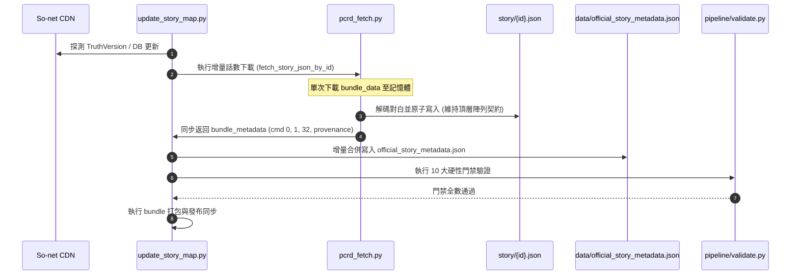

# Issue #2 — Design Review D2.2
# Story Map 官方故事元數據持久化策略決策記錄 (Architecture Decision Record)

> **版本**：1.2.0 (Architecture Decision Record — D2.2 Final Contract Correction)<br/>
> **基準 Commit**：`8a9d24c6d38a18dbcb57f24913443ed3ca60af22` (D2.1 Final)<br/>
> **分支**：`design/story-metadata-persistence-decision`  
> **審查模式**：Evidence-Calibrated Architecture Decision Mode  
> **性質**：架構決策記錄 (ADR) — 正式選定持久化策略，定義資料契約與管線規範（唯讀設計，本階段不修改 production 代碼）

---

## 1. Context (背景與前情脈絡)

在 [Research R1](STORY_ASSETBUNDLE_COMMAND_INVENTORY.md) 與 [Research R2](STORY_ASSETBUNDLE_COMMAND_SEMANTICS_R2.md) 的逆向工程中，專案團隊成功證實了 So-net 官方 CDN 的 `storydata_*.unity3d` AssetBundle 中蘊含著高度有價值的官方中文元數據：
- `cmd 1`：**官方長篇劇情大綱 (Official Synopsis)**，繁中情節摘要，抽樣存在率 100.0% (180/180)，非空率 89.4% (161/180)；
- `cmd 32`：**話數副標題／話名 (Episode Subtitle)**，存在率 88.9% (160/180)；
- `cmd 0`：**話數序號／主標題 (Chapter Title Metadata)**，存在率 100.0% (180/180)。

然而在 [Design Review D1](STORY_METADATA_PERSISTENCE_DESIGN_REVIEW_D1.md) 的架構盤點中確認：
1. **現有契約極度脆弱且具硬約束**：全量 9,033 篇數字 ID 的 `story/{id}.json` 均為**頂層 JSON 陣列 (Top-level Array)**，前端 `dialogue-normalizer.js`、`map.js`、`characters.js` 以及門禁 `pipeline/validate.py` 均對此結構有**不可違逆的硬性斷言**。
2. **大綱渲染存在歷史遺留缺陷**：桌面版詳情面板因依賴資料庫查詢 `sub_title`，在查無記錄或空值時會觸發硬編碼的回退字串「本話為重要主線劇情，美食殿堂的羈絆在此得到了進一步的昇華。」並標註為「📌 官方大綱」，嚴重違反專案真實性原則。

本決策記錄 (D2.2) 旨在正式解決：**「如何以零破壞、高擴展、易維護的方式，將話數層級的官方元數據持久化並整合入 Story Map 產品管線中？」**

---

## 2. Decision Drivers (決策驅動因素)

本決策依據專案現有架構邊界與長期維護目標，確立以下核心考量因素：
1. **零中斷向後相容 (Zero-Breaking Compatibility)**：絕不允許改動現有 9,033 篇故事 JSON 的頂層陣列契約，確保既有閱讀器、角色詳情與外部爬蟲消費端 100% 正常運作。
2. **檔案系統與儲存邊界 (File-System & Footprint Protection)**：不激增 9,033 個實體小檔案，保護 Windows NTFS 檔案系統與 Git 追蹤效能。
3. **職責分離與單一真實來源 (Single Source of Truth & Separation of Concerns)**：不撕裂既有 `chapters.json`（主線章節樹）與 `event_summaries.json`（活動列表）的領域職責，提供集中、清晰、可獨立驗證的話數元數據清單。
4. **管線更新與故障隔離 (Pipeline Simplicity & Fault Isolation)**：能在 `update_story_map.py` 增量同步時以單一檔案完成原子更新，且元數據異常時僅大綱面板優雅降級，對白閱讀完全不受波及。
5. **官方文本誠信原則 (Official Metadata Integrity)**：嚴格落實防幻覺準則，大綱僅來源於 `cmd 1`，空值時誠實隱藏或顯示未提供，嚴禁任何假造文案或假 fallback。
6. **分層架構隔離 (Layered Data Separation)**：本輪僅解決 Episode-level Singleton Metadata 的持久化，明確延後 Ordered In-Story Events，避免過早複雜化。

---

## 3. Considered Options (候選方案概述)

本評估針對以下四種架構策略進行全面橫向對比：

* **方案 A：Dedicated Sidecar Manifest (專屬側車索引清單)**
  在 `dashboard/data/` 建立單一集中式元數據清單檔案（`official_story_metadata.json`），將全量話數之 Episode-level Singleton Metadata 集中管理。
* **方案 B：Independent Metadata JSON (獨立話數元數據檔案)**
  在 `dashboard/metadata/` 目錄下建立 9,033 個與對白檔一一對應的小型 JSON 檔案（例如 `metadata/{story_id}.json`）。
* **方案 C：Story Schema Migration (對白檔案結構重構遷移)**
  直接修改現有 9,033 篇 `story/{story_id}.json`，將頂層陣列改寫為物件結構（如 `{ "metadata": {...}, "dialogues": [...] }`）。
* **方案 D：Hybrid / Existing-data-file Extension (既有目錄/摘要檔案擴充)**
  不建立新檔案，將元數據分別拆解並塞入既有的 `data/chapters.json`（主線）、`data/event_summaries.json`（活動）、`data/branch_stories.json` 及角色資料表中。

---

## 4. Evidence from D1 (D1 架構盤點關鍵證據)

本決策完全建立在 D1 審查通過之客觀證據基礎上：
1. **陣列硬性斷言**：
   - 抽樣 502/502 篇為頂層陣列；
   - 全量 9,033 篇數字 ID 劇本 100% 通過 `pipeline/validate.py` 的 `isinstance(dialogues, list)` 斷言（`speaker_appearance.json` 為輔助檔 warning 跳過）；
   - 前端 `DialogueNormalizer.normalize()`：若非陣列直接返回空對白清單，造成閱讀器完全空白。
2. **Auto Play v1 邊界已完全解耦**：
   - 現有 `story/{id}.json` 中的 `voice` 標籤與陣列順序完全滿足自動播放需求（Persistence Change: NO）；
   - 前端需適配控制器捕捉 `audio.onended` 事件（Runtime Change: YES）；
   - **Auto Play v1 絕不依賴元數據持久化方案，兩者不可綁定**。
3. **元數據具備雙層粒度結構**：
   - **Layer 1 (Episode-level Singleton)**：`cmd 0` (標題)、`cmd 1` (大綱)、`cmd 32` (副標題)，每話僅 1 筆；
   - **Layer 2 (Ordered In-Story Events)**：`cmd 100` (地點橫幅，180 話抽樣中 16 次出現分佈於 12 話，其中 4 話各出現 2 次帶不同 `stream_index`)、`cmd 11` (選擇肢，780 次出現)，屬於事件串流。

---

## 5. Decision Matrix (15 項維度決策矩陣)

對四種方案在專案具體環境下的 15 項工程指標進行量化評估（評分標準：🟢 優 / 🟡 中 / 🔴 差）：

| 評估維度 | 方案 A：Dedicated Sidecar | 方案 B：Independent JSON | 方案 C：Schema Migration | 方案 D：Existing File Ext | 本專案特定工程理由 (Repo-Specific Rationale) |
| :--- | :---: | :---: | :---: | :---: | :--- |
| **1. Backward Compatibility** | 🟢 優 | 🟢 優 | 🔴 差 | 🟡 中 | 方案 C 瞬間摧毀現有 9,033 篇消費端；A 與 B 完全零侵入現有對白。 |
| **2. Parser Integration** | 🟢 優 | 🟡 中 | 🔴 差 | 🟡 中 | 方案 A 單次下載同 session 提取 metadata 合併寫入清單，無需改動對白輸出。 |
| **3. Pipeline Update Complexity** | 🟢 優 | 🟡 中 | 🔴 差 | 🟡 中 | 方案 A 增量同步時僅覆寫單檔；方案 B 需同步遍歷、維護 9,033 檔。 |
| **4. Validator Design** | 🟢 優 | 🟡 中 | 🔴 差 | 🟡 中 | 方案 A 僅需在 `validate.py` 增加單一 JSON Schema 與對等性檢驗；方案 C 需全盤重構。 |
| **5. Bundler Behavior** | 🟢 優 | 🟡 中 | 🟢 優 | 🟢 優 | 方案 A 原生受 `data/*.json` glob 涵蓋；方案 B 需新增目錄遍歷與過期檔案清理邏輯。 |
| **6. Incremental CDN Update** | 🟢 優 | 🟢 優 | 🔴 差 | 🟡 中 | 方案 A 僅在新話數下載時增量合併，耗時極短。 |
| **7. Runtime Loading Model** | 🟢 優 | 🟡 中 | 🟢 優 | 🟡 中 | 方案 A 可全域一次載入並常駐記憶體，點擊單話大綱立即可讀，零延遲。 |
| **8. HTTP Request Behavior** | 🟢 優 | 🔴 差 | 🟢 優 | 🟢 優 | 方案 A 僅增加 1 次 HTTP 請求 (全域快取)；方案 B 每開一話需多發 1 次 fetch。 |
| **9. Cache Invalidation** | 🟢 優 | 🟡 中 | 🟢 優 | 🟢 優 | 方案 A 具備專屬 `metadata_version`，快取失效控制精確獨立。 |
| **10. File-Count / Footprint** | 🟢 優 | 🔴 差 | 🟢 優 | 🟢 優 | 方案 A 僅 +1 檔案；方案 B 額外激增 9,033 個實體檔案，嚴重拖慢磁碟 I/O。 |
| **11. Failure Isolation** | 🟢 優 | 🟢 優 | 🔴 差 | 🟡 中 | 方案 A 若損壞僅大綱面板無資料，對白依然正常閱讀；方案 C 損壞會全站癱瘓。 |
| **12. Rollback Simplicity** | 🟢 優 | 🟡 中 | 🔴 差 | 🟡 中 | 方案 A 依循標準 git revert 與管線 rebuild 即可原子回滾；方案 C 需全庫 revert 9,033 檔。 |
| **13. Third-party Compatibility**| 🟢 優 | 🟢 優 | 🔴 差 | 🟢 優 | 既有直接引用 `story/{id}.json` 的第三方或獨立腳本 100% 不受任何影響。 |
| **14. Future Ordered-Event Ext** | 🟢 優 | 🟡 中 | 🟢 優 | 🔴 差 | 方案 A 將 Singleton 與 Event 清晰分層，未來 Event 可獨立推進，互不污染。 |
| **15. AI / Vibe-Coding Simplicity**| 🟢 優 | 🟡 中 | 🔴 差 | 🔴 差 | 方案 A 單一檔案結構直觀，AI 維護時上下文負擔最小，不易產生幻覺。 |

---

## 6. Selected Strategy (獲選方案)

### 🏆 獲選決策：方案 A — Dedicated Sidecar Manifest (專屬側車索引清單)
* **實體路徑**：`dashboard/data/official_story_metadata.json`
* **發布鏡像**：`dist_story_map/data/official_story_metadata.json`
* **核心定位**：收納全量話數之 **Episode-level Singleton Metadata**（官方大綱、副標題、章節標題、來源溯源版本），作為 Story Map 唯一的官方話數元數據權威清單。
* **獲選核心理由（非單純依賴壓縮體積）**：
  1. **零契約破壞**：完全保留 9,033 篇 `story/{id}.json` 既有的頂層 JSON 陣列結構，既有閱讀器、角色詳情與外部爬蟲零破壞。
  2. **保護檔案系統與 Git 規模**：避免新增 9,033 個零碎小檔案對 Windows NTFS 檔案系統與 Git 造成的遍歷負擔。
  3. **職責分離與單一真實來源**：不破壞 `chapters.json` 與 `event_summaries.json` 的領域定位，集中維護全量話數官方元數據。
  4. **原子回滾與故障隔離**：元數據異常僅影響大綱卡片渲染，閱讀器全文正常運作；修復與回滾具備單一檔案原子性。
  5. **網絡傳輸可行（次要輔助效益）**：經真實 180 話原型基準實測，在 Gzip/Brotli 壓縮下傳輸負載極輕，完全滿足線上高效能需求。

---

## 7. Rejected Alternatives (淘汰方案理由深度分析)

### ❌ 否決方案 C：Story Schema Migration
* **淘汰理由**：
  1. **災難性破壞既有契約**：D1 盤點已證實前端所有核心模組（`dialogue-normalizer.js`、`map.js`、`characters.js`）以及門禁驗證器（`pipeline/validate.py`）對 `isinstance(dialogues, list)` 均有強制硬性斷言。改寫頂層結構會瞬間導致前端崩潰與門禁死鎖。
  2. **極高遷移與回滾風險**：必須一次性改寫、提交並發布 9,033 個實體檔案，Git 差異爆炸，一旦線上出現問題，無法進行原子化快速回滾。

### ❌ 否決方案 B：Independent Metadata JSON (`metadata/{id}.json`)
* **淘汰理由**：
  1. **檔案數量爆炸翻倍**：專案將新增 9,033 個極小檔案（每個僅數百 bytes），這在 Windows NTFS 檔案系統與 GitHub Pages 部署打包時會造成極大的 inode 與遍歷負擔。
  2. **運行時網路請求破碎化**：使用者每在地圖上點擊一個新話數，前端都必須發起一次額外的 HTTP fetch。在弱網環境下會出現對白已載入但大綱卡片延遲彈出或失敗的破碎體驗。

### ❌ 否決方案 D：Hybrid / Existing-data-file Extension
* **淘汰理由**：
  1. **資料孤島與職責混亂**：現有 `chapters.json` 專屬主線章節樹，`event_summaries.json` 專屬活動，角色與公會劇情則無獨立目錄檔。若將 9,033 話的元數據拆分塞入既有檔案，會造成資料割裂，前端需要維護複雜的查表路由表。
  2. **破壞首頁首屏載入效能**：`chapters.json` 是地圖初始化的關鍵首屏資源。若硬塞入全量長篇大綱文本，檔案體積膨脹，將拖累首頁首次載入時間。

---

## 8. Proposed Data Contract (資料契約定義)

### 1. JSON Schema 定義 (Draft-07 規範)

> [!IMPORTANT]
> **消除自循環雜湊 (Non-Circular Deterministic Hash)**：
> 清單檔案本體**不包含 `metadata_version` 與 `generated_at`**。若將雜湊值寫入檔案本體，將造成「寫入雜湊導致內容改變、內容改變導致雜湊失效」之自指循環 (Self-referential Hash Circularity)。
> Canonical Manifest 頂層僅包含 4 個純內容必要欄位：`schema_version`, `truth_version`, `episode_count`, `episodes`。

```json
{
  "$schema": "http://json-schema.org/draft-07/schema#",
  "title": "PCRDOfficialStoryMetadataManifest",
  "type": "object",
  "required": ["schema_version", "truth_version", "episode_count", "episodes"],
  "properties": {
    "schema_version": { "type": "string", "enum": ["1.0.0"] },
    "truth_version": { "type": "string", "pattern": "^[0-9]{8}$" },
    "episode_count": { "type": "integer", "minimum": 0 },
    "episodes": {
      "type": "object",
      "additionalProperties": {
        "type": "object",
        "required": ["chapter_title", "official_synopsis", "subtitle", "provenance"],
        "properties": {
          "chapter_title": { "type": ["string", "null"] },
          "official_synopsis": { "type": ["string", "null"] },
          "subtitle": { "type": ["string", "null"] },
          "provenance": {
            "type": "object",
            "required": [
              "truth_version",
              "cdn_bundle_hash",
              "bundle_name",
              "cmd1_present",
              "cmd1_nonempty",
              "cmd32_present",
              "cmd32_nonempty"
            ],
            "properties": {
              "truth_version": { "type": "string" },
              "cdn_bundle_hash": { "type": "string" },
              "bundle_sha256": { "type": "string" },
              "bundle_name": { "type": "string" },
              "cmd1_present": { "type": "boolean" },
              "cmd1_nonempty": { "type": "boolean" },
              "cmd32_present": { "type": "boolean" },
              "cmd32_nonempty": { "type": "boolean" }
            },
            "additionalProperties": false
          }
        },
        "additionalProperties": false
      }
    }
  },
  "additionalProperties": false
}
```

### 2. 欄位語意與空值契約 (Field Semantic Contract)

| 欄位路徑 | 型別 | 官方 AssetBundle 來源 | 語意說明與空值規範 |
| :--- | :--- | :--- | :--- |
| `episodes.<id>.chapter_title` | `string \| null` | `cmd 0` args[0] | 官方話數序號或主標題（如「序章 前篇」）。若缺失或二進位參數為空時為 `null`。<br/>**特別注意**：現有 `pcrd_fetch.py` 中 `bundle_metadata["title"]` 會被覆蓋為 subtitle 或 chapter_title，**實作階段嚴禁直接引用覆蓋後的 `title`**，必須嚴格自原始 `cmd 0` (即 parser 的 `chapter_title`) 提取。 |
| `episodes.<id>.official_synopsis` | `string \| null` | `cmd 1` args[0] | **官方長篇劇情大綱**。若 `cmd1_nonempty` 為 `false` 或指令缺失，**一律嚴格規整為 `null`**。嚴禁任何自造文案。 |
| `episodes.<id>.subtitle` | `string \| null` | `cmd 32` args[0] | 官方話數副標題／正式話名（如「冒失女僕娘的委託」）。若 `cmd32_nonempty` 為 `false` 或指令缺失，為 `null`。 |
| `episodes.<id>.provenance.truth_version` | `string` | CDN Manifest | 提取時的 So-net TruthVersion 版本號（如 `00600025`）。 |
| `episodes.<id>.provenance.cdn_bundle_hash` | `string` | CDN Manifest | CDN assetmanifest 提供之原始 bundle identifier/hash，**不推定其 hash 演算法**（專供構造 CDN pool 下載 URL）。 |
| `episodes.<id>.provenance.bundle_sha256` | `string` *(可選)* | 本地二進位運算 | (可選欄位) 本地實際下載之 `bundle_data` 二進位 bytes 由 `hashlib.sha256(bundle_data).hexdigest()` 計算取得。**嚴禁將 `cdn_bundle_hash` 與 `bundle_sha256` 混為一談**。 |
| `episodes.<id>.provenance.bundle_name` | `string` | CDN Manifest | 原始 AssetBundle 內部路徑名稱（例如 `a/storydata_1001001.unity3d`）。 |
| `episodes.<id>.provenance.cmd1_present` | `boolean` | 二進位指令串流 | 指示該話二進位串流中是否存在 `cmd 1` 指令。 |
| `episodes.<id>.provenance.cmd1_nonempty`| `boolean` | 二進位指令串流 | 指示該話 `cmd 1` 之 args[0] 經 decode 與 strip 後是否為非空字串。 |
| `episodes.<id>.provenance.cmd32_present`| `boolean` | 二進位指令串流 | 指示該話二進位串流中是否存在 `cmd 32` 指令。 |
| `episodes.<id>.provenance.cmd32_nonempty`| `boolean`| 二進位指令串流 | 指示該話 `cmd 32` 之 args[0] 經 decode 與 strip 後是否為非空字串。 |

### 3. 大綱映射規則 (Synopsis Mapping Invariant)
```python
# 嚴格映射邏輯
if provenance["cmd1_present"] and provenance["cmd1_nonempty"]:
    official_synopsis = raw_cmd1_text
else:
    official_synopsis = None
```

---

## 9. Versioning Strategy (專屬版本控制與快取策略)

為杜絕 self-hash 循環依賴，並嚴格隔離元數據快取與 SQLite DB hash，建立如下單向快取契約：

### 1. 單向版本衍生流程 (One-way Deterministic Versioning)


1. **Manifest 本體純淨**：`official_story_metadata.json` 不包含 `metadata_version`。
2. **Bundling 階段計算**：
   - 打包時讀取最終 canonical `dashboard/data/official_story_metadata.json` 的 source bytes 計算 SHA-256；
   - 取得 `metadata_version = sha256(source_bytes)[:12]`；
   - 寫入發布產物 `dist_story_map/data/db_info.json` 中的 `metadata_version` 欄位。
3. **門禁對等校驗**：
   Validator 強制驗證：
   - `db_info.metadata_version == sha256(source_manifest_bytes)[:12]`
   - `sha256(dashboard/.../official_story_metadata.json) == sha256(dist_story_map/.../official_story_metadata.json)`

### 2. 前端快取獲取與失效策略 (Cache-Busting Contract)
- **避免 Build Info 瀏覽器過期快取**：
  `StoryDataService` 若需要獨立請求 `db_info.json`，必須強制防快取：
  `fetch("data/db_info.json", { cache: "no-store" })` 或 `fetch("data/db_info.json?v=" + Date.now())`。
- **元數據請求帶入版本**：
  取得 `info.metadata_version` 後，發起：
  `fetch("data/official_story_metadata.json?v=" + info.metadata_version)`。
- **缺失處理與安全邊界 (Missing Version Fallback Policy)**：
  若 `db_info.json` 中 `metadata_version` 欄位缺失，**絕對嚴禁 fallback 到 `db_version` 作為元數據新鮮度憑證**！
  此時允許採用安全的 fail-safe：直接以 `{ cache: "no-store" }` 請求清單或優雅降級，絕不混用不同領域的 hash。

---

## 10. Update / Regeneration Flow (管線更新工作流)

### 1. 現狀重要釐清 (Codebase Reality)
- **本地無 AssetBundle 快取**：Repo 目前僅快取 CDN manifest (`dashboard/versions/cached_manifests/storydata2_assetmanifest.txt`)，**未保存 9,033 個 `.unity3d` 實體檔案**。
- `fetch_story_json_by_id` 現有行為是將下載至記憶體 buffer 的 `bundle_data` 解密寫出 `story/{id}.json` 後立即釋放。

### 2. 單次下載同 Session 聚合原則 (Single Download Session)
為避免增量更新時對同一個話數發起兩次 CDN 請求，在實作階段必須遵守：
**「在單次下載取得 `bundle_data` 的記憶體生命週期內，同時完成 dialogues 與 metadata 提取」**。



### 3. 全量重建政策 (Full Regeneration Policy)
若需進行全量重建（Full Regeneration）：
- 必須明確認知：若無本機 AssetBundle 快取層，全量重建必須依序從 CDN 下載 9,033 筆 bundle，消耗相當時間與頻寬。
- 專案嚴禁宣稱「現有 repo 已能離線一鍵全量重建」，全量重建工具需明文化標註網路依賴。

---

## 11. Validator Contract (驗證門禁擴充契約)

在 `pipeline/validate.py` 中新增獨立驗證器，實施 **10 大硬性阻擋門禁 (10 Hard Deployment Gates)**：

1. **檔案存在性門禁 (File Existence Gate)**：
   `dashboard/data/official_story_metadata.json` 必須實體存在。
2. **JSON Schema 嚴格門禁 (Schema Conformance Gate)**：
   必須嚴格符合第 8 節定義之 Draft-07 Schema，禁止任何額外未定義屬性 (`additionalProperties: false`)。頂層僅允許 4 個規範欄位。
3. **確定性鍵排序門禁 (Deterministic Ordering Gate)**：
   頂層鍵名與 `episodes` 底下的話數 ID 鍵名必須按字典序／數值嚴格遞增排序。
4. **數字 ID 格式門禁 (Numeric ID Gate)**：
   `episodes` 的所有鍵名必須符合正則 `^[0-9]+$`。
5. **話數計數一致性門禁 (Count Parity Gate)**：
   必須滿足 `episode_count == len(episodes)`。
6. **Provenance 完整性門禁 (Provenance Completeness Gate)**：
   每話節點必須具備完整的 `truth_version`, `cdn_bundle_hash`, `bundle_name`, 以及四個布林標記（`cmd1_present`, `cmd1_nonempty`, `cmd32_present`, `cmd32_nonempty`）。若包含 `bundle_sha256` 必須符合 SHA-256 格式。
7. **來源無污染門禁 (Provenance Purity Gate)**：
   Provenance 欄位禁止包含任何未知或未宣告的來源標籤。
8. **解析異常 Fail Loudly 門禁 (Extraction Integrity Gate)**：
   提取過程若遇二進位損毀或例外，必須中斷管線，嚴禁寫入半殘或預設資料。
9. **發布二進位等價與版本一致門禁 (Post-Bundle Parity & Version Gate)**：
   - `dist_story_map/data/official_story_metadata.json` 的 SHA-256 必須與源碼端 100% 一致；
   - `dist_story_map/data/db_info.json` 中的 `metadata_version` 必須等於 `sha256(source_manifest_bytes)[:12]`。
10. **防幻覺真實性門禁 (Anti-Hallucination Integrity Gate)**：
    - **核心不變量 (Provenance Invariant)**：`official_synopsis` 必須且只能源自 `cmd 1` 提取路徑，空值時必須為 `null`，嚴禁任何來源（DB `sub_title`、`chapter_summary`、LLM、人工字串）介入；
    - **已知迴歸防禦 (Known Regression Guard)**：全量掃描 `official_synopsis`，嚴格斷言不得包含「美食殿堂的羈絆」、「進一步的昇華」等歷史硬編碼字樣。

> [!NOTE]
> **非空率指標降級說明**：
> 刪除「大綱非空率 $\ge 85\%$」作為硬性阻擋發布的門禁。因為 85% 僅為 180 話樣本統計值，且系統／教學類話數本來就合法為 `null`。非空率改為監控警告指標（Metric / Warning），避免未來管線被合法 null 話數誤阻。

---

## 12. Bundler Contract (發布打包契約)

對齊 `pipeline/bundle.py` 的實體控制流：
1. **現行代碼真實行為 (Current Behavior)**：
   在 `pipeline/bundle.py` 第 830-838 行中，打包邏輯使用：
   ```python
   for jf in src_data_dir.glob("*.json"):
       if jf.name == "db_info.json":
           continue
       copy_if_different(jf, dst_data_dir / jf.name, force_overwrite=True, dry_run=dry_run)
   ```
   在 `force_overwrite=True` 時，`copy_if_different` 直接執行複製覆蓋，**現行 Bundler 並未在打包當下對 data JSON 進行 source/dist SHA-256 比對**。
   但只要 `official_story_metadata.json` 放置於 `dashboard/data/`，**就會被原生 glob 邏輯自動複製至 `dist_story_map/data/`，無需自創任何額外的 pruning whitelist 或例外清單**。
2. **新完整性責任分工 (New Integrity Contract)**：
   打包後之二進位等價性（Source/Dist SHA Parity）及 `db_info.metadata_version` 之一致性，**明確定為 post-bundle validator（門禁第 9 項）的主動檢查責任**，不得宣稱 existing bundler 已完成此校驗。

---

## 13. Runtime Consumption Contract (前端載入契約)

### 1. 職責分離：獨立 `StoryDataService`
維持 `dashboard/story-asset-service.js` 專責多媒體 CDN 資源之單一職責，新建專屬服務：`dashboard/story-data-service.js`（`window.StoryDataService`）。

### 2. 前端介面與快取協議 (Failure & Retry Contract)

> [!IMPORTANT]
> **優雅降級與重試合約 (Failure & Retry Contract)**：
> 1. 若元數據載入失敗，`_metadataCache` 保持 `null`，且**必須將 `_loadingPromise` 重設為 `null`**，以允許使用者或後續動作進行 Retry，絕不讓第一次失敗的 rejected Promise 永久卡死整個瀏覽器 Session。
> 2. 失敗時記錄 warning 並返回空物件或 `null`，閱讀器本體正常呈現對白，大綱面板安全隱藏。

```javascript
window.StoryDataService = {
    _metadataCache: null,
    _loadingPromise: null,

    /**
     * 取得最新 build info 中的 metadata_version (避免 stale cache)
     */
    async fetchMetadataVersion() {
        try {
            // 強制 no-store 避免快取 stale db_info
            const resp = await fetch("data/db_info.json", { cache: "no-store" });
            if (resp.ok) {
                const info = await resp.json();
                if (info && info.metadata_version) {
                    return info.metadata_version;
                }
            }
        } catch (e) {
            console.warn("[StoryDataService] 無法取得最新 db_info.metadata_version", e);
        }
        // 嚴禁 fallback 到 db_version！缺失時回傳 null
        return null;
    },

    /**
     * 惰性載入官方元數據清單 (單一 Session 成功後僅 fetch 1 次)
     */
    async ensureMetadataLoaded() {
        if (this._metadataCache) return this._metadataCache;
        if (this._loadingPromise) return this._loadingPromise;

        this._loadingPromise = (async () => {
            try {
                const version = await this.fetchMetadataVersion();
                // 若 version 存在帶 query，若不存在則直接請求（不 fallback 到 db_version）
                const url = version
                    ? `data/official_story_metadata.json?v=${version}`
                    : `data/official_story_metadata.json`;

                const resp = await fetch(url, version ? {} : { cache: "no-store" });
                if (!resp.ok) {
                    throw new Error(`HTTP ${resp.status} ${resp.statusText}`);
                }
                const data = await resp.json();
                this._metadataCache = data.episodes || {};
                return this._metadataCache;
            } catch (err) {
                console.warn("[StoryDataService] 官方元數據載入失敗，觸發優雅降級:", err);
                // 重設 loadingPromise，允許後續重試，絕不永久卡死 Session
                this._loadingPromise = null;
                this._metadataCache = null;
                return {};
            }
        })();

        return this._loadingPromise;
    },

    /**
     * 取得指定話數的官方元數據
     * @param {number|string} storyId
     * @returns {Promise<{chapter_title: string|null, official_synopsis: string|null, subtitle: string|null}|null>}
     */
    async getStoryMetadata(storyId) {
        const episodes = await this.ensureMetadataLoaded();
        return episodes[String(storyId)] || null;
    }
};
```

### 3. UI 渲染調用範例 (`map.js`)
在詳情面板打開時：
```javascript
const meta = await window.StoryDataService.getStoryMetadata(this.activeStoryId);
if (meta && meta.official_synopsis) {
    // 渲染正式官方大綱卡片
    renderSynopsisCard(meta.official_synopsis);
} else {
    // 誠實隱藏或顯示「本話無官方大綱」，絕不調用任何 fake fallback
    renderEmptySynopsisPlaceholder();
}
```

---

## 14. Rollback Plan (回滾與降級機制)

1. **標準工程回滾 (Standard Rollback Procedure)**：
   若線上發現 `official_story_metadata.json` 存在資料問題，依循標準工程流程回滾：
   ```bash
   git revert <commit-hash>
   python update_story_map.py
   ```
   管線將重新編譯、重建驗證門禁並同步至 dist 目錄。由於對白檔案未受任何破壞，整次回滾僅涉及單一檔案，風險極低。
2. **前端優雅降級與重試 (Graceful Degradation & Retry)**：
   若網路異常導致 `official_story_metadata.json` 載入失敗（HTTP 404/500），`StoryDataService` 會捕獲異常、重設 Promise 並返回空元數據。前端閱讀器與對白渲染**完全不受影響**，僅大綱面板安全隱藏，且後續重試不受阻塞。

---

## 15. Migration Plan (實施階段遷移路徑)

本決策通過後，後續代碼實作階段將嚴格分步推進：
* **Step 1 (Parser 擴充)**：在 `tools/pcrd_fetch.py` 中擴充單次 session 下載提取邏輯，產出 `chapter_title`, `official_synopsis`, `subtitle` 與 `provenance`。
* **Step 2 (Manifest 生成)**：在本地生成初版 `dashboard/data/official_story_metadata.json`。
* **Step 3 (門禁驗證)**：在 `pipeline/validate.py` 實作 10 大硬性門禁，執行乾跑確保全數綠燈。
* **Step 4 (前端適配與假大綱移除)**：
  - 新建 `dashboard/story-data-service.js`；
  - 重構 `dashboard/map.js`，徹底刪除 `map.js:1727` 的人工捏造 fallback 字串；
  - 串接真實官方大綱。
* **Step 5 (正式發布)**：執行標準發布管線推送到 GitHub Pages。

---

## 16. Deferred Ordered Events (Layer 2 循序事件延後處理規範)

* **明確延後範圍**：
  - `cmd 100`（場景地點橫幅）
  - `cmd 11`（玩家分支互動選項）
  - 角色立繪演出 (`cmd 68, 3, 4, 59`)、鏡頭特效 (`cmd 70, 86, 87, 88, 29`)、音效音樂 (`cmd 103, 101, 26, 67, 51, 9`)。
* **延後理由**：
  上述指令均為**話內循序事件串流（Ordered In-Story Events）**，其語意呈現與即時渲染深度綁定於未來的「2D 沉浸式復刻播放器」。當前 Story Map 的主要定位為**文本與語音閱讀器**，若將事件流強行塞入目前的元數據契約，會過度增加系統複雜度。
* **未來擴展預留**：
  未來若啟動 Phase 2 互動分支或沉浸式閱讀器，將為其設計專門的 `story/{id}.events.json` 循序事件伴隨檔，與當前 Layer 1 的 Singleton Manifest 完全解耦。

---

## 17. Auto Play Separation (Auto Play v1 完全解耦宣告)

再次重申並固化 D1 的技術結論：
1. **Auto Play v1 僅需依賴音檔結束事件**：
   自動播放的核心推進機制是前端監聽實體音訊的 `HTMLAudioElement.onended` 事件，現有 `story/{id}.json` 中的 `voice` 標籤已完全具備所需資料。
2. **無任何資料遷移依賴**：
   Auto Play v1 的上線**不需要任何後端資料庫遷移或 JSON Schema 變更**（Persistence Change: NO, Runtime Change: YES）。
3. **獨立立項推進**：
   Auto Play 功能將在獨立的 Issue / PR 中實作前端播放控制器（Controller），不與元數據持久化專案混雜，避免相互阻塞。

---

## 18. Official Metadata Integrity Rules (官方大綱誠信規則)

為維護專案長期誠信與抗幻覺準則（Anti-Hallucination）：
1. **唯一合法來源**：官方大綱（`official_synopsis`）的唯一資料來源為 AssetBundle 中的 **`cmd 1` 原文**。
2. **絕對禁止項目**：
   - 嚴禁以資料庫 `sub_title` 代替大綱；
   - 嚴禁使用大型語言模型（LLM）自動補寫大綱充當官方大綱；
   - 嚴禁任何人工預設模板（如「美食殿堂的羈絆在此得到了進一步的昇華」）；
   - 嚴禁將章節導讀（`chapter_summary`）誤植為單話大綱。
3. **四類文本邊界明晰定義**：
   - **`official_synopsis` (官方大綱)**：AssetBundle `cmd 1`，官方原廠撰寫之長篇情節摘要；
   - **`subtitle` (話名)**：AssetBundle `cmd 32` / DB `sub_title`，話數之具體名稱；
   - **`chapter_title` (話數序號)**：AssetBundle `cmd 0`，話數之序號主標題；
   - **`chapter_summary` (章節導讀)**：`data/chapters.json`，章節整體概述；
   - **`generated_summary` (生成摘要)**：若未來引入 AI 總結，必須具備顯式「🤖 AI 生成」標籤，絕不與官方大綱混同。

---

## 19. Prototype Benchmark Results (原型基準測量)

為客觀評估方案 A 的傳輸體積與記憶體負擔，專案團隊執行了原型基準實測：

### 1. 真實 180 話原型基準實測 (OBSERVED Prototype Result)
依據 R1/R2 抽樣的 180 話真實官方文本（包含不同字數之真實長篇大綱、話數副標題、章節標題與完整 Provenance 欄位，其中 161 話非空，19 話為空值 null），於 `scratch/run_180_benchmark.py` 測得實體數據：
- **測試話數**：180 筆真實樣本
- **未壓縮精簡檔案大小 (Compact Raw)**：**90,526 bytes (平均 502.92 bytes/話)**
- **未壓縮美化檔案大小 (Pretty Raw)**：**110,346 bytes**
- **Gzip 物理壓縮傳輸大小 (Gzip Compressed)**：**4,544 bytes (平均 25.24 bytes/話)**
- **原型 Gzip 壓縮比**：**94.98%**

### 2. 全量 9,033 話推估 (Sample-Based Estimate)
以 180 話真實原型之平均單筆大小，推估全庫 9,033 篇話數合併之清單大小：
- **推估未壓縮精簡大小 (Estimated Raw Compact)**：**~4,542,896 bytes (~4.33 MiB)**
- **推估 Gzip 傳輸大小 (Estimated Gzip)**：**~228,033 bytes (~222.69 KiB)**
- **狀態標記**：`SAMPLE_BASED_ESTIMATE (Not production verified)`
- **非線性縮放說明**：Gzip 壓縮率不假定嚴格線性縮放（Gzip scaling is not assumed strictly linear; 222.69 KiB is planning estimate only）。

### 3. 合成模擬測試之修正說明 (Correction on Synthetic Benchmark)
先前於 D2 初版中曾記錄「9,033 話 Gzip 約 77.61 KiB」之數據，經架構審查確認該測試採用了單一固定大綱字串重複填充 8,075 次之合成資料（Synthetic Data）。由於同一字串重複出現導致 Gzip 字典壓縮率人為虛高（97.6%）。該數值標記為 `OBSERVED (Synthetic Benchmark, Deflated by Repeated Strings)`，**不得作為驗證依據**。

### 4. 傳輸可行性結論
即使依真實原型推估，全量 9,033 話的 Gzip 傳輸體積落在 **~220 KiB** 範圍，在現代寬頻與 CDN 環境下，此體積遠小於一張角色立繪（~500 KiB 至 1 MiB），且為全域單次載入快取，方案 A 在網路傳輸效能維度上依然具備充沛的可行性。

---

## 20. Open Questions (未解決問題與後續討論)

1. **大綱卡片在 UI 的默認折疊狀態**：
   在桌面版右側詳情面板中，若大綱字數達 100 字，是否應預設展示 3 行並提供「展開更多」按鈕，以維持對白全文的可視高度？
2. **多部章節導讀與話數大綱的並列呈現**：
   當章節本身具備 `chapter_summary` 時，UI 面板上章節導讀與單話大綱的先後視覺權重如何調配？

---

## 21. Evidence Boundary (證據邊界)

* **VERIFIED (已證實)**：
  - 現有 `story/{id}.json` 抽樣 502/502 篇為頂層陣列，全量 9,033 篇數字 ID 經 `pipeline/validate.py` 實測 100% 通過陣列斷言。
  - 前端 `dialogue-normalizer.js`、`map.js`、`characters.js` 對陣列結構有硬性依賴。
  - `map.js:1695-1727` 存在人工捏造之「美食殿堂的羈絆」fallback，且被誤標為官方大綱。
  - `cmd 1` 在 180 話抽樣中存在率為 100.0% (180/180)，非空率為 89.4% (161/180)，空值率為 10.6% (19/180)。
  - 真實 180 話原型清單實測大小為 Compact 90,526 bytes (502.92 B/rec)，Gzip 4,544 bytes (25.24 B/rec)。
  - `pipeline/bundle.py` 對 `data/*.json` 採 `glob("*.json")` 同步並使用 `force_overwrite=True`，無現行 SHA 比對。
  - 本地 repo 無 AssetBundle 二進位快取，`fetch_story_json_by_id` 讀取後即釋放記憶體 buffer。
  - `tools/pcrd_fetch.py` 的 `bundle_metadata["title"]` 會將 `subtitle or chapter_title` 覆蓋賦值。
  - Auto Play v1 僅依賴音訊結束事件，不需要任何資料結構遷移。
* **HIGH-CONFIDENCE (高置信度推論)**：
  - 方案 A (Dedicated Sidecar Manifest) 在零破壞既有契約、避免檔案爆炸、單一真實來源與故障隔離維度上，是本專案的最優解。
  - 新設獨立 `StoryDataService` 比擴充 `StoryAssetService` 更具職責單一性。
* **SAMPLE-BASED ESTIMATE (抽樣推估項目)**：
  - 全量 9,033 話精簡大小約 4.33 MiB、Gzip 傳輸體積約 222.7 KiB 屬基於 180 話原型之抽樣推估值 (`SAMPLE_BASED_ESTIMATE`)，Gzip 縮放非嚴格線性。
* **NOT VERIFIED / PENDING (尚未驗證項目)**：
  - 全庫 9,033 話實際生產產物的精確二進位與 Gzip 體積（待全庫萃取實裝後測量）。
  - Layer 2 循序事件（地點橫幅、選擇肢）的具體前端渲染協議。
