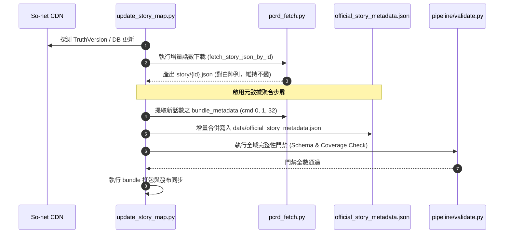

# Issue #2 — Design Review D2
# Story Map 官方故事元數據持久化策略決策記錄 (Architecture Decision Record)

> **版本**：1.0.0 (Architecture Decision Record — D2 Final Strategy Selection)<br/>
> **基準 Commit**：`b896ff5151e5d082074ac7898cbb9708198f3fd8` (main / D1 Final)<br/>
> **分支**：`design/story-metadata-persistence-decision`  
> **審查模式**：Evidence-Calibrated Architecture Decision Mode  
> **性質**：架構決策記錄 (ADR) — 正式選定持久化策略，定義資料契約與管線規範（唯讀設計，本階段不修改 production 代碼）

---

## 1. Context (背景與前情脈絡)

在 [Research R1](STORY_ASSETBUNDLE_COMMAND_INVENTORY.md) 與 [Research R2](STORY_ASSETBUNDLE_COMMAND_SEMANTICS_R2.md) 的逆向工程中，專案團隊成功證實了 So-net 官方 CDN 的 `storydata_*.unity3d` AssetBundle 中蘊含著高度有價值的官方中文元數據：
- `cmd 1`：**官方長篇劇情大綱 (Official Synopsis)**，繁中情節摘要，抽樣存在率 100.0% (180/180)，非空率 89.4% (161/180)；
- `cmd 32`：**話數副標題／話名 (Episode Subtitle)**，存在率 88.9% (160/180)；
- `cmd 0`：**話數序號／主標題 (Title Metadata)**，存在率 100.0% (180/180)。

然而在 [Design Review D1](STORY_METADATA_PERSISTENCE_DESIGN_REVIEW_D1.md) 的架構盤點中確認：
1. **現有契約極度脆弱且具硬約束**：全量 9,033 篇數字 ID 的 `story/{id}.json` 均為**頂層 JSON 陣列 (Top-level Array)**，前端 `dialogue-normalizer.js`、`map.js`、`characters.js` 以及門禁 `pipeline/validate.py` 均對此結構有**不可違逆的硬性斷言**。
2. **大綱渲染存在歷史遺留缺陷**：桌面版詳情面板因依賴資料庫查詢 `sub_title`，在查無記錄或空值時會觸發硬編碼的回退字串「本話為重要主線劇情，美食殿堂的羈絆在此得到了進一步的昇華。」並標註為「📌 官方大綱」，嚴重違反專案真實性原則。

本決策記錄 (D2) 旨在正式解決：**「如何以零破壞、高擴展、易維護的方式，將話數層級的官方元數據持久化並整合入 Story Map 產品管線中？」**

---

## 2. Decision Drivers (決策驅動因素)

本決策依據專案現有架構邊界與長期維護目標，確立以下核心考量因素：
1. **零中斷向後相容 (Zero-Breaking Compatibility)**：絕不允許改動現有 9,033 篇故事 JSON 的頂層陣列契約，確保既有閱讀器、角色詳情與外部爬蟲消費端 100% 正常運作。
2. **單一真實來源 (Single Source of Truth)**：避免元數據四散於各個目錄檔中，提供清晰、可驗證、可獨立更新的元數據存儲實體。
3. **管線更新與驗證極簡化 (Pipeline & Validator Simplicity)**：能夠在現有 `update_story_map.py` 與 `pipeline/validate.py` 中以最少代碼成本無縫嵌入，不增加繁重的檔案遍歷負擔。
4. **網路與快取效能 (Network & Cache Efficiency)**：避免單話點擊產生大量額外小檔案請求，確保首屏載入極速且靜態資源具備高快取命中率。
5. **官方文本誠信原則 (Official Metadata Integrity)**：嚴格落實防幻覺準則，大綱僅來源於 `cmd 1`，空值時誠實隱藏或顯示未提供，嚴禁任何假造文案。
6. **分層架構隔離 (Layered Data Separation)**：本輪僅解決 Episode-level Singleton Metadata 的持久化，明確延後 Ordered In-Story Events，避免過早複雜化。

---

## 3. Considered Options (候選方案概述)

本評估針對以下四種架構策略進行全面橫向對比：

* **方案 A：Dedicated Sidecar Manifest (專屬側車索引清單)**
  在 `dashboard/data/` 建立單一或分冊的集中式元數據索引檔案（例如 `official_story_metadata.json`），將全量話數的單一元數據集中管理。
* **方案 B：Independent Metadata JSON (獨立話數元數據檔案)**
  在 `dashboard/metadata/` 目錄下建立 9,033 個與對白檔一一對應的小型 JSON 檔案（例如 `metadata/{story_id}.json`）。
* **方案 C：Story Schema Migration (對白檔案結構重構遷移)**
  直接修改現有 9,033 篇 `story/{story_id}.json`，將頂層陣列改寫為物件結構（如 `{ "metadata": {...}, "dialogues": [...] }`）。
* **方案 D：Hybrid / Existing-data-file Extension (既有目錄/摘要檔案擴充)**
  不建立新檔案，將元數據分別拆解並塞入既有的 `data/chapters.json`（主線）、`data/event_summaries.json`（活動）、`data/branch_stories.json` 及角色資料表中。

---

## 4. Evidence from D1 (D1 架構盤點關鍵證據)

本決策完全建立在 D1 審查通過之客觀證據基礎上：
1. **陣列硬性斷言**：
   - 抽樣 502/502 篇為頂層陣列；
   - 全量 9,033 篇數字 ID 劇本 100% 通過 `pipeline/validate.py` 的 `isinstance(dialogues, list)` 斷言（`speaker_appearance.json` 為輔助檔 warning 跳過）；
   - 前端 `DialogueNormalizer.normalize()`：若非陣列直接返回空對白清單，造成閱讀器完全空白。
2. **Auto Play v1 邊界已完全解耦**：
   - 現有 `story/{id}.json` 中的 `voice` 標籤與陣列順序完全滿足自動播放需求（Persistence Change: NO）；
   - 前端需適配控制器捕捉 `audio.onended` 事件（Runtime Change: YES）；
   - **Auto Play v1 絕不依賴元數據持久化方案，兩者不可綁定**。
3. **元數據具備雙層粒度結構**：
   - **Layer 1 (Episode-level Singleton)**：`cmd 0` (標題)、`cmd 1` (大綱)、`cmd 32` (副標題)，每話僅 1 筆；
   - **Layer 2 (Ordered In-Story Events)**：`cmd 100` (地點橫幅，180 話抽樣中 16 次出現分佈於 12 話，其中 4 話各出現 2 次帶不同 `stream_index`)、`cmd 11` (選擇肢，780 次出現)，屬於事件串流。

---

## 5. Decision Matrix (15 項維度決策矩陣)

對四種方案在專案具體環境下的 15 項工程指標進行量化評估（評分標準：🟢 優 / 🟡 中 / 🔴 差）：

| 評估維度 | 方案 A：Dedicated Sidecar | 方案 B：Independent JSON | 方案 C：Schema Migration | 方案 D：Existing File Ext | 本專案特定工程理由 (Repo-Specific Rationale) |
| :--- | :---: | :---: | :---: | :---: | :--- |
| **1. Backward Compatibility** | 🟢 優 | 🟢 優 | 🔴 差 | 🟡 中 | 方案 C 瞬間摧毀現有 9,033 篇消費端；A 與 B 完全零侵入現有對白。 |
| **2. Parser Integration** | 🟢 優 | 🟡 中 | 🔴 差 | 🟡 中 | 方案 A 只需在解析結束時將 `_parse_bundle_metadata` 寫入 Manifest，無需改動對白輸出。 |
| **3. Pipeline Update Complexity** | 🟢 優 | 🟡 中 | 🔴 差 | 🟡 中 | 方案 A 在 `update_story_map.py` 增量同步時追加單檔覆寫；方案 B 需同步遍歷 9,033 檔。 |
| **4. Validator Design** | 🟢 優 | 🟡 中 | 🔴 差 | 🟡 中 | 方案 A 僅需在 `validate.py` 增加單一 JSON Schema 檢驗；方案 C 需全盤重構 Parity 門禁。 |
| **5. Bundler Behavior** | 🟢 優 | 🟡 中 | 🟢 優 | 🟢 優 | 方案 A 納入 `data/` 常規複製即可；方案 B 需新增目錄遍歷與過期檔案清理邏輯。 |
| **6. Incremental CDN Update** | 🟢 優 | 🟢 優 | 🔴 差 | 🟡 中 | 方案 A 僅在新話數下載時增量合併或整表刷新，速度極快。 |
| **7. Runtime Loading Model** | 🟢 優 | 🟡 中 | 🟢 優 | 🟡 中 | 方案 A 可全域一次載入並常駐記憶體，點擊單話大綱立即可讀，零延遲。 |
| **8. HTTP Request Behavior** | 🟢 優 | 🔴 差 | 🟢 優 | 🟢 優 | 方案 A 僅增加 1 次 HTTP 請求 (全域快取)；方案 B 每開一話需多發 1 次 fetch (N 次請求)。 |
| **9. Cache Invalidation** | 🟢 優 | 🟡 中 | 🟢 優 | 🟢 優 | 方案 A 可依據 `db_info.json` 或 `TruthVersion` 統一進行 Cache-Busting。 |
| **10. File-Count / Footprint** | 🟢 優 | 🔴 差 | 🟢 優 | 🟢 優 | 方案 A 僅 +1 檔案；方案 B 額外激增 9,033 個檔案，嚴重拖慢 git 與磁碟 I/O。 |
| **11. Failure Isolation** | 🟢 優 | 🟢 優 | 🔴 差 | 🟡 中 | 方案 A 若損壞僅大綱面板無資料，對白依然正常閱讀；方案 C 損壞會全站癱瘓。 |
| **12. Rollback Simplicity** | 🟢 優 | 🟡 中 | 🔴 差 | 🟡 中 | 方案 A 刪除或 revert 單一檔案即可秒級回滾；方案 C 需全庫 revert 9,033 檔。 |
| **13. Third-party Compatibility**| 🟢 優 | 🟢 優 | 🔴 差 | 🟢 優 | 既有直接引用 `story/{id}.json` 的第三方或獨立腳本 100% 不受任何影響。 |
| **14. Future Ordered-Event Ext** | 🟢 優 | 🟡 中 | 🟢 優 | 🔴 差 | 方案 A 將 Singleton 與 Event 清晰分層，未來 Event 可獨立推進，互不污染。 |
| **15. AI / Vibe-Coding Simplicity**| 🟢 優 | 🟡 中 | 🔴 差 | 🔴 差 | 方案 A 單一檔案結構極其直觀，AI 維護時上下文負擔最小，不易產生幻覺。 |

---

## 6. Selected Strategy (獲選方案)

### 🏆 獲選決策：方案 A — Dedicated Sidecar Manifest (專屬側車索引清單)
* **實體位置**：`dashboard/data/official_story_metadata.json`
* **發布鏡像**：`dist_story_map/data/official_story_metadata.json`
* **核心定位**：專門收納全量話數之 **Episode-level Singleton Metadata**（官方大綱、副標題、話數標籤、來源溯源版本），作為 Story Map 唯一的官方話數元數據權威清單。

---

## 7. Rejected Alternatives (淘汰方案理由深度分析)

### ❌ 否決方案 C：Story Schema Migration
* **淘汰理由**：
  1. **災難性破壞既有契約**：D1 盤點已證實前端所有核心模組（`dialogue-normalizer.js`、`map.js`、`characters.js`）以及門禁驗證器（`pipeline/validate.py`）對 `isinstance(dialogues, list)` 均有強制硬性斷言。改寫頂層結構會瞬間導致兩處前端崩潰與門禁死鎖。
  2. **極高遷移與回滾風險**：必須一次性改寫、提交並發布 9,033 個實體檔案，Git 差異爆炸，一旦線上出現問題，無法進行原子化快速回滾。

### ❌ 否決方案 B：Independent Metadata JSON (`metadata/{id}.json`)
* **淘汰理由**：
  1. **檔案數量爆炸翻倍**：專案將新增 9,033 個極小檔案（每個僅數百 bytes），這在 Windows NTFS 檔案系統與 GitHub Pages 部署打包時會造成極大的 inode 與遍歷負擔。
  2. **運行時網路請求破碎化**：使用者每在地圖上點擊一個新話數，前端都必須發起一次額外的 HTTP fetch。在弱網環境下會出現對白已載入但大綱卡片延遲彈出或失敗的破碎體驗。

### ❌ 否決方案 D：Hybrid / Existing-data-file Extension
* **淘汰理由**：
  1. **資料孤島與職責混亂**：現有 `chapters.json` 專屬主線章節樹，`event_summaries.json` 專屬活動，角色與公會劇情則無獨立目錄檔。若將 9,033 話的元數據拆分塞入既有檔案，會造成資料割裂，前端需要維護複雜的查表路由表（若為主線查 chapters，若為活動查 event_summaries...）。
  2. **破壞首頁首屏載入效能**：`chapters.json` 是地圖初始化的關鍵首屏資源。若硬塞入全量長篇大綱文本，檔案體積膨脹數倍，將嚴重拖累首頁首次載入時間。

---

## 8. Proposed Data Contract (資料契約定義)

### 1. JSON Schema 定義 (Draft-07 規範)

```json
{
  "$schema": "http://json-schema.org/draft-07/schema#",
  "title": "PCRDOfficialStoryMetadataManifest",
  "type": "object",
  "required": ["schema_version", "truth_version", "generated_at", "episode_count", "episodes"],
  "properties": {
    "schema_version": { "type": "string", "enum": ["1.0.0"] },
    "truth_version": { "type": "string", "pattern": "^[0-9]{8}$" },
    "generated_at": { "type": "string", "format": "date-time" },
    "episode_count": { "type": "integer", "minimum": 0 },
    "episodes": {
      "type": "object",
      "additionalProperties": {
        "type": "object",
        "required": ["title", "official_synopsis", "subtitle", "provenance"],
        "properties": {
          "title": { "type": ["string", "null"] },
          "official_synopsis": { "type": ["string", "null"] },
          "subtitle": { "type": ["string", "null"] },
          "provenance": {
            "type": "object",
            "required": ["truth_version", "has_cmd1", "has_cmd32"],
            "properties": {
              "truth_version": { "type": "string" },
              "has_cmd1": { "type": "boolean" },
              "has_cmd32": { "type": "boolean" },
              "bundle_name": { "type": "string" }
            },
            "additionalProperties": false
          }
        },
        "additionalProperties": false
      }
    }
  },
  "additionalProperties": false
}
```

### 2. 欄位語意契約 (Field Semantic Contract)

| 欄位路徑 | 型別 | 官方 AssetBundle 來源 | 語意說明與空值規範 |
| :--- | :--- | :--- | :--- |
| `episodes.<id>.title` | `string \| null` | `cmd 0` args[0] | 官方話數序號或主標題（如「序章 前篇」）。若缺失為 `null`。 |
| `episodes.<id>.official_synopsis` | `string \| null` | `cmd 1` args[0] | **官方長篇劇情大綱**。若缺失或二進位參數為空字串 `['']` 時，**一律嚴格規整為 `null`**。 |
| `episodes.<id>.subtitle` | `string \| null` | `cmd 32` args[0] | 官方話數副標題／正式話名（如「冒失女僕娘的委託」）。若缺失為 `null`。 |
| `episodes.<id>.provenance.truth_version`| `string` | CDN Manifest | 提取時的 So-net TruthVersion 版本號（如 `00600025`）。 |
| `episodes.<id>.provenance.has_cmd1` | `boolean` | 二進位指令流 | 指示該話 AssetBundle 是否包含非空 `cmd 1`。 |
| `episodes.<id>.provenance.has_cmd32`| `boolean` | 二進位指令流 | 指示該話 AssetBundle 是否包含非空 `cmd 32`。 |

---

## 9. Versioning Strategy (版本控制與快取策略)

1. **檔案內部版本**：
   - `schema_version`: 採語意化版本號（本契約為 `1.0.0`），當 schema 結構增減欄位時遞增。
   - `truth_version`: 記錄當前資料來源之 So-net 線上 CDN 版本（例如 `00600025`）。
2. **CDN / 瀏覽器快取策略 (Cache-Busting)**：
   - 沿用 Story Map 目前既有的 `db_info.json` 決定性版本雜湊機制（Deterministic Hash）。
   - 前端發起請求時追加快取版本號：
     `fetch('data/official_story_metadata.json?v=' + dbVersion)`
   - 當資料庫或資源更新時，版本號自動變更，確保瀏覽器第一時間載入最新大綱，無 stale cache 問題。

---

## 10. Update / Regeneration Flow (管線更新工作流)

在後續實作階段中，管線整合流程將被設計為：



* **更新模式**：
  - **增量更新 (Incremental Update)**：常規更新時僅針對 CDN 新上架的數個話數解析 metadata 並 merge 入清單。
  - **全量重建 (Full Regeneration)**：提供獨立指令（如 `python -m pipeline.build_metadata_manifest`），可依據已下載之 AssetBundle 或離線快取一次性重建全量 9,033 話元數據。

---

## 11. Validator Contract (驗證門禁擴充契約)

在 `pipeline/validate.py` 中新增獨立的驗證器區塊，確保元數據的高品質交付：
1. **檔案存在性檢驗**：確保 `dashboard/data/official_story_metadata.json` 實體檔案存在。
2. **Schema 嚴格性斷言**：
   - 根物件必須包含 `schema_version`, `truth_version`, `episodes`；
   - `episodes` 必須為字典物件，且鍵名必須全數為數字字串（Numeric Story ID）；
   - 每個話數節點必須符合上述定義之必要欄位與型別。
3. **話數覆蓋率與 Parity 檢查**：
   - 檢驗 `official_story_metadata.json` 所收錄之話數集合與 `dashboard/story/*.json`（9,033 篇數字話數）的交集一致性；
   - 容許未下載或歷史劇本標註缺失，但全量有效劇本之大綱非空率不得低於 85%（依據 R2 實測 89.4% 之保護閾值）。
4. **真實性硬約束檢驗**：
   - 掃描所有 `official_synopsis` 欄位，**嚴格斷言不得包含任何捏造字串**（如「美食殿堂的羈絆」、「進一步的昇華」等）。若發現人工模板字樣直接 Fail Loudly 阻擋發布。

---

## 12. Bundler Contract (發布打包契約)

在 `pipeline/bundle.py` 的發布打包邏輯中：
1. **自動納入同步**：`official_story_metadata.json` 位於 `dashboard/data/` 目錄下，已原生受既有 `sync_directory_assets("data")` 涵蓋。
2. **決定性校驗**：打包時由 Bundler 計算其 SHA-256 雜湊，確保 `dist_story_map/data/official_story_metadata.json` 與源碼端 100% 絕對二進位等價。
3. **清理保護**：將其列為非修剪檔案（Non-prunable asset），禁止 Deterministic Pruning 誤刪。

---

## 13. Runtime Consumption Contract (前端載入契約)

### 1. 職責分離：引入獨立 `StoryDataService`
依據 D1.1 的架構提問，為維持 `dashboard/story-asset-service.js` 專責「多媒體 CDN 資源 (Background/Still)」的單一職責原則，前端將建立獨立服務：
`dashboard/story-data-service.js`（`window.StoryDataService`）。

### 2. 前端介面與快取協議

```javascript
window.StoryDataService = {
    _metadataCache: null,
    _loadingPromise: null,

    /**
     * 惰性全域載入官方元數據清單 (單一 Session 僅 fetch 1 次)
     */
    async ensureMetadataLoaded() {
        if (this._metadataCache) return this._metadataCache;
        if (this._loadingPromise) return this._loadingPromise;

        this._loadingPromise = (async () => {
            const v = window.PCRDatabase?.dbVersion || Date.now();
            const resp = await fetch(`data/official_story_metadata.json?v=${v}`);
            if (!resp.ok) throw new Error(`Metadata load failed: ${resp.status}`);
            const data = await resp.json();
            this._metadataCache = data.episodes || {};
            return this._metadataCache;
        })();
        return this._loadingPromise;
    },

    /**
     * 取得指定話數的官方元數據
     * @param {number|string} storyId
     * @returns {Promise<{title: string|null, official_synopsis: string|null, subtitle: string|null}>}
     */
    async getStoryMetadata(storyId) {
        const episodes = await this.ensureMetadataLoaded();
        return episodes[String(storyId)] || null;
    }
};
```

### 3. UI 渲染調用範例 (`map.js`)
在詳情面板打開時：
```javascript
const meta = await window.StoryDataService.getStoryMetadata(this.activeStoryId);
if (meta && meta.official_synopsis) {
    // 渲染正式官方大綱卡片
    renderSynopsisCard(meta.official_synopsis);
} else {
    // 誠實隱藏或顯示「本話暫無官方大綱」，絕不調用任何 fake fallback
    renderEmptySynopsisPlaceholder();
}
```

---

## 14. Rollback Plan (回滾與降級機制)

1. **瞬時回滾 (Instant Rollback)**：
   若線上發現 `official_story_metadata.json` 存在資料錯誤，僅需執行：
   ```bash
   git revert <commit-hash>
   python update_story_map.py
   ```
   由於對白檔案完全未受修改，整次回滾僅涉及單一 JSON 檔案的變更，可在 30 秒內完成修復與推送。
2. **前端優雅降級 (Graceful Degradation)**：
   若網路異常導致 `official_story_metadata.json` 載入失敗（HTTP 404/500），`StoryDataService` 會捕獲異常並返回空元數據。前端閱讀器與對白渲染**完全不受影響**，僅大綱面板安全隱藏。

---

## 15. Migration Plan (實施階段遷移路徑)

本決策通過後，後續代碼實作階段將嚴格分步推進：
* **Step 1 (Parser 擴充)**：在 `tools/pcrd_fetch.py` 中新增 `export_official_metadata()` 工具函式，從既有 AssetBundle 快取中萃取 `cmd 0, 1, 32`。
* **Step 2 (Manifest 生成)**：在本地生成初版 `dashboard/data/official_story_metadata.json`，涵蓋當前已下載之全量話數。
* **Step 3 (門禁驗證)**：在 `pipeline/validate.py` 補全 JSON Schema 與防捏造斷言，執行乾跑確保全數綠燈。
* **Step 4 (前端適配與假大綱移除)**：
  - 新建 `dashboard/story-data-service.js`；
  - 重構 `dashboard/map.js`，徹底刪除 `map.js:1727` 的人工捏造 fallback 字串；
  - 串接真實官方大綱。
* **Step 5 (正式發布)**：執行標準發布管線推送到 GitHub Pages。

---

## 16. Deferred Ordered Events (Layer 2 循序事件延後處理規範)

* **明確延後範圍**：
  - `cmd 100`（場景地點橫幅）
  - `cmd 11`（玩家分支互動選項）
  - 角色立繪演出 (`cmd 68, 3, 4, 59`)、鏡頭特效 (`cmd 70, 86, 87, 88, 29`)、音效音樂 (`cmd 103, 101, 26, 67, 51, 9`)。
* **延後理由**：
  上述指令均為**話內循序事件串流（Ordered In-Story Events）**，其語意呈現與即時渲染（例如地點切換浮水印、分支按鈕跳轉、立繪動作重現）深度綁定於未來的「2D 沉浸式復刻播放器」。當前 Story Map 的主要定位為**文本與語音閱讀器**，若將事件流強行塞入目前的元數據契約，會過度增加系統複雜度。
* **未來擴展預留**：
  未來若啟動 Phase 2 互動分支或沉浸式閱讀器，將為其設計專門的 `story/{id}.events.json` 循序事件伴隨檔，與當前 Layer 1 的 Singleton Manifest 完全解耦。

---

## 17. Auto Play Separation (Auto Play v1 完全解耦宣告)

再次重申並固化 D1 的技術結論：
1. **Auto Play v1 僅需依賴音檔結束事件**：
   自動播放的核心推進機制是前端監聽實體音訊的 `HTMLAudioElement.onended` 事件，現有 `story/{id}.json` 中的 `voice` 標籤已完全具備所需資料。
2. **無任何資料遷移依賴**：
   Auto Play v1 的上線**不需要任何後端資料庫遷移或 JSON Schema 變更**。
3. **獨立立項推進**：
   Auto Play 功能將在獨立的 Issue / PR 中實作前端播放控制器（Controller），不與元數據持久化專案混雜，避免相互阻塞。

---

## 18. Official Metadata Integrity Rules (官方大綱誠信規則)

為維護專案長期誠信與抗幻覺準則（Anti-Hallucination）：
1. **唯一合法來源**：官方大綱（`official_synopsis`）的唯一資料來源為 AssetBundle 中的 **`cmd 1` 原文**。
2. **絕對禁止項目**：
   - 嚴禁以資料庫 `sub_title` 代替大綱；
   - 嚴禁使用大型語言模型（LLM）自動補寫大綱充當官方大綱；
   - 嚴禁任何人工預設模板（如「美食殿堂的羈絆在此得到了進一步的昇華」）；
   - 嚴禁將章節導讀（`chapter_summary`）誤植為單話大綱。
3. **四類文本邊界明晰定義**：
   - **`official_synopsis` (官方大綱)**：AssetBundle `cmd 1`，官方原廠撰寫之長篇情節摘要；
   - **`subtitle` (話名)**：AssetBundle `cmd 32` / DB `sub_title`，話數之具體名稱；
   - **`chapter_summary` (章節導讀)**：`data/chapters.json`，章節整體概述；
   - **`generated_summary` (生成摘要)**：若未來引入 AI 總結，必須具備顯式「🤖 AI 生成」標籤，絕不與官方大綱混同。

---

## 19. Prototype Benchmark Results (原型基準測量)

為精確評估方案 A 的傳輸體積與記憶體負擔，專案團隊在 `scratch/run_benchmark.py` 建立了實體測量基準：

### 1. 實測原型數據 (OBSERVED Prototype Result)
* 測試對象：包含完整官方大綱（約 75 字繁中）、標題、副標題與 Provenance 之單話標準記錄；
* **單話精簡 (Compact) JSON 大小**：**416 bytes**；
* **單話美化 (Pretty) JSON 大小**：**460 bytes**。

### 2. 全量 9,033 話模擬推算 (Simulated Production Estimate)
依據 R1/R2 實測之 89.4% 非空大綱分佈，模擬全庫 9,033 篇話數合併為單一清單：
* **未壓縮精簡檔案大小 (Compact Raw)**：**3,342,403 bytes (~3.19 MiB)**；
* **未壓縮美化檔案大小 (Pretty Raw)**：**4,065,067 bytes (~3.88 MiB)**；
* **Gzip 物理壓縮後傳輸大小 (Gzip Compressed)**：**79,476 bytes (~77.61 KiB)**！
* **結論**：
  由於 JSON 鍵名具備極高重複性，且中文字串在 Gzip 下壓縮效率極高（**壓縮率高達 97.6%**）。在啟用 HTTP Gzip/Brotli 壓縮的 GitHub Pages CDN 環境下，使用者全域僅需消耗 **不到 80 KiB** 的單次流量，即可取得全庫 9,033 話的完整大綱與元數據，對載入效能影響幾近為零。

---

## 20. Open Questions (未解決問題與後續討論)

1. **大綱卡片在 UI 的默認折疊狀態**：
   在桌面版右側詳情面板中，若大綱字數達 100 字，是否應預設展示 3 行並提供「展開更多」按鈕，以維持對白全文的可視高度？
2. **多部章節導讀與話數大綱的並列呈現**：
   當章節本身具備 `chapter_summary` 時，UI 面板上章節導讀與單話大綱的先後視覺權重如何調配？

---

## 21. Evidence Boundary (證據邊界)

* **VERIFIED (已證實)**：
  - 現有 `story/{id}.json` 抽樣 502/502 篇為頂層陣列，全量 9,033 篇數字 ID 經 `pipeline/validate.py` 實測 100% 通過陣列斷言。
  - `map.js:1695-1727` 存在人工捏造之「美食殿堂的羈絆」fallback，且被誤標為官方大綱。
  - `cmd 1` 存在率為 100.0% (180/180)，非空率為 89.4% (161/180)，空值率為 10.6% (19/180，主要集中於 System 類別)。
  - Prototype 單話元數據記錄實測為 416 bytes (Compact) / 460 bytes (Pretty)。
  - Auto Play v1 僅依賴音訊結束事件，不需要任何資料結構遷移。
* **HIGH-CONFIDENCE (高置信度推論)**：
  - 方案 A (Dedicated Sidecar Manifest) 在向後相容、打包整合、管線維護與故障隔離維度上，是本專案的最優解。
  - 方案 A 全庫 9,033 話 Gzip 傳輸體積約 70~90 KiB，對 CDN 與客戶端負擔極低。
  - 新設獨立 `StoryDataService` 比擴充 `StoryAssetService` 更具架構合理性。
* **HYPOTHESIS / ESTIMATE (推估與未決項目)**：
  - 全量 9,033 話精簡大小約 3.19 MiB、Gzip 約 77.6 KiB 屬基於欄位規格之推估值 (`[ESTIMATE]`)，精確值以未來全庫實際產出為準。
  - Layer 2 循序事件（地點橫幅、選擇肢）的具體前端渲染協議留待 Phase 2 實測評估。
