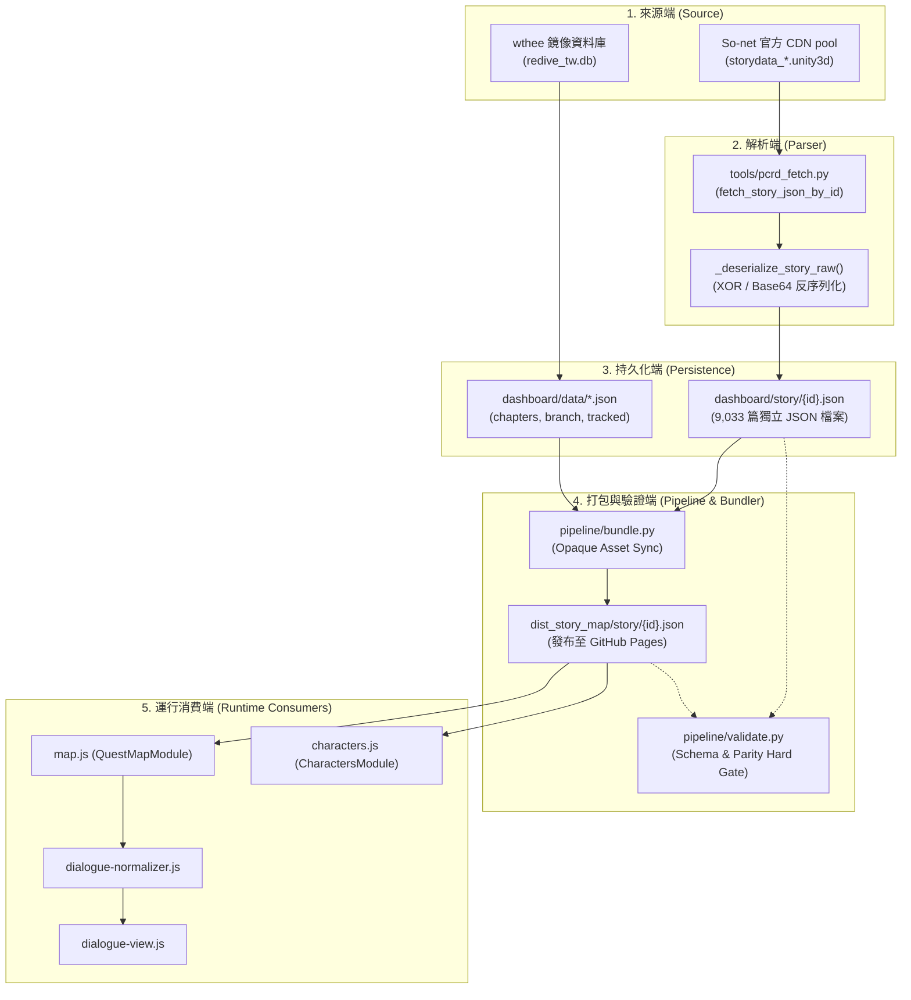
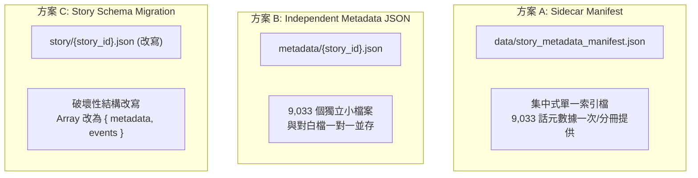

# Issue #2 — Design Review D1
# Story Map 故事元數據持久化與產品整合架構盤點 (Architecture Inventory)

> **版本**：1.0.0 (Design Review D1)  
> **基準 Commit**：`dd75f1dc943939232db3e9c9a5c4c0b1430fc361`  
> **分支**：`design/story-metadata-persistence-review`  
> **審查模式**：Evidence-Calibrated Research & Architecture Audit Mode  
> **性質**：架構分析與資料契約盤點（唯讀審查，本階段不進行實體代碼修改，不選定最終方案）

---

## 摘要 (Executive Summary)

本文件依據已審查通過並合併至 `main` 的 [Research R1](STORY_ASSETBUNDLE_COMMAND_INVENTORY.md) 與 [Research R2](STORY_ASSETBUNDLE_COMMAND_SEMANTICS_R2.md) 成果，針對「So-net 官方未利用元數據（Official Synopsis、話名 Subtitle、Location Title、選擇肢等）」的持久化方案與「Auto Play v1」的產品整合邊界進行深度架構盤點。

本審查核心發現：
1. **現有資料契約具極高約束力**：現有 9,033 篇 `story/{id}.json` 採用**頂層根陣列（Top-level Array）**規格，前端 `dialogue-normalizer.js`、`map.js`、`characters.js` 以及後端 `pipeline/validate.py` 均對此結構有**硬性斷言（Hard Assertions）**。若貿然將根結構改寫為物件（Schema Migration），將直接破壞所有既有 Consumer 並造成驗證門禁全面死鎖。
2. **Auto Play v1 與元數據持久化完全解耦**：Auto Play v1 僅需由**音檔播放結束事件 (`audio.onended`)** 驅動前端控制器步進，現有 `story/{id}.json` 中的 `voice` 標籤與 `MediaService` 已完全具備實作條件，**不需要任何資料庫遷移或 JSON Schema Migration**，亦不依賴低信心的演出計時指令（`cmd 13`）。
3. **官方大綱具明確持久化價值**：`cmd 1`（官方劇情大綱）為 100% 官方正裝文本，可徹底替換目前 UI 因依賴資料庫 `sub_title` 缺失而觸發的人工捏造 Fallback（「美食殿堂的羈絆在此得到了進一步的昇華」），具極高產品價值。

---

## 一、 現有系統架構與資料流 (Current Architecture)

目前 Story Map 的故事劇本處理與消費管線可分為五大階段：



---

## 二、 現有 Story JSON 資料契約盤點 (Current Contract Inventory)

### 1. 檔案規格與頂層結構 (Root Shape)
* **規格**：**Top-level JSON Array (`List[Dict[str, Any]]`)**。
* **統計**：在全量 9,033 篇劇本中，經 502 篇分層抽樣掃描，**100% 均為頂層陣列**，無任何頂層 Object 格式。

### 2. 現有事件節點型別 (Observed Event Types)
劇本陣列中的元素共包含以下五種節點規格：

| 節點型別 (`type`) | 必要欄位 (Mandatory) | 可選欄位 (Optional) | 說明與用途 |
| :--- | :--- | :--- | :--- |
| `dialogue` (顯式) | `name`, `words` | `unit_id`, `voice` | 角色對白節點，帶發言人、台詞、頭像 ID 與語音檔案名。 |
| *(隱式對白)* | `name`, `words` | `voice` | 部分歷史劇本無 `type` 屬性，直接以 `name` + `words` 呈現對白。 |
| `background` | `bg_id` 或 `background` | - | 背景切換節點（`cmd 5` 抽取產物）。 |
| `still` | `still` 或 `still_id` | - | CG 劇照插入或結束節點（`cmd 49` / prefix 抽取產物，`end` 代表關閉）。 |
| `movie` | `movie_id` | - | 過場動畫節點（`cmd 46` 抽取產物）。 |

### 3. 欄位消費與 Consumer 清單

#### A. 核心運行消費端 (Runtime Consumers)
1. **`dashboard/map.js` (`QuestMapModule.loadDialogue`)**：
   * 進入點：Line 1890 `fetch('story/${storyId}.json?v=${Date.now()}')`
   * 硬性假設：Line 1895 `if (!rawDialogueList || rawDialogueList.length === 0)`（假設為陣列或具 `.length`）。
   * 資料傳遞：Line 1901 將整包傳入 `DialogueNormalizer.normalize(rawDialogueList)`。
2. **`dashboard/dialogue-normalizer.js` (`DialogueNormalizer.normalize`)**：
   * 進入點：Line 38 `normalize(rawDialogueList)`
   * **硬性斷言**：Line 39：
     ```javascript
     if (!rawDialogueList || !Array.isArray(rawDialogueList) || rawDialogueList.length === 0) {
         return { dialogueList: [], speakerNames: [] };
     }
     ```
     **若輸入非陣列，靜默返回空資料，導致整個閱讀器無對白可顯示。**
   * 結構走訪：Line 48 `rawDialogueList.forEach(item => ...)`。
   * 消費欄位：`item.type`, `item.words`, `item.name`, `item.unit_id`, `item.voice`。
3. **`dashboard/dialogue-view.js` (`DialogueView.renderDialogue`)**：
   * 消費正規化後陣列：
     * `item.type === 'still'` 讀取 `item.still_id || item.still`。
     * `item.type === 'background'` 讀取 `item.background_id || item.bg_id`。
     * `item.type === 'movie'` 讀取 `item.movie_id || item.movie`。
     * 對白節點讀取 `item.name`, `item.words`, `item.unit_id`, `item.voice`。
4. **`dashboard/characters.js` (`CharactersModule.toggleStoryDetails`)**：
   * 進入點：Line 816 `fetch('story/${storyId}.json?v=${Date.now()}')`
   * 硬性假設：Line 820 `if (!dialogues || dialogues.length === 0)`。
   * 結構走訪：Line 846 `dialogues.map(d => ...)`（若非陣列將拋出 `TypeError` 崩潰）。
   * 消費欄位：`d.voice`, `d.name`, `d.words`。

#### B. 打包與驗證門禁端 (Pipeline & Gate Consumers)
1. **`pipeline/validate.py` (全域驗證門禁)**：
   * **硬性斷言 1 (全域語法檢驗，Line 781-783)**：
     ```python
     if not isinstance(dialogues, list):
         corrupted_count += 1
         res.error(f"對白劇本根結構非陣列: story/{sf.name}")
     ```
   * **硬性斷言 2 (Source/Dist Parity 檢驗，Line 185-189)**：
     ```python
     if not isinstance(s_data, list):
         res.error(f"源碼對白根結構非陣列: {src_path.name}")
     if not isinstance(d_data, list):
         res.error(f"發布對白根結構非陣列: {dist_path.name}")
     ```
   * **逐行序列比對 (Line 193-214)**：循序抽取出全量 `unit_id` 序列、`dialogue` 筆數與 `movie` 序列進行雙向 100% 絕對等價校驗。
2. **`pipeline/bundle.py` (發布打包器)**：
   * Line 854 調用 `sync_directory_assets`，將 `story/*.json` 視為透明二進位/文字檔（Opaque Copy），計算雜湊與檔案差異後複製至 `dist_story_map/story/`。

#### C. 現有契約總結
* **是否存在共享 Loader/Adapter**：**否**。目前各頁面模組（`map.js` 與 `characters.js`）各自發起裸 `fetch('story/${id}.json')`。
* **最強破壞相容性約束**：**根結構必須保持為陣列（Top-level Array）**。任何將根結構轉為物件的修改，均會瞬間觸發 `validate.py` 報警與兩處前端運行時崩潰。

---

## 三、 R2 元數據候選矩陣 (R2 Metadata Candidate Matrix)

依據 R2 研究結論，將 AssetBundle 提取出的元數據依照置信度與產品價值劃分為三層：

| 指令 / 欄位 | 語意與內容 | 置信等級 | 產品價值 | 是否建議持久化 | Auto Play v1 必需性 | 預計產品定位 |
| :--- | :--- | :---: | :---: | :---: | :---: | :--- |
| **cmd 1** | **官方劇情大綱 (Official Synopsis)**<br/>長篇劇情摘要，覆蓋率 100% | **VERIFIED** | **極高**<br/>(取代人工捏造大綱) | **強烈建議** | 非必需 (UI即時受惠) | 📜 官方大綱面板 |
| **cmd 32** | **話數副標題 (Subtitle / Episode Name)**<br/>與 DB 吻合度極高，覆蓋率 88.9% | **VERIFIED** | **高**<br/>(修正話名標籤) | **強烈建議** | 非必需 | 🏷️ 正式話名顯示 |
| **cmd 0** | **話數標籤 / 主標題 (Title Metadata)**<br/>序號或部章標籤，覆蓋率 100% | **HIGH** | 中 | 建議 | 非必需 | 序號輔助導航 |
| **cmd 100** | **場景地點標題 (Location Title)**<br/>如「蘭德索爾・平原」，覆蓋率 38.3% | **HIGH** | 中高 | 建議 (Phase 2) | 非必需 | 🗺️ 地點切換轉場浮水印 |
| **cmd 11** | **玩家互動選擇肢 (Interactive Choices)**<br/>對話分支按鈕，覆蓋率 31.7% | **HIGH** | 中 | 建議 (Phase 2) | 非必需 (可預設首選) | 🔀 互動分支閱讀模式 |
| **cmd 12** | **語音關聯 (Voice Association)**<br/>語音檔案名稱關聯 | **VERIFIED** | **極高** | **已持久化** (`voice`) | **核心必需** | 🔊 對白單句播放 / 自動播放 |
| **cmd 5/46/49** | **背景 / 動畫 / CG 插畫** | **VERIFIED** | **極高** | **已持久化** | 非必需 | 🖼️ 多媒體閱讀呈現 |
| **cmd 10/14/16** | **角色站位與移動 (Staging)** | HYPOTHESIS | 低 | **暫禁入正式結構** | 完全無關 | 僅限未來 2D 復刻引擎 |
| **cmd 18/20** | **鏡頭推拉與轉場 (Camera)** | HYPOTHESIS | 低 | **暫禁入正式結構** | 完全無關 | 僅限未來 2D 復刻引擎 |
| **cmd 8/9/15** | **音效與 BGM 淡入淡出** | HYPOTHESIS | 中低 | **暫禁入正式結構** | 完全無關 | 僅限未來 2D 復刻引擎 |
| **cmd 13/22** | **等待與延遲幀數 (Timing)** | HYPOTHESIS | 低 | **暫禁入正式結構** | **完全無關**<br/>(禁由 delay 驅動) | 待逆向確認計時單位 |

---

## 四、 Auto Play v1 最低資料需求 (Auto Play v1 Scope)

### 1. 產品行為邊界定義
* **啟動**：使用者點擊劇情閱讀器頂部「▶ 自動播放」按鈕。
* **播進行為**：
  1. 尋找當前可播放語音的對白列（具 `item.voice` 之對白）。
  2. 調用現有 `MediaService.playVoice(voiceName)` 播放語音。
  3. 監聽 `HTMLAudioElement.onended` 事件。
  4. 語音播放完畢後，控制器自動將高亮光標移至下一句有配音的對白。
  5. 調用 `element.scrollIntoView({ behavior: 'smooth', block: 'center' })` 將對白平滑捲動至視野中央。
* **無語音處理**：純旁白或無配音台詞在 v1 中給予預設固定停留時間（例如 2.0 秒）或直接前進至下一語音句。
* **終止條件**：到達該話最後一句對白時自動停止，**v1 嚴禁自動跳轉下一話**（維持單話閱讀安全邊界）。

### 2. 需求回答與事實判定
1. **現有 story JSON 是否足夠**：**是，完全足夠**。現有格式已具備 `voice`、`words`、`name` 等所有必需欄位。
2. **是否需要 Schema Migration**：**否**。完全不需要變更任何後端或 JSON 資料結構。
3. **cmd 13 (Timing) 是否需要**：**否**。Web 語音自動播放的核心驅動機制是音檔物理長度的 `audio.ended` 事件，而非 AssetBundle 內語意不明的 frame 計時器。
4. **定位結論**：Auto Play v1 是純前端「語音播放控制器（Runtime Controller）」，與元數據持久化專案在實作上屬於完全解耦的兩件事。

---

## 五、 三種持久化策略對比分析 (Persistence Strategy Analysis)



### 詳細維度對比表

| 評估維度 | 方案 A：Sidecar Manifest | 方案 B：Independent Metadata JSON | 方案 C：Story Schema Migration |
| :--- | :--- | :--- | :--- |
| **既有 Consumer 相容性** | **100% 完全相容**<br/>對白讀取端 0 改動 | **100% 完全相容**<br/>對白讀取端 0 改動 | **0% 嚴重破壞 (Breaking)**<br/>所有讀取端需同步大改 |
| **遷移成本 (Migration Cost)** | **極低**<br/>產出 1~3 個 JSON 清單檔 | **中**<br/>生成 9,033 個新檔案 | **極高**<br/>重寫並提交 9,033 個檔案 |
| **Validator 影響** | **0 影響**<br/>既有 parity 與陣列檢驗保持通過 | **0 影響**<br/>新增獨立驗證規則即可 | **致命衝擊**<br/>現有檢驗邏輯全面失配死鎖 |
| **Bundler 影響** | **極低**<br/>納入 `data/` 常規同步清單 | **中**<br/>新增目錄同步與清理邏輯 | **極低**<br/>依然為檔案同步 |
| **部署體積與檔案數量** | **優秀**<br/>檔案數 +1~3 個，體積增加 ~3 MB | **差**<br/>檔案數量 +9,033 個，遍歷負擔倍增 | **優秀**<br/>檔案數量不變，體積微幅增加 |
| **運行時網路請求** | **優秀**<br/>一次載入或分部快取，0 額外請求 | **中差**<br/>每開啟一話需額外發起 1 次 fetch | **優秀**<br/>依然為 1 次 fetch |
| **快取一致性 (Caching)** | **優** (可依 TruthVersion 版本號集中快取) | **中** (個別小檔案各自快取) | **優** (單檔快取) |
| **回滾難度 (Rollback)** | **極低**<br/>刪除 Manifest 即可秒級回滾 | **低**<br/>刪除目錄即可 | **極高**<br/>需全庫 revert 9,033 篇 JSON |
| **AI/工程維護複雜度** | **低**，單一來源集中管理 | **中**，檔案數量過多易有遺漏 | **極高**，涉及全專案跨語言契約改寫 |

---

## 六、 候選混合策略評估 (Candidate Hybrid Strategy)

為融合方案 A 的零破壞性與方案 B 的按需靈活性，本審查提議將以下架構作為第四個候選方案（Hybrid Candidate）：

### 架構核心概念：
1. **資料存儲層（底層不變）**：
   - 保持現有 `story/{id}.json` 頂層根陣列與 5 種 event 格式 100% 不變。
   - 將「話數層級元數據（Synopsis、Subtitle、Title、Location）」整合入集中式清單：
     * 選項 1：直接擴充 `data/chapters.json`（主線話數）與 `data/event_summaries.json`（活動話數）。
     * 選項 2：獨立建立 `data/official_story_metadata.json`。
2. **前端適配層（引入統一 Loader）**：
   - 在前端封裝 `window.StoryAssetService.loadStory(storyId)`：
     * 背景同時解析 metadata 與 fetch `story/{id}.json`。
     * 對外提供統一介面 `{ metadata: {...}, dialogues: [...] }`。
   - 既有呼叫點（`map.js`、`characters.js`）逐步平滑重構為呼叫此適配器，徹底消除各處散落的裸 `fetch`。
3. **相容性優勢**：
   - 既有外部/第三方消費端依然可直接存取 `story/{id}.json`。
   - 官方大綱與元數據立即可用，且零破壞部署與驗證管線。

---

## 七、 資料完整性問題專案盤點 (Known Data Integrity Finding)

在盤點前端大綱渲染邏輯時，確認了以下歷史遺留的資料誠信度缺陷：

* **具體位置**：[dashboard/map.js:1727](file:///e:/OneDrive%20-%20%E5%AF%B0%E5%AE%87%E7%9F%A5%E8%AD%98%E7%A7%91%E6%8A%80%E8%82%A1%E4%BB%BD%E6%9C%89%E9%99%90%E5%85%AC%E5%8F%B8/PCRD_tool/dashboard/map.js#L1727)
  ```javascript
  // 渲染區塊
  <span ...>📌 官方大綱</span>
  <p ...>${this.escapeHtml(officialSummary) || "本話為重要主線劇情，美食殿堂的羈絆在此得到了進一步的昇華。"}</p>
  ```
* **觸發條件**：
  * 前端以 `SELECT sub_title FROM story_detail WHERE story_id = ...` 查詢 SQLite 資料庫。
  * 若該話在資料庫中查無記錄（例如額外話數、新上架未入庫話數）或 `sub_title` 為空字串時，`officialSummary` 為空，觸發 `||` 運算子。
* **嚴重語意偏差**：
  1. `sub_title` 實質為「話名」（如『冒失女僕娘的委託』），而非「大綱（Synopsis）」，將其冠上「📌 官方大綱」標籤本身即屬誤導。
  2. 當內容缺失時，系統自動填補非官方人工編造字句「本話為重要主線劇情，美食殿堂的羈絆在此得到了進一步的昇華。」，並在前端依然顯示「📌 官方大綱」，**嚴重違反專案真實性原則（Truthfulness & Anti-Hallucination）**。
* **後續修正方向（Design Constraint）**：
  * 在未來的實作階段中，必須將此區塊重構為真正的 `cmd 1`（官方大綱）。
  * 若該話官方無大綱，必須**誠實隱藏該區塊**或顯示「本話無官方大綱」，嚴禁任何人工編造字句作為 fallback。

---

## 八、 未解決問題與後續待辦 (Open Questions & Docs Cleanup)

1. **章節級大綱與單話大綱的呈現層級**：
   - `chapters.json` 已有章節導讀，未來話數大綱面板在 UI 上應採取何種折疊/並列佈局？
2. **Docs 相對路徑待修項目（Non-blocking）**：
   - [docs/STORY_ASSETBUNDLE_COMMAND_SEMANTICS_R2.md](file:///e:/OneDrive%20-%20%E5%AF%B0%E5%AE%87%E7%9F%A5%E8%AD%98%E7%A7%91%E6%8A%80%E8%82%A1%E4%BB%BD%E6%9C%89%E9%99%90%E5%85%AC%E5%8F%B8/PCRD_tool/docs/STORY_ASSETBUNDLE_COMMAND_SEMANTICS_R2.md) 內之分析腳本路徑應修正為 `../tools/diagnostics/audit_story_command_semantics.py`，列入後續文檔清理清單。

---

## 九、 證據邊界 (Evidence Boundary)

* **VERIFIED (已證實)**：
  - 現有 `story/{id}.json` 頂層 100% 為陣列，`pipeline/validate.py` 與 `dialogue-normalizer.js` 對此有強制依賴。
  - `map.js:1727` 存在人工捏造之「美食殿堂的羈絆」fallback 字串，且被標註為「官方大綱」。
  - Auto Play v1 僅依賴現有 `voice` 標記與音檔事件，不依賴 `cmd 13`。
* **HIGH-CONFIDENCE (高置信度推論)**：
  - 方案 A（Sidecar Manifest）或 Hybrid 策略在工程風險、打包相容性與回滾難度上顯著優於全量改寫的方案 C。
* **HYPOTHESIS / UNRESOLVED (假說與未決項目)**：
  - 各話 AssetBundle 內的 `cmd 13` / `cmd 22` 的具體幀數與延遲公式，尚未經過 runtime 反編譯或實測校準，嚴禁納入正式生產契約。
