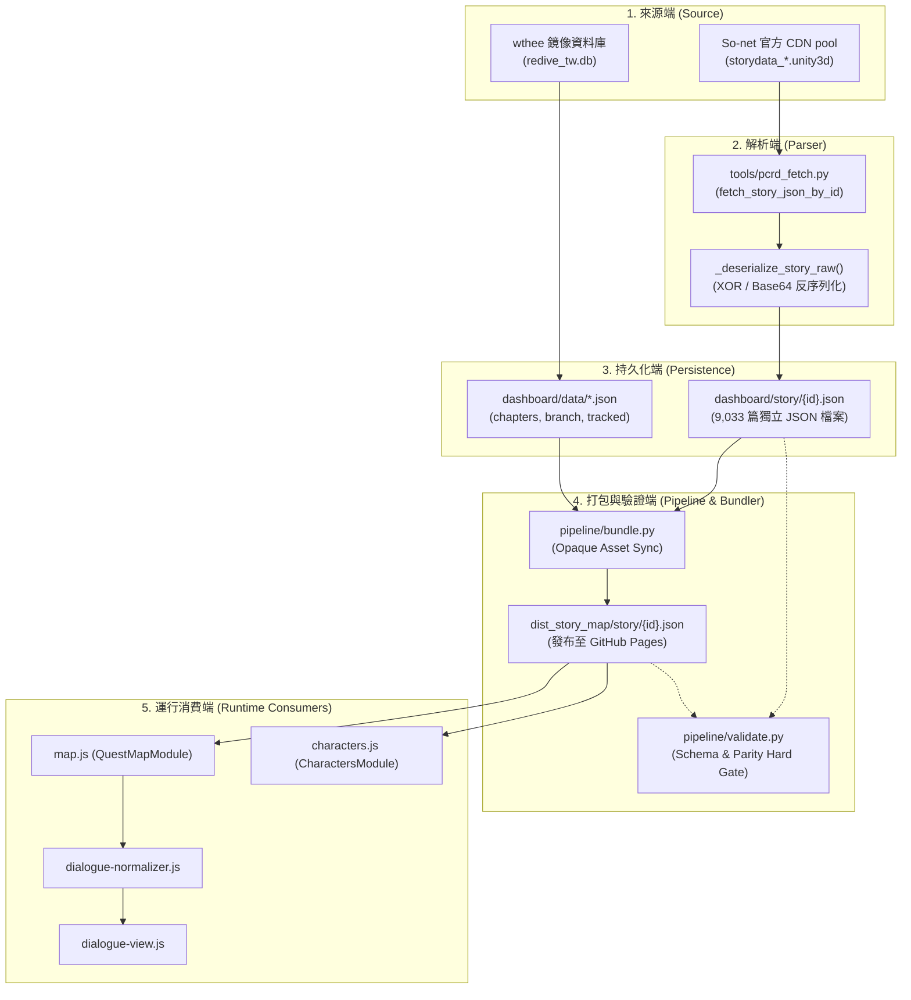
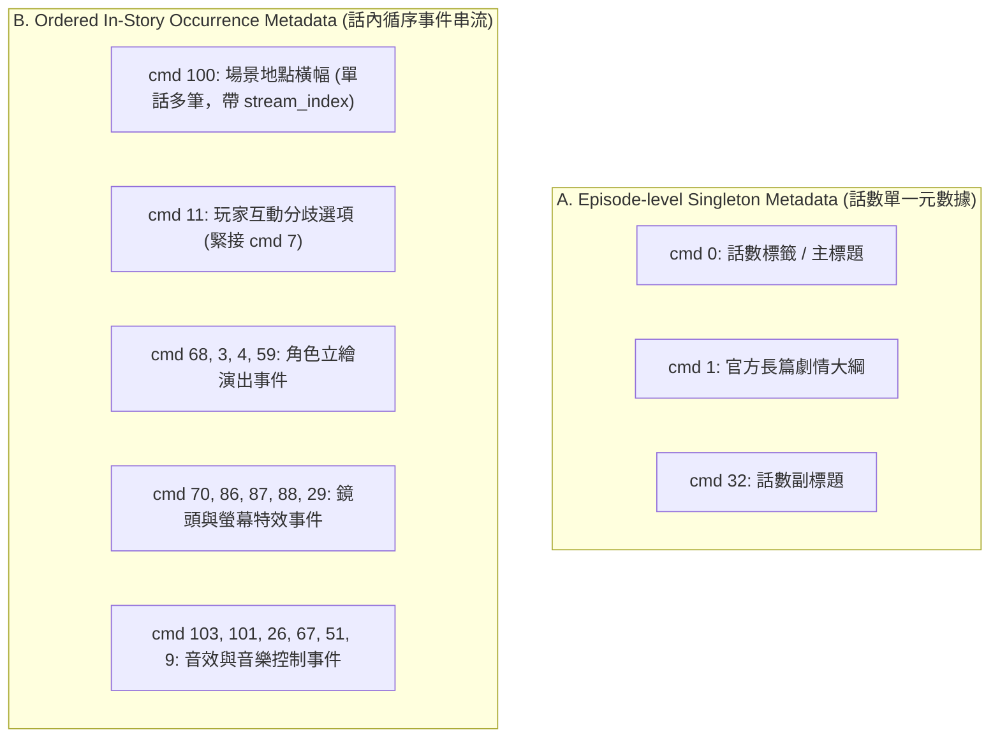
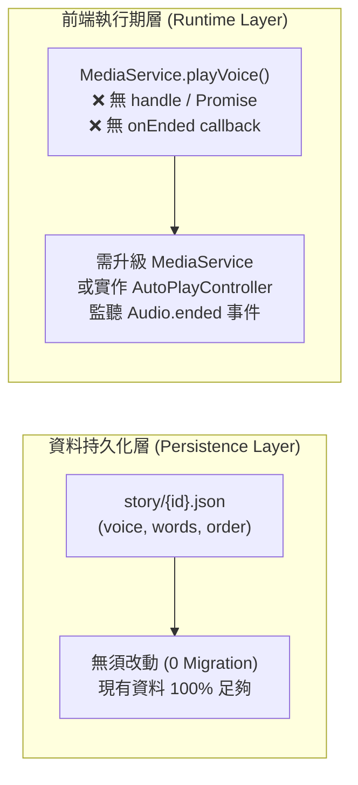
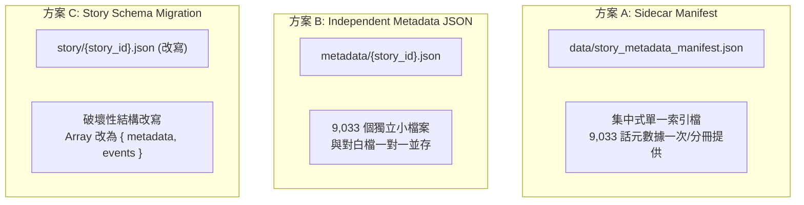

# Issue #2 — Design Review D1.1
# Story Map 故事元數據持久化與產品整合架構盤點 (Architecture Inventory)

> **版本**：1.1.0 (Design Review D1.1 — Evidence & Architecture Correction)<br/>
> **基準 Commit**：`dd75f1dc943939232db3e9c9a5c4c0b1430fc361` (main) / `89334bbe73e655b8c9683dbe6ef93d2be4010c6d` (D1 remote)<br/>
> **分支**：`design/story-metadata-persistence-review`  
> **審查模式**：Evidence-Calibrated Research & Architecture Audit Mode  
> **性質**：架構分析與資料契約盤點（唯讀審查，本階段不進行實體代碼修改，不選定最終方案）

---

## 摘要 (Executive Summary)

本文件依據已審查通過並合併至 `main` 的 [Research R1](STORY_ASSETBUNDLE_COMMAND_INVENTORY.md) 與 [Research R2](STORY_ASSETBUNDLE_COMMAND_SEMANTICS_R2.md) 成果，針對「So-net 官方未利用元數據（Official Synopsis、話名 Subtitle、Location Title、選擇肢等）」的持久化方案與「Auto Play v1」的產品整合邊界進行深度架構盤點。

本審查核心架構結論：
1. **現有資料契約具極高約束力 (Top-level Array Contract)**：
   - **抽樣觀察**：在 502 篇分層抽樣劇本中，100.0% (502/502) 觀察為頂層陣列（Top-level JSON Array）。
   - **母體全量驗證**：經 `pipeline/validate.py` 執行全域檢驗，全量 9,034 篇 JSON 檔案（包含 9,033 篇數字話數 ID 劇本，以及 1 篇非數字 ID 的 `story/speaker_appearance.json` 統計檔）全數通過 `isinstance(dialogues, list)` 門禁校驗。
   - 前端 `dialogue-normalizer.js`、`map.js`、`characters.js` 以及後端 `pipeline/validate.py` 對此結構均有**硬性斷言（Hard Assertions）**。若貿然將根結構改寫為物件（Schema Migration），將直接破壞所有既有 Consumer 並造成驗證門禁全面死鎖。
2. **Auto Play v1 邊界釐清（Persistence vs Runtime）**：
   - **Persistence / Schema Change: NO**。現有 `story/{id}.json` 中的 `voice` 標籤、`words` 與陣列順序完全滿足自動播放需求，**不需要任何資料庫遷移或 JSON Schema Migration**，亦不依賴低信心的演出計時指令（`cmd 13`）。
   - **Runtime / Controller Change: YES**。現有 `MediaService.playVoice()` 內部建立 `new Audio()` 並直接播放，但**不回傳 Audio handle 或 Promise，亦未提供 `onEnded` callback**。因此前端必須升級 `MediaService` 或在 `AutoPlayController` 內封裝專屬的語音播放與事件監聽適配機制。
3. **元數據結構必須分層（Singleton vs Ordered Events）**：
   - **Episode-level Singleton Metadata（全話單一屬性）**：`cmd 0`（標題）、`cmd 1`（官方大綱）、`cmd 32`（副標題），每話僅 1 筆，適合集中式清單存儲。
   - **Ordered In-Story Occurrence/Event Metadata（話內循序事件串流）**：`cmd 100`（場景/地點標題，R2 證實單話可能出現多筆且具有不同 `stream_index`）、`cmd 11`（分支選擇肢）及立繪/鏡頭/音效指令，屬於循序事件流，不可誤當作單一字串欄位。
4. **官方大綱具明確持久化價值與空值約束**：
   - `cmd 1`（官方長篇劇情大綱）存在率 100.0% (180/180)，非空有效大綱率為 89.4% (161/180)，空值率為 10.6% (19/180，主要集中於 System 類別)。
   - 產品約束：當 `cmd 1` 為空時，UI 必須隱藏大綱區塊或顯示「本話無官方大綱」，**嚴禁人工補寫或默認假造字句**，以徹底根絕現有桌面版依賴資料庫 `sub_title` 缺失時觸發的人工捏造 Fallback（「美食殿堂的羈絆在此得到了進一步的昇華」）。

---

## 一、 現有系統架構與資料流 (Current Architecture)

目前 Story Map 的故事劇本處理與消費管線可分為五大階段：



---

## 二、 現有 Story JSON 資料契約盤點 (Current Contract Inventory)

### 1. 檔案規格與頂層結構 (Root Shape)
* **規格**：**Top-level JSON Array (`List[Dict[str, Any]]`)**。
* **母體與抽樣數據區隔**：
  * **抽樣觀察 (Sample Observation)**：在 502 篇分層抽樣劇本中，**100.0% (502/502) 均為頂層陣列**，無任何頂層 Object 格式。
  * **全量母體驗證 (Population Verification)**：經 `pipeline/validate.py` 執行全域門禁檢驗，全量 9,034 篇 JSON 檔案（9,033 篇數字話數 ID 與 1 篇 `speaker_appearance.json` warning）**100% 通過 `isinstance(dialogues, list)` 斷言**。

### 2. 現有事件節點型別 (Observed Event Types)
劇本陣列中的元素共包含以下五種節點規格：

| 節點型別 (`type`) | 必要欄位 (Mandatory) | 可選欄位 (Optional) | 說明與用途 |
| :--- | :--- | :--- | :--- |
| `dialogue` (顯式) | `name`, `words` | `unit_id`, `voice` | 角色對白節點，帶發言人、台詞、頭像 ID 與語音檔案名。 |
| *(隱式對白)* | `name`, `words` | `voice` | 部分歷史劇本無 `type` 屬性，直接以 `name` + `words` 呈現對白。 |
| `background` | `bg_id` 或 `background` | - | 背景切換節點（`cmd 5` 抽取產物）。 |
| `still` | `still` 或 `still_id` | - | CG 劇照插入或結束節點（`cmd 49` / prefix 抽取產物，`end` 代表關閉）。 |
| `movie` | `movie_id` | - | 過場動畫節點（`cmd 46` 抽取產物）。 |

### 3. 欄位消費與 Consumer 清單

#### A. 核心運行消費端 (Runtime Consumers)
1. **`dashboard/map.js` (`QuestMapModule.loadDialogue`)**：
   * 進入點：Line 1890 `fetch('story/${storyId}.json?v=${Date.now()}')`
   * 硬性假設：Line 1895 `if (!rawDialogueList || rawDialogueList.length === 0)`（假設為陣列或具 `.length`）。
   * 資料傳遞：Line 1901 將整包傳入 `DialogueNormalizer.normalize(rawDialogueList)`。
2. **`dashboard/dialogue-normalizer.js` (`DialogueNormalizer.normalize`)**：
   * 進入點：Line 38 `normalize(rawDialogueList)`
   * **硬性斷言**：Line 39：
     ```javascript
     if (!rawDialogueList || !Array.isArray(rawDialogueList) || rawDialogueList.length === 0) {
         return { dialogueList: [], speakerNames: [] };
     }
     ```
     **若輸入非陣列，靜默返回空資料，導致整個閱讀器無對白可顯示。**
   * 結構走訪：Line 48 `rawDialogueList.forEach(item => ...)`。
   * 消費欄位：`item.type`, `item.words`, `item.name`, `item.unit_id`, `item.voice`。
3. **`dashboard/dialogue-view.js` (`DialogueView.renderDialogue`)**：
   * 消費正規化後陣列：
     * `item.type === 'still'` 讀取 `item.still_id || item.still`。
     * `item.type === 'background'` 讀取 `item.background_id || item.bg_id`。
     * `item.type === 'movie'` 讀取 `item.movie_id || item.movie`。
     * 對白節點讀取 `item.name`, `item.words`, `item.unit_id`, `item.voice`。
4. **`dashboard/characters.js` (`CharactersModule.toggleStoryDetails`)**：
   * 進入點：Line 816 `fetch('story/${storyId}.json?v=${Date.now()}')`
   * 硬性假設：Line 820 `if (!dialogues || dialogues.length === 0)`。
   * 結構走訪：Line 846 `dialogues.map(d => ...)`（若非陣列將拋出 `TypeError` 崩潰）。
   * 消費欄位：`d.voice`, `d.name`, `d.words`。

#### B. 打包與驗證門禁端 (Pipeline & Gate Consumers)
1. **`pipeline/validate.py` (全域驗證門禁)**：
   * **硬性斷言 1 (全域語法檢驗，Line 781-783)**：
     ```python
     if not isinstance(dialogues, list):
         corrupted_count += 1
         res.error(f"對白劇本根結構非陣列: story/{sf.name}")
     ```
   * **硬性斷言 2 (Source/Dist Parity 檢驗，Line 185-189)**：
     ```python
     if not isinstance(s_data, list):
         res.error(f"源碼對白根結構非陣列: {src_path.name}")
     if not isinstance(d_data, list):
         res.error(f"發布對白根結構非陣列: {dist_path.name}")
     ```
   * **逐行序列比對 (Line 193-214)**：循序抽取出全量 `unit_id` 序列、`dialogue` 筆數與 `movie` 序列進行雙向 100% 絕對等價校驗。
2. **`pipeline/bundle.py` (發布打包器)**：
   * Line 854 調用 `sync_directory_assets`，將 `story/*.json` 視為透明二進位/文字檔（Opaque Copy），計算雜湊與檔案差異後複製至 `dist_story_map/story/`。

#### C. 現有契約總結
* **是否存在共享 Loader/Adapter**：**否**。目前各頁面模組（`map.js` 與 `characters.js`）各自發起裸 `fetch('story/${id}.json')`。
* **最強破壞相容性約束**：**根結構必須保持為陣列（Top-level Array）**。任何將根結構轉為物件的修改，均會瞬間觸發 `validate.py` 報警與兩處前端運行時崩潰。

---

## 三、 R2 元數據候選矩陣 (R2 Metadata Candidate Matrix)

依據已通過審查並合入 `main` 的 [Research R2 報告](STORY_ASSETBUNDLE_COMMAND_SEMANTICS_R2.md) 與 [Research R1 普查報告](STORY_ASSETBUNDLE_COMMAND_INVENTORY.md)，將 AssetBundle 提取出的元數據嚴格按照驗證結論劃分：

### 1. 指令語意與候選矩陣表

| 指令 / 欄位 | 領域 (Domain) | 語意與內容 (Semantics) | 置信等級 (Confidence) | 產品價值 | 是否建議持久化 | Auto Play v1 必需性 | 預計產品定位 |
| :--- | :--- | :--- | :---: | :---: | :---: | :---: | :--- |
| **cmd 1** | Metadata | **官方劇情大綱 (Official Synopsis)**<br/>長篇劇情概要，存在率 100%，非空率 89.4% | **VERIFIED** | **極高**<br/>(取代人工捏造大綱) | **強烈建議** | 非必需 (UI即時受惠) | 📜 官方大綱面板 |
| **cmd 32** | Metadata | **話數副標題 (Subtitle / Episode Name)**<br/>與 DB 吻合度高，存在率 88.9% | **VERIFIED** | **高**<br/>(校正話名標籤) | **強烈建議** | 非必需 | 🏷️ 正式話名顯示 |
| **cmd 0** | Metadata | **話數標籤 / 主標題 (Title Metadata)**<br/>序號或部章標籤，存在率 100% | **HIGH** | 中 | 建議 | 非必需 | 序號輔助導航 |
| **cmd 100** | Location | **場景地點標題 (Location Title)**<br/>官方繁中地名橫幅，180話共 16 occurrences | **HIGH** | 中高 | 建議 (Phase 2) | 非必需 | 🗺️ 地點切換轉場浮水印 |
| **cmd 11** | Interaction | **玩家互動選擇肢 (Interactive Choices)**<br/>選項按鈕與跳轉標籤，180話共 780 occurrences | **HIGH** | 中 | 建議 (Phase 2) | 非必需 (可預設首選) | 🔀 互動分支閱讀模式 |
| **cmd 12** | Audio | **語音關聯 (Voice Association)**<br/>14,703 筆 `vo_` 100% 關聯至此指令 | **VERIFIED** | **極高** | **已持久化** (`voice`) | **核心必需** | 🔊 對白單句播放 / 自動播放 |
| **cmd 5/46/49**| Media | **背景 / 動畫 / CG 劇照** | **VERIFIED** | **極高** | **已持久化** | 非必需 | 🖼️ 多媒體閱讀呈現 |
| **cmd 68** | Staging | **角色立繪站位指定 (Slot Placement)**<br/>插槽 `C, L, R, LC, RC` 與圖層控制 | **HIGH** | 低 | **暫禁入正式結構** | 完全無關 | 僅限未來 2D 復刻引擎 |
| **cmd 3** | Staging | **角色表情切換 (Face Expression)**<br/>切換 Unit ID 對應表情 | **HIGH** | 低 | **暫禁入正式結構** | 完全無關 | 僅限未來 2D 復刻引擎 |
| **cmd 4** | Staging | **角色退場隱藏 (Character Dismiss)**<br/>從舞台淡出立繪 | **HIGH** | 低 | **暫禁入正式結構** | 完全無關 | 僅限未來 2D 復刻引擎 |
| **cmd 59** | Staging | **頭頂動態情緒符號 (Emote Bubble with SE)**<br/>氣泡符號、座標與 `se_adv_` 音效 | **HIGH** | 低 | **暫禁入正式結構** | 完全無關 | 僅限未來 2D 復刻引擎 |
| **cmd 70** | Camera/FX | **全螢幕著色遮罩 (Color Flash / Tint)**<br/>RGB 三元色覆蓋 | **HIGH** | 低 | **暫禁入正式結構** | 完全無關 | 僅限未來 2D 復刻引擎 |
| **cmd 86/87/88**| Camera | **鏡頭座標、平移路徑與縮放倍率** | **LIKELY** | 低 | **暫禁入正式結構** | 完全無關 | 僅限未來 2D 復刻引擎 |
| **cmd 29** | Camera | **鏡頭震動 (Camera Shake)**<br/>強度與震動時長 | **HIGH** | 低 | **暫禁入正式結構** | 完全無關 | 僅限未來 2D 復刻引擎 |
| **cmd 103** | Audio | **話數開場／段落 BGM 指定 (Start BGM)** | **HIGH** | 中低 | **暫禁入正式結構** | 非必需 (v1無BGM) | 未來背景音樂連播 |
| **cmd 101** | Audio | **過場 BGM 切換 (Transition BGM Switch)** | **LIKELY** | 低 | **暫禁入正式結構** | 完全無關 | 未來背景音樂連播 |
| **cmd 26** | Audio | **單次音效觸發 (One-shot SE)** | **HIGH** | 中低 | **暫禁入正式結構** | 完全無關 | 未來音效連動 |
| **cmd 67** | Audio | **參數化音效／循環控制 (Controlled SE)** | **HIGH** | 低 | **暫禁入正式結構** | 完全無關 | 未來音效連動 |
| **cmd 51** | Audio | **常駐環境氛圍音 (Ambience Loop)** | **HIGH** | 低 | **暫禁入正式結構** | 完全無關 | 未來環境音連動 |
| **cmd 9** | Audio | **BGM 淡出／停止 (BGM Stop)** (佔 `bgm_` 99.2%)| **HIGH** | 低 | **暫禁入正式結構** | 完全無關 | 未來背景音樂連播 |
| **cmd 13** | Timing | **子句停頓／間歇延遲 (Inter-phrase Delay)**<br/>語意 Timing，單位與 blocking 未確認 | **HYPOTHESIS** | 低 | **暫禁入正式結構** | **完全無關**<br/>(禁由 delay 驅動) | 待逆向確認計時單位 |
| **cmd 27** | Timing | **幕簾過渡／轉場黑屏等待 (Curtain Wait)** | **HYPOTHESIS** | 低 | **暫禁入正式結構** | 完全無關 | 待逆向確認計時單位 |
| **cmd 61** | Timing | **畫面淡入淡出時長 (Fade Duration)** | **HYPOTHESIS** | 低 | **暫禁入正式結構** | 完全無關 | 待逆向確認計時單位 |

> [!NOTE]
> **未校準指令排除說明**：早期 R1 假說中提及之 `cmd 10/14/16`（原猜測與 Staging 有關）、`cmd 18/20`（原猜測與 Camera 有關）、`cmd 8/15`（原猜測與 Audio 有關）、`cmd 22`（原猜測與 Timing 有關），在 R2 的嚴格驗證中均未獲得充足證據支持，故全數不列入確認的候選清單中，嚴禁納入生產契約。

---

### 2. 資料粒度分層：Singleton vs Ordered Events

依據 R2 語意與生命週期驗證，AssetBundle 元數據在資料模型本質上存在兩種截然不同的粒度：



1. **Episode-level Singleton Metadata（全話單一屬性）**：
   - **包含項目**：`cmd 0`（標題）、`cmd 1`（官方大綱）、`cmd 32`（副標題）。
   - **資料模型**：一對一（1-to-1）。每話全域僅存在單一標題與單一大綱。
   - **持久化定位**：**極適合集中式存儲**（如獨立 Manifest 清單或擴充 `chapters.json`）。UI 在清單瀏覽或開啟對話框前即可預先獲取，無需加載完整劇本。
2. **Ordered In-Story Occurrence/Event Metadata（話內循序事件串流）**：
   - **包含項目**：`cmd 100`（地點橫幅）、`cmd 11`（選擇肢）、Staging、Camera、Audio。
   - **關鍵事實**：**`cmd 100` 絕非單一話數只有一個字串的欄位**。R2 在 180 話抽樣中提取之 16 筆 `cmd 100` 顯示，單一話數常包含多筆地點切換：
     - `2104006`：idx 155「月光學院～操場～」與 idx 232「月光學院」；
     - `2201007`：idx 6「吉歐‧提格尼亞～平原～」與 idx 1491「帕菲之城～城堡前廣場～」；
     - `2210006`：idx 2498「吉歐‧尼布爾黑爾～馬車內～」與 idx 2782「吉歐‧尼布爾黑爾～遺灰沙漠～」；
     - `2212001`：idx 31「巨鯨城～脊柱的祕密房間～」與 idx 1243「巨鯨城～療養室～」。
   - **資料模型**：一對多循序串流（1-to-N Ordered Stream），每筆事件帶有指令流位置 `stream_index` 或依附於特定對白前後。
   - **持久化定位**：**適合與劇本對白事件流整合**。若置於集中式清單中，必須保留為陣列且記錄對齊之對白索引或時間點，不可扁平化為單一字串。

---

### 3. cmd 1 覆蓋率與空值統計語意

在 180 話確定性抽樣中，`cmd 1` 經自動化診斷腳本統計結果如下：
* **指令存在率 (Presence)**：**100.0% (180 / 180)**。在所有抽樣話數的 AssetBundle 指令流中，均包含 `cmd 1`。
* **非空有效大綱率 (Non-Empty Official Synopsis)**：**89.4% (161 / 180)**。包含 50~100 字官方繁體中文長篇情節摘要。
* **空值內容率 (Empty Content)**：**10.6% (19 / 180)**。參數為空字串 `['']`。
  * **空值結構分析**：19 筆空值中，有 **15 筆集中於 System 類別**（System 類劇本非空 16 話、空值 15 話，非空率僅 51.6%）；其餘 4 筆為 Main 1 話、Event 3 話。
* **產品行為規範 (Product Constraint)**：
  * 當 `cmd 1` 包含有效非空文本時，前端渲染正式大綱卡片；
  * 當 `cmd 1` 為空值時，**前端必須明確隱藏該區塊**，或顯示中立文字「本話暫無官方大綱」；
  * **嚴禁任何人工編造字句或預設罐頭文案**充當大綱。

---

### 4. cmd 100 與 cmd 11 的精確統計數值

* **`cmd 100`（場景地點橫幅）**：
  - 在 180 話確定性抽樣中**共觀察到 16 次出現 (occurrences)**。
  - 分佈於 11 話主線劇情中（4 話各出現 2 次，7 話各出現 1 次）。
* **`cmd 11`（玩家分支互動選項）**：
  - 在 180 話確定性抽樣中**共觀察到 780 次出現 (occurrences)**。
  - **89.23%** 緊接 `cmd 7`（等待玩家點擊輸入），10.0% 呈現連續分歧 `11 -> 11 -> 7`。

---

## 四、 Auto Play v1 最低資料需求與執行期邊界 (Auto Play v1 Scope)

### 1. 產品行為邊界定義
* **啟動**：使用者點擊劇情閱讀器頂部「▶ 自動播放」按鈕。
* **播進行為**：
  1. 尋找當前可播放語音的對白列（具 `item.voice` 之對白）。
  2. 透過控制器播放語音。
  3. 監聽實體音訊播放結束事件（`audio.onended`）。
  4. 語音播放完畢後，控制器自動將高亮光標移至下一句有配音的對白。
  5. 調用 `element.scrollIntoView({ behavior: 'smooth', block: 'center' })` 將對白平滑捲動至視野中央。
* **無語音處理**：純旁白或無配音台詞在 v1 中給予預設固定停留時間（例如 2.0 秒）或直接前進至下一語音句。
* **終止條件**：到達該話最後一句對白時自動停止，**v1 嚴禁自動跳轉下一話**（維持單話閱讀安全邊界）。

### 2. 技術邊界判定：Persistence vs Runtime



* **Persistence / Schema Change: NO**：
  - 現有 `story/{id}.json` 中的 `voice` 欄位已完整保存官方音檔標籤（如 `vo_adv_1001001_000`）。
  - 對白陣列的物理先後順序即代表對白推進順序。
  - **不需要任何資料庫遷移或 JSON Schema Migration**。
* **Runtime / Controller Change: YES**：
  - 現行 `dashboard/media-service.js` 的 `MediaService.playVoice(voiceName)` 實作：
    ```javascript
    const audio = new Audio(cdnList[index]);
    audio.play().catch(...);
    this._currentAudio = audio;
    ```
    該方法內部實例化 `Audio` 並維護內部指針，但**不回傳 Promise 或 Audio handle**，亦**無提供 `onEnded` callback 註冊機制**。
  - 因此前端**必須進行 runtime 改造**：
    - **途徑 1**：升級 `MediaService.playVoice()` 使其回傳 Promise / Audio 實例，或接受 `onEnded` 回調參數；
    - **途徑 2**：在新增之 `AutoPlayController` 中自行調用 `MediaService.getVoiceCandidates()` 並獨立管理 Audio 實例生命週期與事件監聽。
* **cmd 13 (Timing) 必需性**：**完全不需要**。Auto Play v1 核心是由音檔物理結束事件驅動，不依賴二進位計時指令。

---

## 五、 三種持久化策略對比分析 (Persistence Strategy Analysis)



### 詳細維度對比表

| 評估維度 | 方案 A：Sidecar Manifest | 方案 B：Independent Metadata JSON | 方案 C：Story Schema Migration |
| :--- | :--- | :--- | :--- |
| **既有 Consumer 相容性** | **100% 完全相容**<br/>對白讀取端 0 改動 | **100% 完全相容**<br/>對白讀取端 0 改動 | **0% 嚴重破壞 (Breaking)**<br/>所有讀取端需同步大改 |
| **遷移成本 (Migration Cost)** | **極低**<br/>產出 1~3 個集中索引檔 | **中**<br/>生成 9,033 個新檔案 | **極高**<br/>重寫並提交 9,033 個檔案 |
| **Validator 影響** | **0 影響**<br/>既有 parity 與陣列檢驗保持通過 | **0 影響**<br/>新增獨立驗證規則即可 | **致命衝擊**<br/>現有檢驗邏輯全面失配死鎖 |
| **Bundler 影響** | **極低**<br/>納入 `data/` 常規同步清單 | **中**<br/>新增目錄同步與清理邏輯 | **極低**<br/>依然為檔案同步 |
| **部署體積與檔案數量** | **優秀**<br/>檔案數 +1~3 個<br/>體積預估增加 ~2.7 MB `[ESTIMATE]` | **差**<br/>檔案數量 +9,033 個<br/>遍歷與磁碟負擔倍增 | **優秀**<br/>檔案數量不變<br/>總體積微幅增加 |
| **運行時網路請求** | **視組織方式而定**：<br/>• 獨立檔案：**+1 次請求** (可全域快取重複利用)<br/>• 內嵌既有檔案：**0 額外請求** | **中差**<br/>每開啟一話需額外發起 **1 次 fetch** (N 次請求) | **優秀**<br/>依然為 **1 次 fetch** |
| **快取一致性 (Caching)** | **優** (可依 TruthVersion 版本號集中快取) | **中** (個別小檔案各自快取) | **優** (單檔快取) |
| **回滾難度 (Rollback)** | **極低**<br/>刪除 Manifest 即可秒級回滾 | **低**<br/>刪除目錄即可 | **極高**<br/>需全庫 revert 9,033 篇 JSON |
| **AI/工程維護複雜度** | **低**，單一來源集中管理 | **中**，檔案數量過多易有遺漏 | **極高**，涉及全專案跨語言契約改寫 |

> [!NOTE]
> **體積估算依據 `[ESTIMATE]`**：全量約 9,033 篇劇本。每話 Episode-level metadata（包含 `title`、`synopsis` 50~100 中文字、`subtitle` 及鍵名）未壓縮 JSON 字串約 200~350 bytes。$9,033 \times 300\text{ bytes} \approx 2.71\text{ MB}$（格式化排版約 3.5 MB，gzip 傳輸約 600~900 KB）。此為基於欄位規格之推算值，非實測驗證事實。

---

## 六、 候選混合策略評估 (Candidate Hybrid Strategy)

為融合方案 A 的零破壞性與按需載入的靈活性，本審查提議將以下架構作為第四個候選方案（Hybrid Candidate）：

### 1. 資料存儲層（底層契約零破壞）：
* 保持現有 9,033 篇 `story/{id}.json` 頂層根陣列規格 100% 不變。
* 將「**Episode-level Singleton Metadata**（`cmd 0` 標題、`cmd 1` 大綱、`cmd 32` 副標題）」集中存儲：
  * **選項 1（合併型）**：擴充既有已載入的 `data/chapters.json` 等目錄檔（0 額外 HTTP 請求）。
  * **選項 2（獨立清單）**：發布為獨立的 `data/story_metadata_manifest.json`（+1 次 HTTP 請求，單一 session 內全域快取）。
* 將「**Ordered In-Story Occurrence Metadata**（`cmd 100` 地點切換、`cmd 11` 選擇肢）」保留至 Phase 2，作為劇本事件流節點或帶 `stream_index` 的循序陣列。

### 2. 前端適配層架構設計提問（Open Architectural Question）：
目前前端已存在專責多媒體資源解析的 `dashboard/story-asset-service.js`（`window.StoryAssetService`）。在引入故事與元數據載入層時，存在兩種架構路線：
* **路線 A（擴充既有服務）**：擴充 `StoryAssetService` 增加 `loadStory(storyId)`。
  - *潛在問題*：造成「多媒體資產（Media Asset）」與「故事對白資料（Story Dialogue Data）」職責混淆。
* **路線 B（新建專職服務，推薦）**：新建獨立的 `StoryDataService` 或 `StoryLoader`。
  - *職責定義*：專責 `story/{id}.json` 與元數據 Manifest 的加載、快取與對齊，對外暴露統一介面 `{ metadata: {...}, dialogues: [...] }`。
  - *平滑遷移*：既有模組（`map.js`、`characters.js`）逐步由裸 `fetch` 改為調用 `StoryDataService`，徹底收攏資料存取邊界。

---

## 七、 資料完整性問題專案盤點 (Known Data Integrity Finding)

在盤點前端大綱渲染邏輯時，確認了以下歷史遺留的資料誠信度缺陷：

* **具體位置**：[dashboard/map.js:1695-1727](file:///e:/OneDrive%20-%20%E5%AF%B0%E5%AE%87%E7%9F%A5%E8%AD%98%E7%A7%91%E6%8A%80%E8%82%A1%E4%BB%BD%E6%9C%89%E9%99%90%E5%85%AC%E5%8F%B8/PCRD_tool/dashboard/map.js#L1695-L1727)
* **觸發情境與資料表來源**：
  * 該行為**僅發生在桌面版（非 mobile 佈局）右側詳情面板**中。
  * 前端依據當前選取的故事類型動態切換查詢以下五種 SQLite 資料表：
    ```javascript
    let tableName = 'story_detail';
    if (story.isEvent) {
        tableName = 'event_story_detail';
    } else if (story.type === 'guild') {
        tableName = 'guild_story_detail';
    } else if (story.type === 'chara') {
        tableName = 'chara_story_detail';
    } else if (story.type === 'tower') {
        tableName = 'tower_story_detail';
    }
    const sql = `SELECT sub_title FROM ${tableName} WHERE story_id = ${this.activeStoryId}`;
    ```
  * 當查詢結果為空、無此話記錄、或 `sub_title` 欄位為空時，`officialSummary` 為空字串。
  * 在桌面版渲染大綱卡片時，觸發 `||` 回退：
    ```javascript
    <span ...>📌 官方大綱</span>
    <p ...>${this.escapeHtml(officialSummary) || "本話為重要主線劇情，美食殿堂的羈絆在此得到了進一步的昇華。"}</p>
    ```
* **嚴重語意偏差**：
  1. `sub_title` 實質為「話名」（如『冒失女僕娘的委託』），而非「大綱（Synopsis）」，將其冠上「📌 官方大綱」標籤本身即屬誤導。
  2. 當內容缺失時，系統自動填補非官方人工編造字句「本話為重要主線劇情，美食殿堂的羈絆在此得到了進一步的昇華。」，並在前端依然顯示「📌 官方大綱」，**嚴重違反專案真實性原則（Truthfulness & Anti-Hallucination）**。
* **後續修正方向（Design Constraint）**：
  * 在後續實作階段中，必須將此區塊重構為真正的 `cmd 1`（官方長篇大綱）。
  * 若該話 `cmd 1` 為空，必須**誠實隱藏該區塊**或顯示「本話暫無官方大綱」，嚴禁任何人工編造字句作為 fallback。

---

## 八、 未解決問題與後續待辦 (Open Questions & Docs Cleanup)

1. **資料服務命名與職責邊界 (Architectural Boundary)**：
   - 前端 Loader 應新設 `StoryDataService` / `StoryLoader`，還是擴充既有 `StoryAssetService`？（建議新設獨立資料服務，以維持多媒體資產服務的單一職責）。
2. **多地點橫幅 (cmd 100) 於 UI 之呈現形式**：
   - 由於單話中可出現多筆 `cmd 100`（如 `2104006` 有 2 筆、`2201007` 有 2 筆），未來 Phase 2 呈現時應作為劇情串流內部的浮水印切換、還是右側章節時間軸上的地點節點？
3. **章節級大綱與單話大綱的呈現層級**：
   - `chapters.json` 已有章節導讀，未來話數大綱面板在 UI 上應採取何種折疊/並列佈局？
4. **Docs 相對路徑待修項目（Non-blocking）**：
   - [docs/STORY_ASSETBUNDLE_COMMAND_SEMANTICS_R2.md](file:///e:/OneDrive%20-%20%E5%AF%B0%E5%AE%87%E7%9F%A5%E8%AD%98%E7%A7%91%E6%8A%80%E8%82%A1%E4%BB%BD%E6%9C%89%E9%99%90%E5%85%AC%E5%8F%B8/PCRD_tool/docs/STORY_ASSETBUNDLE_COMMAND_SEMANTICS_R2.md) 內之分析腳本路徑應修正為 `../tools/diagnostics/audit_story_command_semantics.py`，列入後續文檔清理清單。

---

## 九、 證據邊界 (Evidence Boundary)

* **VERIFIED (已證實)**：
  - 現有 `story/{id}.json` 抽樣 502/502 篇為頂層陣列，全量 9,034 篇經 `pipeline/validate.py` 檢驗 100% 通過陣列斷言。
  - `map.js:1695-1727` 依故事類型查詢 5 張不同資料表之 `sub_title`，且在桌面版空值時存在人工捏造之「美食殿堂的羈絆」fallback 字串。
  - `cmd 1` 存在率為 100.0% (180/180)，非空率為 89.4% (161/180)，空值率為 10.6% (19/180，主要為 System 劇本)。
  - `cmd 100` 在 180 話抽樣中共出現 16 次，單話可出現多筆且帶不同 `stream_index`。
  - `cmd 11` 在 180 話抽樣中共出現 780 次，89.23% 緊接 `cmd 7`。
  - Auto Play v1 在 Persistence / Schema 層級無需任何改動，但在 Runtime 層級需要適配控制器以捕捉音訊結束事件（現有 `MediaService.playVoice` 無 callback / handle）。
* **HIGH-CONFIDENCE (高置信度推論)**：
  - 方案 A（Sidecar Manifest）或 Hybrid 策略在工程風險、打包相容性與回滾難度上顯著優於全量改寫的方案 C。
  - 新建獨立 `StoryDataService` 比擴充多媒體專用的 `StoryAssetService` 更符合單一職責原則。
* **HYPOTHESIS / UNRESOLVED (假說與未決項目)**：
  - `cmd 13` / `cmd 27` / `cmd 61` 的時間單位與 blocking 屬性尚未經 runtime 反編譯或 wall-clock 實測證實，嚴禁作為生產計時依據。
  - 方案 A 體積增加 ~2.7 MB 屬 `[ESTIMATE]` 推估，實際以實作產物為準。
