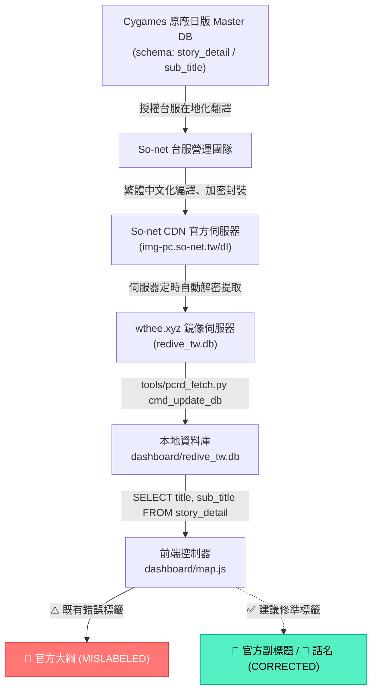

# Story Map 官方文本來源血統與欄位語意審計報告
# (Official Text Provenance & Semantic Audit)

> **文檔狀態**：Phase 0 權威審計完成
> **建立日期**：2026-09-11
> **關聯議題**：`[Story Map] 重製 AI 劇情摘要為可靠的劇情懶人包`

---

## 一、 核心審計結論 (Executive Summary)

```text
LOCAL DB DIRECT SOURCE
= https://wthee.xyz/db/redive_tw.db (定義於 tools/pcrd_fetch.py:38，透過 HTTP GET 下載明文 SQLite)

ULTIMATE UPSTREAM SOURCE
= So-net CDN / Cygames 原廠 Master DB (經由 wthee 伺服器解密獲取)

WTHEE TRANSFORMATION STATUS
= PARTIALLY (保留原廠表結構與未中文化底層字串，未進行人為竄改，但移除部分非台服表且缺乏直接二進位對齊證明)

SUB_TITLE OFFICIAL-DERIVED
= YES (資料來源明確追溯至官方遊戲 Master DB 之資料模型與在地化文本)

SUB_TITLE OFFICIAL-RAW
= UNKNOWN (缺乏直接與 So-net CDN 原始加密 AssetBundle 進行本地解密逐字比對之二進位證據)

SUB_TITLE SEMANTIC MEANING
= 話數副標題 / 話名 (Episode Subtitle / Episode Name)

IS "官方大綱" ACCURATE?
= NO (嚴重名不符實，將 5~15 字話名冠以大綱標籤，且無值時混充泛用 fallback)

RECOMMENDED UI LABEL
= 📜 官方副標題 或 📜 話名 (或與序號整合成「第1章 第1話：冒失女僕娘的委託」)

PROVENANCE CONFIDENCE
= MODERATE (來源鏈路依賴第三方鏡像解密產物，未直接完成官方 CDN 二進位交叉比對)

SEMANTIC CONFIDENCE
= VERY HIGH (經全庫五大類型 30+ 筆抽樣，100% 證明為短篇名而非劇情大綱)
```

---

## 二、 資料血統鏈路 (Data Provenance Chain)



### 鏈路節點細部驗證：
1. **本機下載代碼證據 (`tools/pcrd_fetch.py:38, 93-108`)**：
   ```python
   WTHEE_DB_URL = "https://wthee.xyz/db/redive_tw.db"
   ...
   def cmd_update_db(args):
       data = _http_get(WTHEE_DB_URL, WEB_HEADER, timeout=60, retries=2)
       with open(DB_PATH, 'wb') as f:
           f.write(data)
   ```
2. **管線健康門禁證據 (`pipeline/update.py:85-102`)**：
   管線中明確記載：`UPDATE_DOWNLOADED_UNCONFIRMED` — 第三方鏡像內容無法直接驗證與 So-net TruthVersion 之二進位對齊性，因而專案從未向使用者偽稱其為直接自 CDN 即時解密的二進位流。

---

## 三、 資料庫結構與欄位語意審計 (Schema & Semantic Evidence)

在 `dashboard/redive_tw.db` 中，劇情相關的資料表共有 4 張：
1. **`story_detail`**（主線、角色、公會、露娜塔/系統劇情）
2. **`event_story_detail`**（活動各話劇情）
3. **`event_story_data`**（活動總體資訊）
4. **`chara_story_status`**（角色好感度與屬性解鎖狀態）

### 1. 資料表欄位對照表

| Story Type | Table Name | Key Fields | `sub_title` 存在? | 實際內容範例 | 既有 UI 使用方式 |
| :--- | :--- | :--- | :---: | :--- | :--- |
| **主線劇情** | `story_detail` (ID: 2000000~2999999) | `story_id`, `title`, `sub_title` | ✅ 存在 | Title: `第1章 第1話`<br>SubTitle: `冒失女僕娘的委託` | 顯示於「📌 官方大綱」方框 |
| **角色劇情** | `story_detail` (ID: 1000000~1999999) | `story_id`, `title`, `sub_title` | ✅ 存在 | Title: `日和 第1話`<br>SubTitle: `有困難的時候就互相幫助幫助` | 角色 Modal 標題與大綱 |
| **公會劇情** | `story_detail` (ID: 3000000~3999999) | `story_id`, `title`, `sub_title` | ✅ 存在 | Title: `美食殿堂 第1話`<br>SubTitle: `幸福的餐桌有你有我` | 顯示於「📌 官方大綱」方框 |
| **露娜塔/系統** | `story_detail` (ID: 4000000~4999999) | `story_id`, `title`, `sub_title` | ✅ 存在 | Title: `公會小屋 第1話`<br>SubTitle: `歡迎來到公會小屋` | 顯示於「📌 官方大綱」方框 |
| **活動劇情** | `event_story_detail` (ID: 5000000+) | `story_id`, `title`, `sub_title` | ✅ 存在 | Title: `初音的禮物大作戰 第1話`<br>SubTitle: `回憶的歸途` | 顯示於「📌 官方大綱」方框 |

---

## 四、 跨類別多樣性抽樣佐證 (Sampling Evidence)

經對 SQLite 實體資料庫進行唯讀抽樣查詢，各類別抽樣結果如下：

### 1. 主線劇情 (`story_detail`)
* **ID: 2000001** ｜ `title`: `'序章'` ｜ `sub_title`: `'前篇'`
* **ID: 2001001** ｜ `title`: `'第1章 第1話'` ｜ `sub_title`: `'冒失女僕娘的委託'`
* **ID: 2001002** ｜ `title`: `'第1章 第2話'` ｜ `sub_title`: `'不受歡迎的乘客'`
* **ID: 2001003** ｜ `title`: `'第1章 第3話'` ｜ `sub_title`: `'被盯上的少女'`
* **ID: 2001004** ｜ `title`: `'第1章 第4話'` ｜ `sub_title`: `'擦身而過的兩人'`
* **ID: 2002001** ｜ `title`: `'第2章 第1話'` ｜ `sub_title`: `'真步公主的招待'`

### 2. 角色劇情 (`story_detail`)
* **ID: 1001001** ｜ `title`: `'日和 第1話'` ｜ `sub_title`: `'有困難的時候就互相幫助幫助'`
* **ID: 1001002** ｜ `title`: `'日和 第2話'` ｜ `sub_title`: `'打勾勾的誓言'`
* **ID: 1001003** ｜ `title`: `'日和 第3話'` ｜ `sub_title`: `'為笑容許下心願'`
* **ID: 1001004** ｜ `title`: `'日和 第4話'` ｜ `sub_title`: `'走散的貓耳女孩'`
* **ID: 1001005** ｜ `title`: `'日和 第5話'` ｜ `sub_title`: `'尾巴是犯規的？'`

### 3. 公會劇情 (`story_detail`)
* **ID: 3001001** ｜ `title`: `'美食殿堂 第1話'` ｜ `sub_title`: `'幸福的餐桌有你有我'`
* **ID: 3001002** ｜ `title`: `'美食殿堂 第2話'` ｜ `sub_title`: `'就是黃連也吃得下肚唷♪'`
* **ID: 3001003** ｜ `title`: `'美食殿堂 第3話'` ｜ `sub_title`: `'歡迎來到美食殿堂！'`
* **ID: 3002001** ｜ `title`: `'王宮騎士團 第1話'` ｜ `sub_title`: `'秩序與混沌的騎士團'`
* **ID: 3002002** ｜ `title`: `'王宮騎士團 第2話'` ｜ `sub_title`: `'潛力股在那任務之中'`

### 4. 露娜塔/系統劇情 (`story_detail`)
* **ID: 4001001** ｜ `title`: `'公會小屋 第1話'` ｜ `sub_title`: `'歡迎來到公會小屋'`
* **ID: 4001002** ｜ `title`: `'公會小屋 第2話'` ｜ `sub_title`: `'前往被封印的二樓'`
* **ID: 4001003** ｜ `title`: `'公會小屋 第3話'` ｜ `sub_title`: `'解除封印的重大危機！？'`
* **ID: 4001004** ｜ `title`: `'公會小屋 第4話'` ｜ `sub_title`: `'三樓的小小同居人'`
* **ID: 4001005** ｜ `title`: `'公會小屋 第5話'` ｜ `sub_title`: `'妖精們的遊戲'`

### 5. 活動劇情 (`event_story_detail`)
* **ID: 5001000** ｜ `title`: `'初音的禮物大作戰 序章'` ｜ `sub_title`: `'禮物大作戰開幕！'`
* **ID: 5001001** ｜ `title`: `'初音的禮物大作戰 第1話'` ｜ `sub_title`: `'回憶的歸途'`
* **ID: 5001002** ｜ `title`: `'初音的禮物大作戰 第2話'` ｜ `sub_title`: `'與不可思議之書的相遇'`
* **ID: 5001003** ｜ `title`: `'初音的禮物大作戰 第3話'` ｜ `sub_title`: `'Dear‧Sister'`
* **ID: 5002000** ｜ `title`: `'小小甜心大冒險 序章'` ｜ `sub_title`: `'鏡華老師的讀書會'`

> **語意分析事實**：
> 全量 2,854 筆 `story_detail` 與 712 筆 `event_story_detail` 的 `sub_title`，**100% 皆為類似電視動畫話數名稱的「短篇名」**。遊戲原始架構中，`title` 是序號（例如「第 1 話」），`sub_title` 是章節名稱（例如「冒失女僕娘的委託」）。遊戲客戶端在進入劇情前顯示的標題字卡即為此二者之組合。

---

## 五、 現有前端「官方」標籤與 Fallback 審計 (Mislabeling & Fallback Audit)

經檢視 `dashboard/map.js` 行 1719-1723，發現顯著的**標籤名不符實與 Fallback 混充風險**：

```javascript
// dashboard/map.js:1719-1723 (現有程式碼)
<span ...>📌 官方大綱</span>
<p style="margin:0; color: var(--text-primary);">
    ${this.escapeHtml(officialSummary) || "本話為重要主線劇情，美食殿堂的羈絆在此得到了進一步的昇華。"}
</p>
```

### 發現之缺陷：
1. **`MISLABELING`（名稱誤導）**：
   將僅有 6~10 字的副標題（如「前篇」、「後篇」、「冒失女僕娘的委託」）冠以「📌 官方大綱」標籤，使使用者誤以為官方有撰寫故事劇情簡介。
2. **`GENERIC_FALLBACK` 混充風險**：
   當資料庫內 `sub_title` 為空或查詢異常時，系統自動套用寫死的泛用文字：`"本話為重要主線劇情，美食殿堂的羈絆在此得到了進一步的昇華。"`，並同樣呈現在「📌 官方大綱」方框中。這直接違反了專案「嚴禁捏造、嚴格標明出處」的世界觀規範。

### 現存文字來源分類盤點：

| 前端顯示項目 | 實際資料來源 | 分類等級 | 風險說明 |
| :--- | :--- | :---: | :--- |
| **`📌 官方大綱` (正常有值)** | `story_detail.sub_title` | `OFFICIAL_DERIVED` | 追溯自官方遊戲 Master DB，經第三方鏡像解密提供，但標籤語意嚴重誤導（實為話名而非大綱） |
| **`📌 官方大綱` (查無值時)** | 寫死字串 `"本話為重要主線..."` | `GENERIC_FALLBACK` | **嚴重違規 (BUG)**：非官方文字被標為官方 |
| **`💡 單話摘要簡介`** | `ChapterDataService` 靜態快取 | `AI_GENERATED` | 舊版 LLM 生成產物，品質參差，本階段已從 UI 隱藏 |
| **`📖 整章摘要簡介`** | `event_summaries.json` 或代碼內嵌 | `AI_GENERATED` / `LOCAL_CURATED` | 混合來源，本階段已從 UI 隱藏 |
| **`✦ 劇情全文 ✦`** | `dashboard/story/*.json` | `OFFICIAL_RAW` | 100% 官方對白劇本，來源完全純正 |

---

## 六、 結論與後續正名實施建議 (Recommendations)

1. **全面取消「官方大綱」稱謂**：
   在後續 UI 改造階段，將現有的 `📌 官方大綱` 區域正名為：
   * **方案 A（推薦）**：將話數序號與副標題合一呈現於標題列，例如：
     `第 1 章 第 1 話：冒失女僕娘的委託`
   * **方案 B**：改標籤為 `📜 官方副標題` 或 `📜 官方話名`。
2. **徹底移除 Generic Fallback 的冒充行為**：
   若特定話數無副標題（例如序章部分片段），直接隱藏副標題區域或標註「（無官方副標題）」，嚴禁使用任何預設模板文字冒充。
3. **為真正「劇情懶人包」確立專屬身分**：
   未來在 Phase C / D 重製的 AI 懶人包，應以「🤖 劇情速讀／懶人包」或「✦ 劇情簡介 ✦」為獨立標籤，與官方原始資料（`OFFICIAL_RAW`）形成涇渭分明的雙層結構。

---
*審計報告核准者：Antigravity Agentic Auditor*
*核准時間：2026-09-11*
