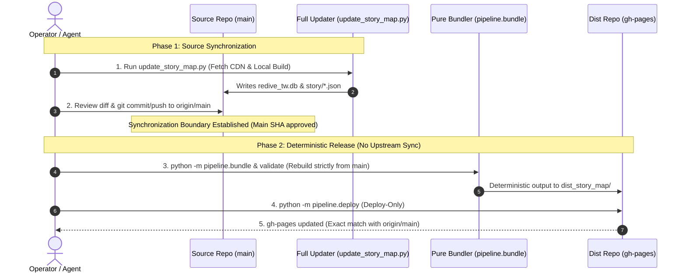

# Character Identity C1 — Story Map Update Workflow Audit (Final Release Reproducibility Polish)

> [!IMPORTANT]
> **本報告為 PCRD Story Map 資料管線 (Pipeline v1) 之完整流程審計、發布同步邊界與可重現性評估報告 (Audit Only)**。未修改任何管線執行時代碼。

## 1. Executive Summary

本審計深入探勘了 `update_story_map.py` 與 `pipeline/` 自動化資料管線：
- **發布同步邊界 (Release Synchronization Boundary)**: 確立了「全流程更新 (`update_story_map.py`，包含上游同步)」與「純發布命令 (`pipeline.deploy`，無上游同步)」的職責分離。來源合併至 main 後，必須使用純發布指令，禁止二次觸發上游同步。
- **可重現性不變式 (Reproducibility Invariant)**: `Approved Main SHA -> Deterministic Bundle -> Validated Dist -> gh-pages Deploy`。部署產物保證 100% 決定性對齊已提交的 main 分支。
- **雙倉庫架構分離**: 專案由**來源倉庫 (`main` 分支)** 與**發布倉庫 (`dist_story_map` 獨立 working tree / `gh-pages` 分支)** 組成。`pipeline.deploy` 僅負責推送 `gh-pages`，絕不觸碰主倉庫的 commit/push。
- **前端故事發現與上游抓取**: 本地資料就緒時前端 100% 自動發現；Canonical Updater 增量抓取範圍限於 `tracked_characters.json`，非角色故事可透過 `sync-episode` 單話同步。

---

## 2. Release Synchronization Boundary & Reproducibility Flow

---

## 3. Tool Duty Classification (工具職責分類表)

| 工具名稱 | 具體指令 | 職責分類 | 說明 |
| :--- | :--- | :--- | :--- |
| **`scan-cdn`** | `python -m pipeline.fetch scan-cdn` | `DISCOVERY_ONLY` | 探測 So-net CDN 是否有新 TruthVersion、檢查 manifest 是否有預上架素材，不下載對白 JSON |
| **`fetch-stories`** | `python -m pipeline.fetch fetch-stories --unit-id <unit_id>` | `DOWNLOAD_JSON_CHARACTER_ONLY` | 僅限依角色 unit_id 查詢 DB 並下載該角色的個人劇情對白 JSON |
| **`sync-episode`** | `python -m pipeline.fetch sync-episode --story-id <story_id>` | `DOWNLOAD_JSON_SINGLE_EPISODE` | 依單一 story_id 從 manifest 匹配 Hash，下載對白 JSON 並一併下載音訊與圖像素材 |
| **`fetch-story-voices`** | `python -m pipeline.fetch fetch-story-voices --story-id <story_id>` | `DOWNLOAD_MEDIA_ONLY` | 僅下載指定話數的 M4A 語音音檔 |
| **`fetch-story-images`** | `python -m pipeline.fetch fetch-story-images --story-id <story_id>` | `DOWNLOAD_MEDIA_ONLY` | 僅下載指定話數的背景與 CG WebP 大圖 |
| **`fetch-assets`** | `python -m pipeline.fetch fetch-assets --unit-id <unit_id>` | `DOWNLOAD_MEDIA_ONLY` | 僅下載指定角色的頭像與卡面立繪素材 |

---

## 4. Story Type Acquisition & Discovery Matrix

| 劇情類別 | 本地資料存在時前端是否自動發現？ | Canonical Update 是否自動抓取 JSON？ | 經實證之抓取路徑 (Verified Acquisition Path) |
| :--- | :--- | :--- | :--- |
| **Character Story (個人劇情)** | YES (由 SQLite story_detail 驅動，未入庫角色由 pendingNewCharas 兜底) | **PARTIAL (僅自動增量下載 tracked_characters.json 中註冊之 unit_id 劇本)** | `python -m pipeline.fetch fetch-stories --unit-id <unit_id> (或 sync-episode --story-id)` |
| **Main Story (主線劇情)** | YES (由 SQLite story_detail 表自動建立章節目錄) | **NO (Canonical update 未涵蓋主線劇本批次掃描)** | `python -m pipeline.fetch sync-episode --story-id <story_id> (單話抓取；無專屬批次主線下載器)` |
| **Guild Story (公會劇情)** | YES (由 SQLite story_detail 驅動) | **NO** | `python -m pipeline.fetch sync-episode --story-id <story_id> (單話抓取；無專屬批次公會下載器)` |
| **Event Story (活動劇情)** | YES (由 SQLite story_detail 驅動，新形式活動由 extra_events.json 補充) | **NO** | `python -m pipeline.fetch sync-episode --story-id <story_id> (單話抓取；無專屬批次活動下載器)` |
| **Tower / System (露娜塔/系統)** | YES (由 SQLite story_detail 驅動) | **NO** | `python -m pipeline.fetch sync-episode --story-id <story_id> (單話抓取；無專屬批次露娜塔下載器)` |
| **Part 3 Branch (第 3 部分支補充)** | YES (由 branch_stories.json 補充載入) | **NO** | `MANUAL_CURATION (手動提取 JSON 並更新 branch_stories.json)` |

---

## 5. Warning Conditions & Degradation Behavior

| 警告情境 | 管線是否繼續執行？ | Exit Code 是否仍可為 0？ | 新鮮度與涵蓋面後果 |
| :--- | :--- | :--- | :--- |
| **CDN TruthVersion probe network failure / timeout** | `YES` | `YES` | Freshness uncertainty / Stale-success risk (若本地有 DB，管線使用舊版資料成功打包並通過驗證) |
| **tracked_characters.json read exception** | `YES` | `YES` | Degraded-success risk (跳過追蹤角色缺失對白檢查，繼續打包現有劇本) |
| **Non-numeric story filename (e.g. story/speaker_appearance.json)** | `YES` | `YES` | None (合法警告，驗證器正確跳過元數據檔案並檢查其餘數字劇本) |
| **Metadata missing local dialogues (e.g. 17 historic un-fetched events)** | `YES` | `YES` | Partial historic coverage (允許歷史少數可選劇本未下載) |
| **Footprint Warning (750 MiB <= size < 900 MiB)** | `YES` | `YES` | Approaching Pages hard limit, warning logged but deploy allowed |

---

## 6. Validator Semantics & Known Gaps

- **Dist 集合關係**: **`SOURCE_SUBSET_OF_DIST (Source ⊆ Dist, verifies all numeric source story IDs exist in dist, extras allowed)`**
- **額外 Dist 劇本是否阻斷 (Extra Dist Stories Rejected)**: **`NO`**
- **劇本語法驗證深度**: **JSON parseability + list-root structural verification (逐篇檢驗 JSON 可解析且根物件為 list)**
- **資料庫查詢語意**: **Validator successfully queries unit_data count, story_detail IDs, event_story_data count, and reports dataset metrics.**

---

## 7. Key Questions & Direct Answers

### Q1. 官方新增正常故事後，是否需要修改前端 JS？
**【答】不需要 (NO)**。只要本地資料庫與劇本 JSON 齊全，前端由 SQLite `story_detail` 自動驅動發現與導航。

### Q2. 是否能靠權威管線自動抓取所有新故事？
**【答】部分支援 (NO / PARTIAL)**。`update_story_map.py` 自動同步 `tracked_characters.json` 中的個人劇本；非角色劇情（主線、活動、公會、露娜塔）前端可在資料就緒時自動渲染，但目前 Canonical Updater 未自動涵蓋其抓取路徑。

### Q3. 目前還有哪些步驟需要人工記憶？
**【答】**: 1. 新可玩角色需加入 `tracked_characters.json`；2. 非角色新故事若需對白需使用 `sync-episode` 單話同步；3. 第 3 部分支劇情需在 `branch_stories.json` 補充副標題；4. 來源資料必須在發布前手動執行針對性 `git commit` 與 `git push` 至 main，並使用純發布指令 `pipeline.deploy` 發布。

### Q4. 是否有 Silent Failure (靜默失敗) 風險？
**【答】存在陳舊成功風險 (Freshness Uncertainty / Stale-Success Risk)**。若 CDN 探測超時，管線會記錄 Warning 並以現有本地資料成功完成打包（不會損毀資料，但產物可能非最新）。

### Q5. 最值得在 C2 改善的是什麼？
**【答】排序維持不變**：
1. **Freshness 探測確認策略 (Freshness Confirmation Policy)**：評估是否在 CDN 探測失敗時提供更明確的互動提示或可選的 fail-closed 模式。
2. **通用劇本抓取原語 (Generic Story Acquisition Primitive)**：評估建立基於 `DB expected story IDs - local JSON IDs` 的全庫差集增量下載器，取代僅依賴 `tracked_characters`。
3. **元數據自動化整合**：將 `story_thumbnails` 與 `speaker_appearance` 納入標準更新流程。

### Q6. 目前是否已適合日常資料更新？
**【答】YES WITH COVERAGE AWARENESS, BUT NON-CHARACTER STORY ACQUISITION REMAINS A KNOWN GAP**（已知角色劇情完全適合，非角色劇情需注意抓取覆蓋面缺口，且需遵循來源提交先於發布之規範）。

---

## 8. Final Recommendation

- **Idempotence Status**: **`PARTIALLY_VERIFIED (Bundler is component-level deterministic via SHA-256; end-to-end network rerun not fully verified in live state)`**
> [!TIP]
> **C1 審計結論：PASS (管線架構與發布同步邊界高度完備，來源可重現性契約已嚴密規範，建議進入 C2 進行通用抓取與新鮮度策略規劃)**。
